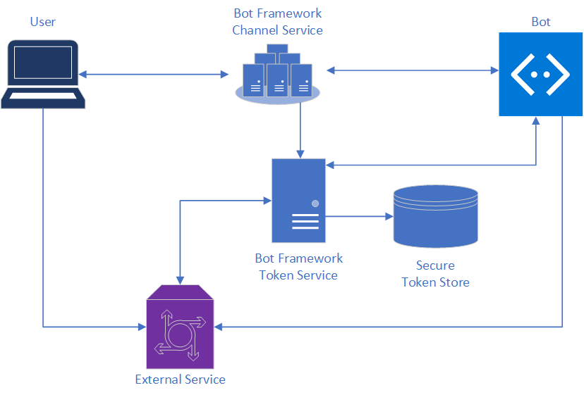
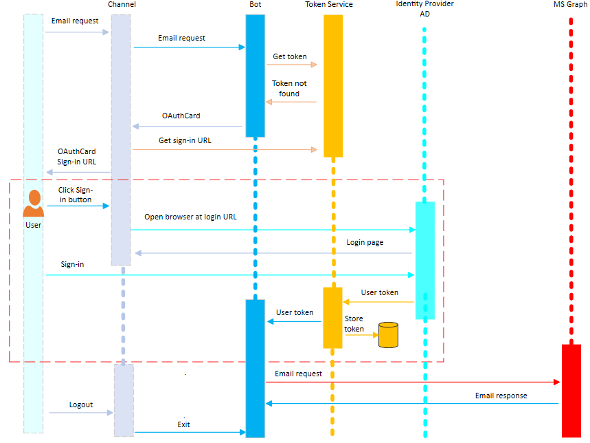

# Bot authentication

<!-- work in progress -->
In order for a bot to access protected online resources on behalf of the user, the bot must be authenticated. This authentication takes the form of a token based on the user's credentials. All this is accomplished by a set of components that are part of the **Azure Bot Service** architecture described below.

1. **Bot Channels Registration application**. This is the mechanism to *integrate* a bot within the Azure infrastructure, which allows the user to communicate via channels with the bot.
1. **Bot**. The bot can be hosted anywhere including Azure. If hosted in Azure, you can build an deploy it.
1. **Identity provider application**. This application is needed for each protected resource the bot must access on behalf of the user. It is the **identity provider** which allows the bot to *access an external protected resource*, such as Office 365 MSGraph. The Azure Active Directory (AAD) is the identity provider to access Microsoft protected resources. Many other identity providers exist, for example GitHub, to access their protected resources.

The following picture shows the architecture of the Azure Bot Service which uses the Azure AD as the identity provider for authentication.

## User authentication in a conversation

To perform certain operations on behalf of a user, such as checking email, referencing a calendar, checking on flight status, or placing an order, the bot will need to call an external service, such as the Microsoft Graph, GitHub, or a company's REST service.
Each external services has a way of securing those calls, and a common way is to issue those requests using a **user token** that uniquely identifies the user on that external service (sometimes referred to as a [JSON Web Token](https://jwt.io/introduction/) (JWT)).

To secure the call to an external service, the bot must ask the user to sign-in, so it can acquire the user's token for that service.
Many services support token retrieval via the **OAuth** or **OAuth2** protocol.

The Azure Bot Service provides specialized **sign-in** cards and services that work with the OAuth protocol and manage the token life-cycle. A bot can use these features to acquire a user token.

- As part of bot configuration, an **OAuth connection** is registered within the Azure Bot Service resource in Azure.

    The connection contains information about the **identity provider** to use, along with a valid OAuth client id and secret, the OAuth scopes to enable, and any other connection metadata required by that identity provider.

- In the bot's code, the OAuth connection is used to help sign-in the user and get the user token.

The following image shows the elements involved in the authentication process.

## About the Bot Framework Token Service

The Bot Framework Token Service is responsible for:

- Facilitating the use of the OAuth protocol with a wide variety of external services.
- Securely storing tokens for a particular bot, channel, conversation, and user.
- Acquiring user tokens.
    > [!TIP]
    > If the bot has an expired user token, the bot should:
    >    - Log the user out
    >    - Initiate the sign in flow again

For example, a bot that can check a user's recent emails, using the Microsoft Graph API, requires an user token from an **Identity Provider**, in this case **Azure Active Directory**. At design time, the bot developer performs these 2 important steps:

1. Registers an Azure Active Directory application i.e., an Identity Provider, with the Bot Framework Token Service, via the Azure Portal.
1. Configures an OAuth connection (named for example `GraphConnection`) for the bot.

The following picture shows the sequence of the user's interaction with a bot when an email request is made using the Microsoft Graph service.

1. The user makes an email request to the bot.
1. An activity with this message is sent from the user to the Bot Framework channel service. The channel service ensures that the `userid` field within the activity has been set and the message is sent to the bot.

    User ID's are channel specific, such as the user's facebook ID or their SMS phone number.

1. The bot makes a request to the Bot Framework Token Service asking if it already has a token for the UserId for the OAuth connection `GraphConnection`.
1. Since this is the first time this user has interacted with the bot, the Bot Framework Token Service does not yet have a token for this user, and returns a *NotFound* result to the bot.

    > [!NOTE]
    > If the token is found, the authentication steps are skipped and the bot can make the email request using the stored token.

1. The bot creates an OAuthCard with a connection name of `GraphConnection` and replies to the user asking to sign-in using this card.
1. The activity passes through the Bot Framework Channel Service, which calls into the Bot Framework Token Service to create a valid OAuth sign-in URL for this request. This sign-in URL is added to the OAuthCard and the card is returned to the user.
1. The user is presented with a message to sign-in by clicking on the OAuthCard's sign-in button.
1. When the user clicks the sign-in button, the channel service opens a web browser and calls out to the external service to load its sign-in page.
1. The user signs-in to this page for the external service. Once complete, the external service completes the OAuth protocol exchange with the Bot Framework Token Service, resulting in the external service sending the Bot Framework Token Service the user token. The Bot Framework Token Service securely stores this token and sends an activity to the bot with this token.
1. The bot receives the activity with the token and is able to use it to make calls against the MS Graph API.

## Securing the sign-in URL

An important consideration when the Bot Framework facilitates a user login is how to secure the sign-in URL. When a user is presented with a sign-in URL, this URL is associated with a specific conversation ID and user ID for that bot. This URL should not be shared, as it would cause the wrong sign-in to occur for a particular bot conversation. To mitigate security attacks regarding sharing the sign-in URL, it is necessary to ensure that the machine and person who clicks on the sign-in URL is the person who _owns_ the conversation window.

Some channels such as Cortana, Teams, Direct Line, and WebChat are able to do this without the user noticing. For example, WebChat uses session cookies to ensure that the sign-in flow took place in the same browser as the WebChat conversation. However, for other channels the user is often presented with a 6-digit _magic code_. This is similar to a built-in multi-factor authentication, as the Bot Framework Token Service will not release the token to the bot unless the user finishes the final authentication, proving that the person who signed-in has access to the chat experience by entering the 6-digit code.

## Azure Activity Directory application registration

Every bot that is registered as an Azure Bot Service uses an Azure Activity Directory (AD) application ID. It is important **not** to re-use this application ID and password to sign-in users. The Azure Bot Service's Azure AD application ID is to secure the service to service communication between the bot and the Bot Framework Channel Services. If you want to sign-in users to Azure AD, you should create a separate Azure AD application registration with the appropriate permissions and scopes.

## Configure an OAuth connection setting

For more on how to register and use an OAuth connection setting, see [Add authentication to your bot](bot-builder-authentication.md).
