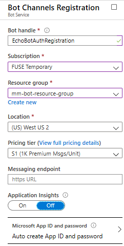
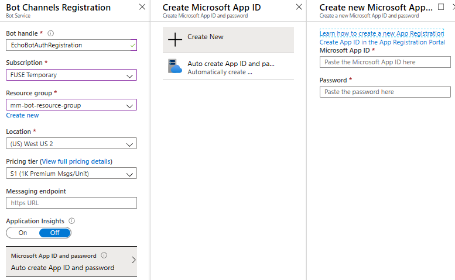
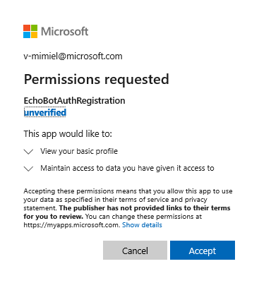
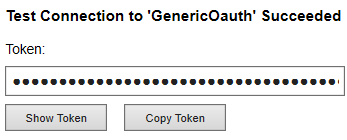
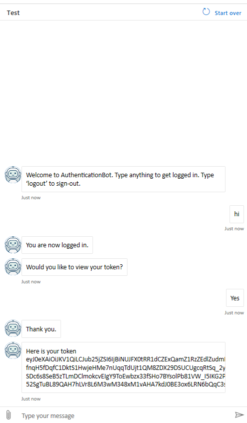

# Add authentication to your bot using generic authentication providers

[!INCLUDE [applies-to-v4](../includes/applies-to.md)]

The Azure Bot Service v4 SDK facilitates the development of bots that can access online protected resources which require authentication. You do not need to manage token exchange or storage. Azure does it for you using OAuth2 to generate a token, based on user's credentials. The bots use the token to access the resources. In this way, the user does not have to provide ID and password to a third party app (bot) to access a protected resource.

Here is a good [OAuth overview](https://aaronparecki.com/oauth-2-simplified/) that's easier to follow than the formal [OAuth specification](https://oauth.net/2/).

See also [User authentication within a conversation](bot-builder-concept-authentication.md).

## Overview

This article describes how to add authentication to a bot to obtain the **authentication token**. The bot can then use the token to access a protected resource to perform operations on behalf of the user. The article shows the use of generic identity providers, specifically:

- **Generic OAuth 2**. It can be used to access any protected resource which support a generic OAuth 2 identity provider with similar expectations as Azure Active Directory (AAD), particularly AAD v2. It requires a limited number of configuration parameters to fill because the query strings and request body payloads are fixed.

- **OAuth 2 Generic Provider**. It can be used to access any protected resource which support a generic OAuth 2 identity provider. It requires the most configuration parameters to fill. With this configuration you specify the URL templates, the query string templates, and the body templates for authorization, refresh, and token conversion.

## Prerequisites

- Knowledge of [bot basics][concept-basics], [managing state][concept-state], the [dialogs library][concept-dialogs], how to [implement sequential conversation flow][simple-dialog], and how to [reuse dialogs][component-dialogs].
- Knowledge of Azure and OAuth 2.0 development.
- Visual Studio 2017 or later, Node.js, npm, Csharp, Python 3.6.4, and git.
- One of the samples shown below.

    | Bot authentication| BotBuilder version | Demonstrates |
    |:---|:---:|:---|
    |[CSharp][cs-auth-sample] or [JavaScript][js-auth-sample] or [Python][python-auth-sample]| v4 | OAuthCard support |

## Create the bot channels registration in Azure

You can skip this section if you already have a registration.

1. In your browser navigate to the [Azure portal][azure-portal].
1. In the left panel, click **Create a resource**.
1. In the right panel selection box enter "bot". Select **Bot Channels Registration** card from the drop-down list.
1. Click **Create**.
1. You'll be asked to provide the following information:
    1. **Name**. Enter tne name for the app registration. For example,  *EchoBotAuthRegistration*.
    1. **Subscription**. You can use an existing subscription.
    1. **Resource Group**. Select a group available to you or create one.
    1. **Region**. Select a region closest to you.
    1. **Pricing Tier**. Make sure that *Standard S1* is selected. This should be the default value.
    1. **Messaging endpoint**. Leave it blank for now. You will insert the correct value after you have deployed the bot application. The following picture shows an example of the registration settings:

         


### Get the bot channels registration credentials

1. In the previous panel, click **Microsoft App ID and password**.
1. In the *Create Microsoft App ID* panel, click **Create New**.
1. In the *Create new Microsoft App...* panel, click **Create App ID in the App Registration Portal** link.

    

1. In the displayed *App registration* window, click the **New registration** tab in the upper left.
1. Enter the name of the bot application you are registering. We used *EchoAuthBotRegistration* but you need to select your own unique name.
1. For the **Supported account types** select *Accounts in any organizational directory (Any Azure AD directory - Multitenant) and personal Microsoft accounts (e.g. Skype, Xbox)*.
1. Click the **Register** button. Once completed, Azure displays the Overview page for the application.
1. Copy the **Application (client) ID** value and save it in a file.
1. In the left panel, click **Certificate and secrets**.
1. In the right panel, under *Client secrets*, click **New client secret**.
1. Add a description to identify this secret from others you might need to create for this app.
1. Set **Expires** to your selection.
1. Click **Add**.
1. Copy the client secret and save it in a file.
1. Go back to the Bot Channel Registration window and copy the **App ID** and the **Client secret** in the *Microsoft App ID* and *Password* boxes, respectively.
1. Click **OK**.
1. Finally, click **Create**.

After Azure has created the bot channels registration resource, it will be included in the resource group list.

## Create OAuth connection

This section shows how to create an OAuth connection the bot can use to access a protected resource.
> [!WARNING]
> To use the example listed previously and get some concrete results, we are going to use an Active Directory application to obtain Client ID and Client secret to configure the connection. In a real world situation, you would use your own application.

1. In the [Azure portal][azure-portal] left panel, click **Azure Active Directory**.
1. In the displayed blade, select **App registrations**.
1. In the right panel, click the **New Registration** tab.
1. Enter the required information.
    1. The **name** of the application.
    1. For the **Supported account types**, select the multi-tenant type.
    1. For the **redirect URL**
        1. Select **Web**.
        1. Set the URL to: `https://token.botframework.com/.auth/web/redirect`.
1. Click the **Register** button. Azure displays the app *Overview* page.
1. Copy the **Application (client) ID** value and save it in a file. Y
1. In the right panel blade, click **Certificates & secrets**.
1. In the Client secrets, click the **New client secret** button.
1. Click the **New client secret** button.
1. Add the description, select the expiration time.
1. Click the **Add** button. This generates a new password. Copy it and save it in a file.

You will use the saved values in the bot registration to configure the connection between the bot and the protected resource.

### Select identity provider and configure the connection

The connection settings require the selection of an identity service provider.  The next sections show you how to configure the connection for **Generic Oauth2** and **Oauth2 Generic Provider**.

#### Generic OAuth 2

This identity service provider can be used with any generic OAuth2 service that has similar expectations as Azure Active Directory provider,particularly AADv2. It has a limited number of properties because the query strings and request body payloads are fixed. For the values you enter, you can see how parameters to the various URls, query strings, and bodies are in curly braces.

1. In the left panel, click **All resources**.  In the right panel, search for the Azure registration app created earlier. Click on the name (link) of the app.
1. In the displayed panel on the left, click **Settings**.
1. In the displayed panel on the right, at the bottom under **OAuth Connection Settings**, click the **Add Setting** button.
1. The **New Connection Setting** panel is displayed. Enter the following information:

<!--    [!INCLUDE [generic-oauth2-settings](../includes/authentication/auth-generic-oauth2-settings.md)] -->

<!-- Generic Oauth2 provider settings -->
| **Property** | **Description** | **Value** |
|---|---|---|
|**Name** | The name of your connection | \<Your name for the connection\> |
| **Service Provider**| Identity provider | From the drop-down list, select **Generic Oauth 2** |
|**Client id** | Azure AD authentication app ID| \<Value recorded earlier\> |
|**Client secret** | Azure AD authentication app secret| <Value recorded earlier\> |
|**Authorization URL** | | https://login.microsoftonline.com/common/oauth2/v2.0/authorize |
|*Authorization URL Query String* | | *?client_id={ClientId}&response_type=code&redirect_uri={RedirectUrl}&scope={Scopes}&state={State}* |
|**Token URL** | | https://login.microsoftonline.com/common/oauth2/v2.0/token |
|*Token Body* | Body to send for the token exchange | *code={Code}&grant_type=authorization_code&redirect_uri={RedirectUrl}&client_id={ClientId}&client_secret={ClientSecret}* |
|**Refresh URL** | | https://login.microsoftonline.com/common/oauth2/v2.0/token |
|*Refresh Body Template* | Body to send with the token refresh | *refresh_token={RefreshToken}&redirect_uri={RedirectUrl}&grant_type=refresh_token&client_id={ClientId}&client_secret={ClientSecret}* |
|**Scopes** | Comma separated list of the API permissions you granted earlier to the Azure AD authentication app | Values such as **openid, profile, Mail.Read, Mail.Send, User.Read, User.ReadBasic.All**|


1. Click the **Save** button.

#### OAuth 2 generic provider

This identity service provider can be used with any generic OAuth 2 service provider and has the most flexibility, but requires the most configuration parameters. With this configuration you specify the URL templates, the query string templates, and the body templates for authorization, refresh, and token conversion. For the values you enter, you can see how parameters to the various URls, query strings, and bodies are in curly braces {}.

1. In the left panel, click **All resources**.  In the right panel, search for the Azure registration app created earlier. Click on the name (link) of the app.
1. In the displayed blade, click **Settings**.
1. In the displayed panel on the right, at the bottom under **OAuth Connection Settings**, click the **Add Setting** button.
1. The **New Connection Setting** panel is displayed. Enter the following information:

  <!--  [!INCLUDE [generic-provider-oauth2-settings](../includes/authentication/auth-generic-provider-oauth2-settings.md)] -->

1. Click the **Save** button.

### Test your connection

1. In the *Settings* pane, at the bottom of the page, click on the connection entry to open the connection you just created.
1. Click **Test Connection** at the top of the *Service Provider Connection Setting* pane. The first time, this opens a new browser window listing the permissions your registration app is requesting and prompt you to accept.

    

1. Click **Accept**. This redirects you to a **Test Connection to "your-connection-name" Succeeded** page.

    

You can now use this connection name in your bot to obtain the authentication token.

## Prepare the bot code

You will need your bot channel registration app ID and password to complete this process.

# [C#](#tab/csharp)

1. Clone from the github repository the sample you want to work with: [**Bot authentication**][cs-auth-sample].
1. Update **appsettings.json**:

    - Set `ConnectionName` to the name of the OAuth connection setting you added to your bot channels registration.
    - Set `MicrosoftAppId` and `MicrosoftAppPassword` to your bot's app ID and app secret.

      Depending on the characters in your bot secret, you may need to XML escape the password. For example, any ampersands (&) will need to be encoded as `&amp;`.

    [!code-json[appsettings](~/../botbuilder-samples/samples/csharp_dotnetcore/18.bot-authentication/appsettings.json)]

# [JavaScript](#tab/javascript)

1. Clone from the github repository you want to work with: [**Bot authentication**][js-auth-sample].
1. Update **.env**:

    - Set `connectionName` to the name of the OAuth connection setting you added to your bot.
    - Set `MicrosoftAppId` and `MicrosoftAppPassword` values to your bot's app ID and app secret.

      Depending on the characters in your bot secret, you may need to XML escape the password. For example, any ampersands (&) will need to be encoded as `&amp;`.

    [!code-txt[.env](~/../botbuilder-samples/samples/javascript_nodejs/18.bot-authentication/.env)]

# [Python](#tab/python)

1. Clone the sample [**Bot authentication**][python-auth-sample] from the github repository.
1. Update **config.py**:

    - Set `ConnectionName` to the name of the OAuth connection setting you added to your bot.
    - Set `MicrosoftAppId` and `MicrosoftAppPassword` to your bot's app ID and app secret.

      Depending on the characters in your bot secret, you may need to XML escape the password. For example, any ampersands (&) will need to be encoded as `&amp;`.

    [!code-python[config](~/../botbuilder-python/samples/python/18.bot-authentication/config.py)]

---

### Deploy the bot

After you have completed the configuration, you are ready to deploy the bot to Azure. For information about deployment, see [Deploy your bot](../bot-builder-deploy-az-cli.md).

At the end of the deployment In your default browser, copy and save the bot App service URL (end point) where the bot is running. This URL has the format: `https://<your_bot_hostname>`. For example, `https://echoauthbot.azurewebsites.net/`
You must assign this URL in the Azure bot channels registration **Settings** in the **Messaging endpoint** box. The URL has the following format: `https://<your_bot_hostname>/api/messages`.  For example, `https://echoauthbot.azurewebsites.net/api/messages`.

## Test the deployed bot

1. In your browser, navigate to the [Azure portal][azure-portal].
1. In the left pane, select **All Resources**.
1. In the right panel find your **Bot channels registration**.
1. Click the link. The related bot page is displayed.
1. In the left panel, click **Test in Web Chat**. The bot starts and displays the predefined greetings.
1. Type anything to login. This is where OAUth comes into play to authenticate the bot based on the user's credentials.
1. Follow the log in steps.
1. Enter any of the allowed commands to test the bot. The following picture shows the output.

    

1. At the end enter **logout**. Click **OK**.
1. If you want to repeat the test, you must *login* again.

## Appendix

### Deploy a bot using the Azure Command-Line Interface (CLI)

This section describes how to deploy a bot to Azure using
the [Azure Command-Line Interface](https://docs.microsoft.com/en-us/cli/azure/?view=azure-cli-latest) (CLI).


You can run the steps shown next in Visual Studio code.

#### Csharp

1. In a command terminal, navigate to the project diectory.
For example: C:\Users\v-mimiel\aWork\GitHub\BotBuilder-Samples\samples\csharp_dotnetcore\18.bot-authentication,

1. Log into Azure portal.

    ```cmd
    az login
    ```

1. Set subscription.

    ```cmd
    az account set --subscription "FUSE Temporary"
    ```

1. Create the bot channels registration. Then copy the app id and password obtained and save them in a file  to use in the next step.

    ```cmd
    az ad app create --display-name "EchoBotAuthReg" --password "@mm-authentication-bot-22499" --available-to-other-tenants
    ```

1. Set the deployment using ARM template, service plan and resource group. Copy the subscription id obtained to use in the next step.

    ```cmd
    az deployment create --name "EchoBotAuthReg" --template-file "C:\Users\v-mimiel\aWork\GitHub\BotBuilder-Samples\samples\csharp_dotnetcore\18.bot-authentication\DeploymentTemplates\template-with-new-rg.json" --location "westus" --parameters appId="71bc5ebc-84f3-4062-a39a-c7b954a544ff" appSecret="@mm-authentication-bot-22499" botId="EchoBotAuthReg" botSku=F0 newAppServicePlanName="mm-bot-service-plan" newWebAppName="EchoBotAuthWebApp" groupName="mm-bot-resource-group" groupLocation="westus" newAppServicePlanLocation="westus"
    ```

1. Optionally, check app Id and password.

    ```cmd
    az webapp config appsettings list -g mm-bot-service-group -n EchoBotAuthRegWebApp --subscription 174c5021-8109-4087-a3e2-a1de20420569
    ```

1. Before deploying the bot you must do the following:
    1. Create an identity provider application via the [Azure portal][azure-portal]  name it `EchoBotAuthIdentity`.
    1. Create a connection using the identity provider app Id and client secret and using one of the OAuth generic settings.
    1. Add this connection to the bot channels registration.
    1. Add the the bot channel registration app id, client secret and the name of the connection to the `appsettings.json` file.

1. Create a deployment file within the bot project folder:

    ```cmd
    az bot prepare-deploy --lang Csharp --code-dir "." --proj-file-path "EchoBot.csproj"This produces a .deployment file in the project directory.
    ```

1. In the project directory zip up all the files and folders. This produces an `<ProjectName>.zip`. file.

1. `Deploy the zip file:

    ```cmd
    az webapp deployment source config-zip --resource-group "mm-echo-bot-deployment-group" --name "mm-echo-bot-deploy-cli" --src "<ProjectName>.zip"
    ```

1. If you change the code you must repeat steps 5 to 7.

1. Deploy the bot
az webapp deployment source config-zip --resource-group "mm-bot-service-group" --name "EchoBotAuthenticationApp" --src "`<ProjectName>.zip`"


[!INCLUDE [oauth-prompt-to-get-token](../includes/authentication/oauth-prompt-to-get-token.md)]

[!INCLUDE [auth-webchat-directline-security-considerations](../includes/authentication/auth-webchat-directline-security-considerations.md)]

## See also

- [User authentication within a conversation][concept-authentication]
- [Add authentication to your bot via Azure Bot Service using Active Directory provider][user-authentication-aad-provider]
- [Authentication connector service][connector-rest-authentication]
- [Bot Framework additional resources](https://docs.microsoft.com/azure/bot-service/bot-service-resources-links-help). Additional information and support for developing bots with the Bot Framework.
- The [Bot Framework SDK](https://github.com/microsoft/botbuilder). Comprehensive information about repository samples, tools, and specs associated with the Bot Builder SDK.

<!-- Footnote-style links -->

[azure-portal]: https://ms.portal.azure.com

<!-- Related articles -->
[concept-authentication]: bot-builder-concept-authentication.md
[connector-rest-authentication]: ../rest-api/bot-framework-rest-connector-authentication.md
[user-authentication-aad-provider]: bot-builder-authentication.md

<!-- Bot conceptual articles -->
[concept-basics]: bot-builder-basics.md
[concept-state]: bot-builder-concept-state.md
[concept-dialogs]: bot-builder-concept-dialog.md

<!-- Dialogs -->
[simple-dialog]: bot-builder-dialog-manage-conversation-flow.md
[component-dialogs]: bot-builder-compositcontrol.md

<!-- broken link
[dialog-prompts]: bot-builder-prompts.md
-->

<!-- Code samples -->
[cs-auth-sample]: https://aka.ms/v4cs-bot-auth-sample
[js-auth-sample]: https://aka.ms/v4js-bot-auth-sample
[python-auth-sample]: https://aka.ms/bot-auth-python-sample-code
[cs-teams-auth-sample]:https://aka.ms/cs-teams-auth-sample
[js-teams-auth-sample]:https://aka.ms/js-teams-auth-sample
[teams-activity-feed]:[https://aka.ms/teams-activity-feed