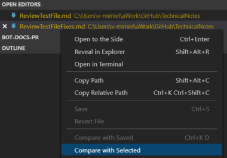

# Authoring Notes

Sparse authoring notes and more.

[How to Write Good](https://www.plainlanguage.gov/resources/humor/how-to-write-good/)

## Markdown

The following topics describe **markdown** used at Microsoft.

- [How to use Markdown](https://review.docs.microsoft.com/en-us/help/contribute/contribute-how-to-write-use-markdown?branch=master)
- [Markdown Reference for OPS](https://review.docs.microsoft.com/en-us/help/contribute/markdown-reference?branch=master).  Markdown extensions designed to provide richer content in docs.microsoft.com.
- [How to include code in docs](https://review.docs.microsoft.com/en-us/help/contribute/code-in-docs?branch=master)
- [VS Code Open In Browser](https://www.bing.com/videos/search?q=preview+visual+code+markdown+in+default+browser&view=detail&mid=C816AE112B86E16599DEC816AE112B86E16599DE&FORM=VIRE)

## GitHub

### Getting Started

1. Download and install GitHub desktop client at: https://desktop.github.com/ 
1. Clone https://github.com/Microsoft/BotBuilder-Samples/ 
1. Clone https://github.com/MicrosoftDocs/bot-docs-pr/  
1. Download  and install Visual Studio (community version 2017 or higher)
    1. Install ASP.NET and web developer workload. Check  the Visual Studio Installe. 
1. Download [Bot Framework v4 SDK Templates](https://marketplace.visualstudio.com/items?itemName=BotBuilder.botbuilderv4) for Visual Studio. 
    1. After the download click the .vsix file to install the extension into Visual Studio. 

### Branches

1. In GitHub select the **repository** where to create the branch.
1. Assure that **master** is selected.
1. In the Branch master button, upper left, click the down arrow. 
1. In the popup dialog, enter the name of the branch.
1. Click the **Create branch** button.

    

1. Open your GitHub desktop client, switch to the branch just created.
1. Clone the master branch into the new branch.
1. Start working in this branch.
1. When you reach a meaningful stage, commit the work to the branch.
1. Click the **Push origin** button.
1. Click the **Create pull request** button. This opens the remote GitHub *Open a pull requet* page. 

    

1. Enter the needed comments (you can change them later). 
1. Enter the assignees.
1. Enter/create related label such as WIP. 
1. Click the **Create pull request** button. The related pull request page is displayed.

   

1. Keep the pull request open to continue the work in the branch.

## Review Process

The review process is a crucial step when authoring a document. This section describes a possible way to proceed.
We assume that you are using Visual Studio Code to author markdown articles.
For more information see [How to Compare files in Visual Studio Code ?](https://dailydotnettips.com/how-to-compare-files-in-visual-studio-code/).

1. Open Visual Studio Code.
1. Author the article. We'll use this file as an example: [Review Test File](ReviewTestFile.md).
1. Save the file.
1. Copy the file and mail it for review.
1. We have made some fictitious changes you can see here: [Review Test File Fixes](ReviewTestFileFixes.md).
This file contains the review changes that you need to incorporate in the original file. You might reject the changes, by the way.  
1. Open both the original and the reviewed files.
1. In the explorer pane, right click on the name of the original file. In the drop-down select **Select for compare**.

1. In the explorer pane, right click on the name of the reviewed file. In the drop-down select **Compare with Selected**.

## Create Class Diagrams

You can create class diagrams in VS2019 using the code map tool. For more information,see [Map dependencies with code maps](https://docs.microsoft.com/en-us/visualstudio/modeling/map-dependencies-across-your-solutions?view=vs-2019).

In order to have the **Architecture** tab in the task bar do the following: 

1. Go to **Tools->Get Tools and Featutres...**
1. Click the **Individual components** tab
1. In the *Code tools* section, check **Live Dependency Validation**

## Bot Core Content

- [Docs contributor guide](https://review.docs.microsoft.com/help/contribute/index?branch=master)
- [Onboarding & admin guide](https://review.docs.microsoft.com/help/onboard/?branch=master)

## Tools

- [Capture popup menus with the Windows Snipping tool](https://pandlbisset.wordpress.com/2015/09/12/capture-popup-menus-with-the-windows-snipping-tool/)
- [Start a chat in Teams](https://support.office.com/en-us/article/Start-a-chat-in-Teams-0c71b32b-c050-4930-a887-5afbe742b3d8)
- [How to: Add class diagrams to projects](https://docs.microsoft.com/en-us/visualstudio/ide/class-designer/how-to-add-class-diagrams-to-projects?view=vs-2019)
  - [How to add a Class Diagram to an ASP.NET Core project in VS 2017?](https://stackoverflow.com/questions/52760190/how-to-add-a-class-diagram-to-an-asp-net-core-project-in-vs-2017/53799840#53799840)
  - [Class Diagrams in VS 2017](https://stackoverflow.com/questions/42233831/class-diagrams-in-vs-2017)
- [Lorem Ipsum generator](https://lipsum.com/)
- [Visual Studio Code](https://code.visualstudio.com/Download)
- [Map dependencies with code maps](https://docs.microsoft.com/en-us/visualstudio/modeling/map-dependencies-across-your-solutions?view=vs-2019)
- [Markdown Here](https://github.com/adam-p/markdown-here)
  - [Markdown Cheatsheet](https://github.com/adam-p/markdown-here/wiki/Markdown-Cheatsheet)
- [Bot Framework Doc Contributor Guide](https://github.com/MicrosoftDocs/bot-docs-pr/tree/master/contributor-guide)

<!-- Testing. See Testing a Bot Using the Bot Framework Emulator section
Deploying. See Deploy a Bot to Azure section.
Knowledge of ASP.Net Core and asynchronous programming in C# -->
