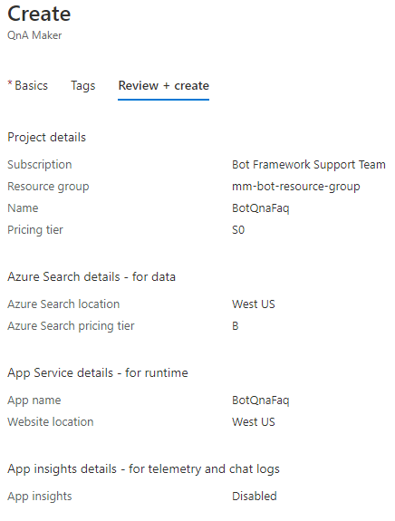

# Bot Cognitive AI

## Overview

The [Bot Framework](https://dev.botframework.com/) provides a platform for developers to build **intelligent conversation agents**, aka **bots**, and connect them via a growing list of **channels** such as Facebook Messenger, Slack, Telegram and an embedded web chat widget.
If combined with the services and APIs offered in [Microsoft Cognitive Services](https://azure.microsoft.com/en-us/services/cognitive-services/), such as [Language Understanding Intelligent Service (LUIS)](https://azure.microsoft.com/en-us/services/cognitive-services/language-understanding-intelligent-service/), bots have the potential to provide rich and useful interactions with users.


## Using QnA maker service to answer questions

The [QnA Maker](https://docs.microsoft.com/azure/cognitive-services/qnamaker/overview/overview) is a Natural Language Processing (NLP) service to find the most appropriate answer for any given natural language input, from the customer's knowledge base (KB) of information.

A **QnA Maker's client** is any conversational application that communicates with a user in natural language to answer a question. Examples of client applications include social media apps, chat bots, and speech-enabled desktop applications.

### Knowledge base

The QnA Maker imports your content into a knowledge base of question and answer pairs. The import process extracts information about the relationship between the parts of your structured and semi-structured content to imply relationships between the question and answer pairs. You can edit these question and answer pairs or add new pairs.

### How to start

1. [Create a **knowledge base**](https://docs.microsoft.com/en-us/azure/cognitive-services/qnamaker/quickstarts/create-publish-knowledge-base#create-your-first-qna-maker-knowledge-base) in the [QnA Maker portal](https://qnamaker.ai/) click **Create a knowledge base** in the top menu bar. Add [files and URLs](https://docs.microsoft.com/en-us/azure/cognitive-services/qnamaker/concepts/content-types) to create the knowledge base.
    1. **Steps 1 - Create a QnA service in Microsoft Azure.**. If needed, click the **Create a QnA service** button to [Create a QnA Maker service](https://docs.microsoft.com/azure/cognitive-services/qnamaker/how-to/set-up-qnamaker-service-azure#create-a-new-qna-maker-service) in the [Azure portal](https://portal.azure.com/).
    This is an example:

        

        Click the **Create** button and wait for the deployment to finish. You should see the *BotQnaFaq* service listed in the resource group.

    1. **Step 2 - Connect your QnA service to your KB.**. I had to toggle between tenants to be able to select the service created in step 1 (in the example *BotQnaFaq*.)

1. Publish your knowledge base and test from your custom endpoint using [cURL or Postman](https://docs.microsoft.com/en-us/azure/cognitive-services/qnamaker/quickstarts/get-answer-from-knowledge-base-using-url-tool).
1. From your client application, programmatically call your knowledge base's endpoint. The client application processes the JSON response to show the best answer to the user.

## Create a QnA Maker knowledge base

1. In your browser, navigate to the [QnA Maker portal](https://qnamaker.ai/).
1. In the top menu bar, click **Create a knowledge base**.
1. If you have already created the QnA Maker service, skip step 1.
1. In step 2 enter the information similar to the following:
    1. Microsoft Azure Directory ID: *Microsoft*.
    1. Azure subscription name: *Bot Framework Support Team*.
    1. Azure QnA service: *myqnamakermm*.
    1. Lanuage: *English*.
1. In step 3 enter the name of your knowledge base for example: *mmtestkb*.
1. In step 4 populate the KB as follows:
    1. Check *Enable multi-turn extraction from URLs, .pdf or .docx files*.
    1. Default answer: *Default answer not found*.
    1. URL: `https://docs.microsoft.com/azure/cognitive-services/qnamaker/troubleshooting`.
    1. Add the FAQ index page URL: `https://docs.microsoft.com/en-us/azure/bot-service/bot-service-resources-bot-framework-faq?view=azure-bot-service-4.0`.
    1. Chit-chat: *Professional*.
1. In step 5 click **Create your KB**.
1. Click the **Save and train** button.
1. Click the **Publish** button.
1. From the Postman or Curl entries copy and save the following values:
    1. POST /knowledgebases/\<knowledge-base-id>/generateAnswer
    1. Host: \<your-hostname>  // NOTE - this is a URL ending in /qnamaker.
    1. Authorization: EndpointKey <qna-maker-resource-key>

## Test QnA with the bot

1. Clone the example [11.qnamaker](https://github.com/microsoft/BotBuilder-Samples/tree/master/samples/csharp_dotnetcore/11.qnamaker).
1. Add the values saved before in the `appsettings.file`:
```json
{
  "MicrosoftAppId": "",
  "MicrosoftAppPassword": "",
  "ScmType": "None",

  "QnAKnowledgebaseId": "knowledge-base-id",
  "QnAAuthKey": "qna-maker-resource-key",
  "QnAEndpointHostName": "your-hostname" // This is a URL ending in /qnamaker
}
```
1. Run the bot locally in Visual Studio and open it in the Emulator.

## References

- [QnA Maker](https://docs.microsoft.com/azure/cognitive-services/qnamaker/overview/overview)
- [Create a **knowledge base**](https://docs.microsoft.com/en-us/azure/cognitive-services/qnamaker/quickstarts/create-publish-knowledge-base#create-your-first-qna-maker-knowledge-base)
- [QnA Maker portal](https://qnamaker.ai/)
- [Tutorial: Use QnA Maker in your bot to answer questions](https://docs.microsoft.com/azure/bot-service/bot-builder-tutorial-add-qna?view=azure-bot-service-4.0&tabs=csharp)
- [Use QnA Maker to answer questions](https://docs.microsoft.com/en-us/azure/bot-service/bot-builder-howto-qna?view=azure-bot-service-4.0&tabs=cs)