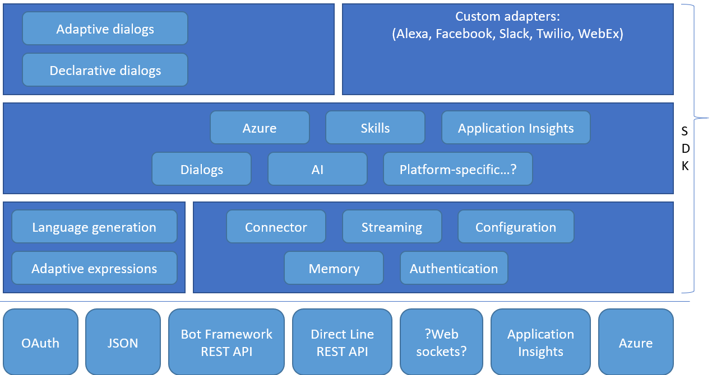

# Bot Framework Architecture

## Overview

The [Bot Framework](https://dev.botframework.com/) provides a platform for developers to build **intelligent conversation agents**, aka **bots**, and connect them via a growing list of **channels** such as Facebook Messenger, Slack, Telegram and an embedded web chat widget.
If combined with the services and APIs offered in [Microsoft Cognitive Services](https://azure.microsoft.com/en-us/services/cognitive-services/), such as [Language Understanding Intelligent Service (LUIS)](https://azure.microsoft.com/en-us/services/cognitive-services/language-understanding-intelligent-service/), bots have the potential to provide rich and useful interactions with users.

A bot is a web app and users interact with it in a conversational way via **text**, **graphics** (such as cards or images), or **speech**.
Every interaction between the user and the bot generates an **activity**.

Typically, a bot is implemented as a **standard Web service which exposes a REST API**. You can implement it with any web technology stack you prefer.
Microsoft provides a [Bot Framework SDK](https://docs.microsoft.com/en-us/azure/bot-service/?view=azure-bot-service-4.0) for .NET (C#} and JavaScript (Node.js).
Both SDKs are free, open source and hosted on GitHub at this location: [botframework-sdk](https://github.com/microsoft/botframework-sdk)
The Bot Framework SDK gives you two primary tools for building your bot.

The **Bot Framework Service**, which is a component of the **Azure Bot Service**, sends information between the user's bot-connected app (channels such as Facebook, Skype, Slack, etc. which we call the channel) and the bot. Each channel may include additional information in the activities they send.

The following picture provides a view of the Microsoft Bot Framework architecture.

## Application layer
Lorem ipsum dolor sit amet, consectetur adipiscing elit. Etiam maximus quam quis suscipit varius. Vestibulum non finibus justo, in convallis massa. Nulla sit amet convallis sem.

## Abstraction layer
Lorem ipsum dolor sit amet, consectetur adipiscing elit. Etiam maximus quam quis suscipit varius. Vestibulum non finibus justo, in convallis massa. Nulla sit amet convallis sem.

## Utility layer
Lorem ipsum dolor sit amet, consectetur adipiscing elit. Etiam maximus quam quis suscipit varius. Vestibulum non finibus justo, in convallis massa. Nulla sit amet convallis sem.

## Bottom Layer
Lorem ipsum dolor sit amet, consectetur adipiscing elit. Etiam maximus quam quis suscipit varius. Vestibulum non finibus justo, in convallis massa. Nulla sit amet convallis sem.