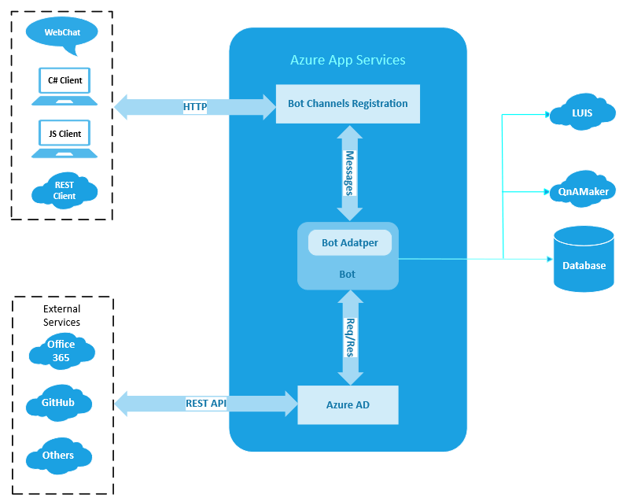
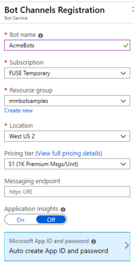
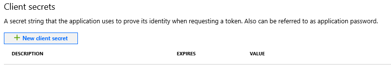
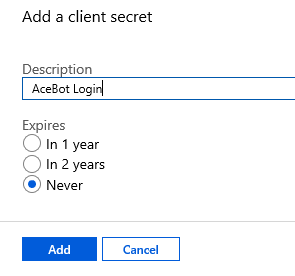
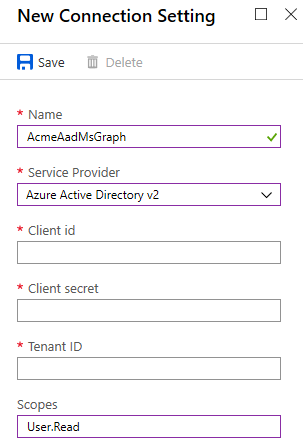
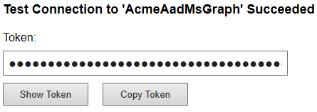

# Add authentication to a bot

This article shows how to use **Azure Bot Service** authentication to develop a bot which can be authenticated by various identity providers such as Azure Active Directory (Azure AD), GitHub and so on.

The example in this article shows how the user can check her emails through a bot which uses the user's email service (MSGraph) API. The bot needs a token, based on the user's credentials, to be able to use the mail service API. 

You can download the code at this location: [Bot Authentication MsGraph](https://aka.ms/v4cs-auth-msgraph-sample).

The current documentation can be found at: [Add authentication to your bot via Azure Bot Service](https://docs.microsoft.com/en-us/azure/bot-service/bot-builder-authentication?view=azure-bot-service-4.0&tabs=aadv1%2Ccsharp%2Cbot-oauth).

In order for a bot to access online resources, via their REST API, the bot must be authenticated (and authorized). This authentication takes the form of a token based on the user's credentials. The user has access to the online resources which the bot will access on her behalf. 

This translated in the following **Azure App Services** architecture:

1. **Bot Channels Registration**. This is the mechanism that allows the   *integration* of a bot with the Azure infrastructure; allowing the bot to communicate with channels for example. The key elements that allow the integration are the following:

    1. **app ID**.
    1. **client secret**.
    1. **bot URL endpoint**.
    1. **authenticated connection**.

1. **Bot**. The bot can be hosted anywhere including Azure. If hosted in Azure, as in the example shown here, you can build an deploy it.

1. **Azure AD (AAD) application**. The Azure AD (AAD) app is needed for each application that you want the bot to be able to authenticate on behalf of the user. This Azure AD app allows your bot to **access an external resource*, such as Office 365 MSGraph. In other words, the AAD is the mechanism to allow the bot to access resources, such as MSGraph, because authenticated based on the user's credentials.

    The following picture shows the architecture of an Azure Bot Service which uses an Azure AD for authentication.

    

## Overview

You will create a sample bot that connects to [Microsoft Graph](https://docs.microsoft.com/en-us/graph/overview) using **Azure AD authentication**. You will use code from a GitHub repository.

- [Create an Azure Bot Service app registration](#Create-an-azure-bot-service-resource-app-registration)
- [Create an Azure AD application](#Create-an-azure-ad-application)
- [Prepare the bot sample code](#prepare-the-bot-sample-code)
- [Use the emulator to test the bot](#use-the-emulator-to-test-the-bot)

The completed bot performs a few simple tasks against an Azure AD application, such as checking and sending an email, or displaying who you are and who your manager is. To do this, the bot will use a token from an Azure AD application against the `Microsoft.Graph` library.

## Create an Azure Bot Service app registration

You need an **Azure Bot Service** app registration to register the bot with Azure and make it available to the users, for example over the web through channels.

To create this resource, you must use one of these approaches:

- **Web Bot App**. If your bot is hosted in Azure. Please, follow the steps described in this article: [Create a bot with Azure Bot Service](https://docs.microsoft.com/en-us/azure/bot-service/abs-quickstart?view=azure-bot-service-4.0).  

- **Bot Channels Registration**. If your bot is not hosted in Azure. Please, follow the steps described in this article: [Register a bot with Bot Service](https://docs.microsoft.com/en-us/azure/bot-service/bot-service-quickstart-registration?view=azure-bot-service-3.0).

      

> [!NOTE] This resource registers your bot's Azure registration credentials. You need these credentials to use the authentication features, even when running your bot code locally.

In this article, we are going to use the  **Bot Channels Registration** approach. Remember to save the app ID and the client secret; you are going to need them to deploy the bot. See section[Prepare the bot sample code](#prepare-the-bot-sample-code).

## Create an Azure AD (AAD) application

Whenever you register a bot in Azure, it gets assigned an Azure AD registration app. However, this app secures channel-to-bot access. You need an additional Azure AD (AAD) app for each application that you want the bot to be able to authenticate on behalf of the user.
This Azure AD app allows your bot to **access an external resource*, such as Office 365 MSGraph. In other words, the AAD is the mechanism to allow the bot to access resources, such as MSGraph, because authenticated based on the user's credentials.

1. In your browser, navigate to the [Azure portal](https://ms.portal.azure.com/). 
1. In the left pane, select **Azure Active Directory**.
1. In the displayed blade, select **App registrations**.
1. In the right panel, click the **New Registration** tab.
1. Enter the required information.
    1. The **name** of the application.
    1. Select one of the **Supported account types**, any value works for this example.
    1. For the **redirect URL**
        1. Select **Web**
        1. Set the URL to: `https://token.botframework.com/.auth/web/redirect`.

      

1. Click the **Register** button. Azure displays the app **Overview** page.
1. Copy the **Application (client) ID** and **Directory (tenant) ID** values. You will use them when you register the Azure AD app with your bot.
1. In the right panel blade, click **Certificates & secrets**.
1. In the *Client secrets*, click the **New client secret** button.

      

1. Enter the following information:
    1. A description to identify this secret from others you might need to create for this app.
    1. Set Expires to **Never**.
    1. Click **Add**.
    1. Copy the secret and store it in a file. You will use this value when you register your Azure AD application with your bot.

          

1. In the right panel blade, click **API permissions**.
1. In the displayed panel **API permissions**, click the **API Permissions** button.
1. In the **Request API permissions** panel on the right, click the **Microsoft APIs** tab and then select **Microsoft Graph**.

       

1. The **Microsoft Graph** link is displayed in the *API Permissions* panel. 
1. Click on the link. In the *Request API permissions* panel on the right, select **Delegate permissions**.

      

    This allows the Azure AD app to be authenticated by OAuth via a token based on the user's credentials.

1. Also, assure to check the box by the following permissions: **openid,
profile, Mail.Read, Mail.Send, User.Read, User.ReadBasic.All**.

1. Click the **Add permissions** button at the bottom of the panel. The following information is displayed:

     

### Register the Azure AD app with the bot

1. In the left pane, click **All resources**.  In the right panel, search for your resource and click on the name (link) of the resource.
1. In the displayed blade, click **Settings**. 
1. In the displayed panel on the right, at the bottom under **OAuth Connection Settings**, click the **Add Setting** button. 
1. The **New Connection Setting** panel is displayed. Enter the following information:
    1. **Name**. This is the name of your connection.
    1. **Service Provider**. From the drop-down list, select **Azure Active Directory v2**. After this selection, the following Azure AD specific fields are displayed: 
    1. **Client Id**. Your Azure AD app Id you recorded earlier.
    1. **Client secret**. The secret you created to grant access to the Azure AD app to your bot.
    1. **Tenant ID**. The directory (tenant) ID you recorded earlier for your Azure AD app. This is the tenant associated with users who can be authenticated.
    1. **Scopes**. For testing purposes enter *User.Read*.
    1. Click the **Save** button.

        

    > [!NOTE]
    > The above values allow the Azure AD app to access Office 365 data via Microsoft Graph API.  

#### Test your connection

1. In the *Settings* pane, at the bottom of the page, click on the connection entry to open the connection you just created.
1. Click **Test Connection** at the top of the *Service Provider Connection Setting* pane. The first time, this should open a new browser tab listing the permissions your app is requesting and prompt you to accept.
1. Click Accept. This should redirect you to a **Test Connection to "your-connection-name" Succeeded** page.

    

You can now use this connection name in your bot code to retrieve user tokens.

## Prepare the bot sample code

1. Clone from the github repository the sample you want to work with: [Bot authentication](https://github.com/Microsoft/BotBuilder-Samples/tree/master/samples/csharp_dotnetcore/18.bot-authentication) or [Bot authentication MSGraph](https://github.com/Microsoft/BotBuilder-Samples/tree/master/samples/csharp_dotnetcore/24.bot-authentication-msgraph). In this article, we are going to use [Bot authentication MSGraph](https://github.com/Microsoft/BotBuilder-Samples/tree/master/samples/csharp_dotnetcore/24.bot-authentication-msgraph).

1. Open the project in Visual Studio.
1. Edit the file `appsettings.json` and assign the following values:
    1. **MicrosoftAppId**. The app Id you saved when you created *Azure Bot Service app registration*.
    1. **MicrosoftAppPassword**. The app secret you saved when you created *Azure Bot Service app registration*.
    1. **ConnectionName**. The name you assigned to the connection when you created the AAD app.
1. Save the `appsettings.json` file.
1. In the *Solution Explorer*, right-click on the project name and select **Publish**.
1. In the displayed dialog, select ****Create New** and then click the **Advanced** link.
1. In the displayed dialog, expand the **File Publish** drop-down and select **Remove additional files and destination**.
1. Click the **Save** button.
1. Click the **Publish** button.
1. In the displayed dialog, enter information similar to the following and then click OK. The bot code is published in the **App Service**.

## Use the emulator to test the bot

## References

-  [Add authentication to your bot via Azure Bot Service](https://docs.microsoft.com/en-us/azure/bot-service/bot-builder-authentication?view=azure-bot-service-4.0&tabs=aadv1%2Ccsharp%2Cbot-oauth)
- [Register a bot with Azure Bot Service](https://docs.microsoft.com/en-us/azure/bot-service/bot-service-quickstart-registration?view=azure-bot-service-3.0&viewFallbackFrom=azure-bot-service-4.0#bot-channels-registration-password)
