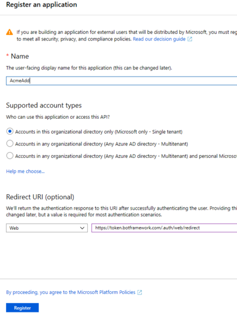
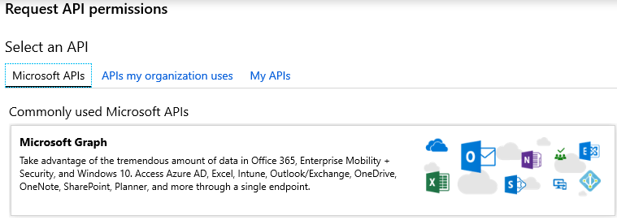
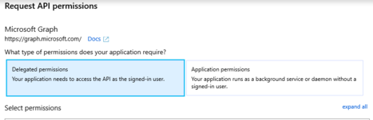
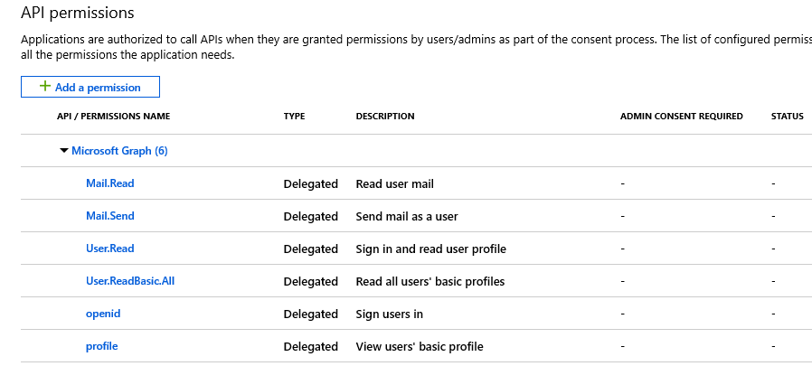

# Add OAuth to a bot

This topic shows how to use **Azure Bot Service** authentication to develop a bot which can be authenticated by various identity providers such as Azure Active Directory (Azure AD), GitHub and so on.

## Overview

You will create a sample bot that connects to [Microsoft Graph](https://docs.microsoft.com/en-us/graph/overview) using **Azure AD authentication**. You will use code from a GitHub repository, and learn how to 

- [Create an Azure Bot Service resource](#Create-an-azure-bot-service-resource)
- [Create an Azure AD application](#Create-an-azure-ad-application)
- [Prepare the bot sample code](#prepare-the-bot-sample-code)
- [Use the emulator to test the bot](#use-the-emulator-to-test-the-bot)

The completed bot performs a few simple tasks against an Azure AD application, such as checking and sending an email, or displaying who you are and who your manager is. To do this, the bot will use a token from an Azure AD application against the `Microsoft.Graph` library.

test

## Create an Azure Bot Service resource

You need an **Azure Bot Service** resource to register the bot with Azure and make it available to the users, for example over the web through channels.

To create this resource, you must use one of these approaches:

- **Web Bot App**. If your bot is hosted in Azure. Please, follow the steps described in this article: [Create a bot with Azure Bot Service](https://docs.microsoft.com/en-us/azure/bot-service/abs-quickstart?view=azure-bot-service-4.0).  
- **Bot Channels Registration**. If your bot is not hosted in Azure. Please, follow the steps described in this article: [Register a bot with Bot Service](https://docs.microsoft.com/en-us/azure/bot-service/bot-service-quickstart-registration?view=azure-bot-service-3.0).

This resource registers your bot's credentials, and you need these credentials to use the authentication features, even when running your bot code locally.

## Create an Azure AD application

Whenever you register a bot in Azure, it gets assigned an Azure AD app. However, this app secures channel-to-bot access. You need an additional AAD app for each application that you want the bot to be able to authenticate on behalf of the user.
This Azure AD app registration allows your bot to access an external resource, such as Office 365.

1. In your browser, navigate to the [Azure portal](). 
1. In the left pane, select **Azure Active Directory**.
1. In the displayed, select **App Registration**.
1. In the right panel, click the **New Registration** tab. 
1. Enter the required information.
    1. The **name** of the application.
    1. Select one of the **Supported account types**, any value works for this example.
    1. For the **redirect URL**
        1. Select **Web**
        1. Set the URL to: `https://token.botframework.com/.auth/web/redirect`.

      

1. Click the **Register** button. Azure displays the app **Overview** page.
1. Copy the **Application (client) ID** and **Directory (tenant) ID** values. You will use them when you register the Azure AD app with your bot.
1. In the right panel blade, click **Certificates & secrets**.
1. In the *Client secrets*, click the **New client secret** button.

      

1. Enter the following information:
    1. A description to identify this secret from others you might need to create for this app, such as bot login.
    1. Set Expires to **Never**.
    1. Click **Add**.
    1. Copy the secret and store it in a file. You will use this value when you register your Azure AD application with your bot.

1. In the right panel blade, click **API permissions**.
1. In the displayed panel **API permissions**, click the **API Permissions** button.
1. In the **Request API permissions** panel on the right, click the **Microsoft APIs** tab and then select **Microsoft Graph**.

       

1. The **Microsoft Graph** link is displayed in the *API Permissions* panel. 
1. Click on the link. In the *Request API permissions* panel on the right, select **Delegate permissions**.

      

    This allows the Azure AD app to be authenticated by OAuth via a token based on the user's credentials.

1. Also, assure to check the box by the following permissions: **openid,
profile, Mail.Read, Mail.Send, User.Read, User.ReadBasic.All**.

1. Click the **Update permissions** button at the bottom of the panel. The following information is displayed:

     

### Register the Azure AD app with the bot

1. In your browser, navigate to the Azure Bot Service resource for your bot.
1. In the left pane, click **All resources**.  In the right panel, search for your resource and click on the name (link) of the resource.
1. In the displayed blade, click **Settings**. 
1. In the displayed panel on the right, at the bottom under **OAuth Connection Settings**, click the **Add Setting** button. 
1. The **New Connection Setting** panel is displayed. Enter the following information:
    1. **Name**. This is the name of your connection.
    1. **Service Provider**. From the drop-down list, select **Azure Active Directory**. After this selection, the following Azure AD specific fields are displayed: 
    1. **Client Id**. Your Azure AD app Id you recorded earlier.
    1. **Client secret**. The secret you created to grant access to the Azure AD app to your bot.
    1. **Grant Type**. Enter `authorization-code`.
    1. **Login URL**. Enter `https://login.microsoftonline.com`.
    1. **Tenant ID**. The directory (tenant) ID you recorded earlier for your Azure AD app. This is the tenant associated with users who can be authenticated.
    1. **Resource URL**. Enter `https://graph.microsoft.com/`.
    1. **Scopes**. Leave it blank.
    1. Click the **Save** button. 
    > [!NOTE]
    > The above values allow the Azure AD app to access Office 365 data via Microsoft Graph API.  

## Prepare the bot sample code

## Use the emulator to test the bot