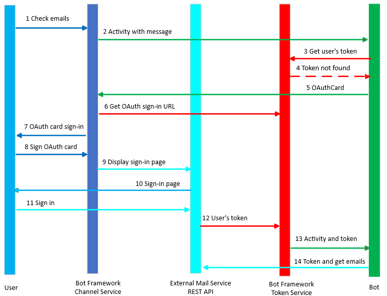

# OAuth in Bot Framework

To perform certain operations on behalf of a user, such as checking email, referencing a calendar, checking on flight status, or placing an order, the bot need to call external service via its REST API.

To secure the call to an external service, the bot must ask the user to sign-in in the service, so it can acquire a user's token, based on the user's credentials, for that service.

Many services support token retrieval via the **OAuth** or **OAuth2** protocol. The Azure Bot Service provides specialized **sign-in cards** and services that work with the OAuth protocol and manage the token life-cycle. A bot can use these features to acquire a user token.

- As part of bot configuration, an **OAuth connection setting** is registered within the Azure Bot Service resource in Azure. Each connection setting contains the following:
  - Information about the external service or identity provider to be used
  - A valid OAuth client id and secret
  - The OAuth scopes to enable
  - Any other connection metadata required by that external service or identity provider.
- In the bot's code, an OAuth connection setting is used to help sign in a user and get a user token.

## Authentication using a bot scenario

Let's assume that the user checks her recent emails through a bot which uses her email service API. The bot needs the user's token to be able to use the API, so this is what happens:

- At design time, the bot developer register an Azure Active Directory application with the **Bot Framework Token Service**, via the Azure Portal.
- Then he configures an **OAuth connection setting**, named *EmailConnection* for example, that the bot will use.

    

The run time workflow is as follows:

1. The user send a message to the bot through the **Bot Framework Channel Service** such as *Check my email, please*. 
1. The *Bot Framework Channel Service* creates ah **activity** which encapsulates the previous message. The channel service assures that the activity `userId` field is set and sends the message to the bot.
     [!NOTE]
    > User ID's are channel specific, such as the user's facebook ID or their SMS phone number.
1. The bot asserts that the *intent* of the user is to check her emails. Then it sends a request to the **Bot Framework Token Service** asking if it already has a **token** for the OAuth *EmailConnection* of the specific `userId`. 
1. Assuming that this is the first time the user interacts with the bot, the token does not exist and the *Bot Framework Token Service* answers with a `NotFound` result to the bot.
1. The bot creates an **OAuthCard** with a connection name, *EmailConnection* in our example, associates it with the activity and send the activity back to the *Bot Framework Channel Service*.  
1. The *Bot Framework Channel Service*, calls into the *Bot Framework Token Service* to create a valid **OAuth sign-in URL** for this request. This sign-in URL is added to the OAuthCard.
1. The *Bot Framework Channel Service* returns the card to the user. The user is presented with a message to sign-in by clicking on the **OAuthCard's sign-in button**.
1. When the user clicks the *sign-in button*, the *Bot Framework Channel Service* opens a **web browser** and calls out to the **External Service** to display its sign-in page.
1. The user accesses the page and signs-in for the *External Service*.
1. The *External Service* completes the *OAuth protocol exchange* with the *Bot Framework Token Service*, resulting in the *External Service* **sending the user token** to the *Bot Framework Token Service*. 
1. The *Bot Framework Token Service* securely stores this token and sends an activity to the bot with the token.
1. The bot upon receiving the activity with the token, uses the token to make calls against the email server API to access the user's emails.
