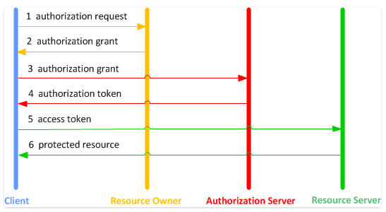
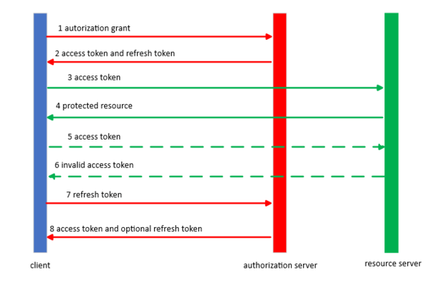

# OAuth in a nutshell

These notes refer to the OAuth 2.0 version, which replaces and obsoletes the OAuth 1.0 protocol. For more information, see [OAuth 2.0](https://oauth.net/2/).

## Overview

OAuth stands for **Open Authentication** and can be defined as an **open standard** for implementing **token-based authentication and authorization**.
The term *open standard* essentially describes a specification that is open to the public and free to be implemented by application developers.

OAuth allows your account information from one application, for example Gmail, to be used by another application for example Linkedin, without having to expose or share the user's credentials between applications. OAuth acts as an intermediary on behalf of the user, negotiating access and authorization between the two applications.

The OAuth 2.0 authorization framework enables a third-party application to obtain limited access to an HTTP service in one of the following ways:

- On behalf of a resource owner by orchestrating an approval interaction between the resource owner and the service.
- By allowing the application to obtain access on its own behalf.

### Authentication vs. Authorization

You'll often hear the two words **authentication** and **authorization** sometimes used interchangeably. They actually have two very different meanings. 

- Authentication answers the question **Who are you?**.
- Authorization answers the question **What are you allowed to do?**.

While the OAuth flow handles authorization and permissions as well, its main emphasis is on the authentication process, where you can essentially "log in" to a third-party without giving away your credentials.

### Token-Based Auth

OAuth is an important part of creating secure applications by acting as an intermediary to negotiate access to other application data. This intermediary role avoids giving away access credentials by providing access tokens instead.

The initial phase of generating a token to identify a user is considered the **authentication handshake**. The term *handshake* is used frequently to describe an authentication mechanism. It simply means that a client is telling a server: *I would like for you to trust me. Here are a couple facts about myself.*
And the server checks and writes down the information received, and says:
*Ok, I trust you on one condition: you must provide me your secret password every time we do business.*
Then the server gives a token to the client that has encoded all of client's information and permission levels. The client can now use this token as a **keycard** to send and receive data from the server. 
 
 ## OAuth 2.0 Roles

1. **Client**. An application making protected resource requests on behalf of the resource owner and with its authorization.  The term client does not imply any particular implementation characteristics (e.g. whether the application executes on a server, a desktop, or other devices).
1. **Resource owner**. An entity capable of granting access to a protected resource. When the resource owner is a person, it is referred to as an end-user.
1. **Authorization server**. The server issuing access tokens to the client after successfully authenticating the resource owner and obtaining authorization.
1. **Resource server**. The server hosting the protected resources, capable of accepting and responding to protected resource requests using access tokens.

> [!NOTE]
> The authorization server may be the same server as the resource server or a separate entity. A single authorization server may issue access tokens accepted by multiple resource servers.

## OAuth 2.0 Protocol Flow
The following diagram shows the interactions between the various roles involved in the authentication and authorization process.

1. The client requests authorization from the resource owner.  The authorization request can be made directly to the resource owner (as shown), or preferably indirectly via the authorization server as an intermediary.
1. The client receives an authorization **grant**, which is a credential representing the resource owner’s authorization, expressed using one of four grant types defined in the OAuth 2.0 specification or using an extension grant type.  The authorization grant type depends on the method used by the client to request authorization and the types supported by the authorization server.
1. The client requests an access token by authenticating with the authorization server and presenting the authorization grant.
1. The authorization server authenticates the client and validates the authorization grant, and if valid issues an **access token**.
1. The client requests the protected resource from the resource server and authenticates by presenting the access token.
1. The resource server validates the access token, and if valid, serves the request.

### Terminology

- **Authorization Grant**. An authorization grant is a credential representing the resource owner’s authorization to access its protected resources. A client uses the grant to obtain an access token. The OAuth 2.0 specification defines the following grant types:
  - **Authorization code**. The authorization code is obtained by using an authorization server as an intermediary between the client and the resource owner.
  - **Implicit**.The implicit grant is a simplified authorization code flow optimized for clients implemented in a browser using a scripting language such as JavaScript.
  - **Resource owner password credentials**. The resource owner password credentials (i.e. username and password) can be used directly as an authorization grant to obtain an access token.
  - **Client credentials**.The client credentials (or other forms of client authentication) can be used as an authorization grant when the authorization scope is limited to the protected resources under the control of the client, or to protected resources previously arranged with the authorization server.
- **Access Token**. Access tokens are credentials used to access protected resources. An access token is a string representing an authorization issued to the client. The string is usually opaque to the client. Tokens represent specific scopes and durations of access, granted by the resource owner, and enforced by the resource server and authorization server.
- **Refresh Token**. Refresh tokens are credentials used to obtain access tokens. Refresh tokens are issued to the client by the authorization server and are used to obtain a new access token when the current access token becomes invalid or expires, or to obtain additional access tokens with identical or narrower scope (access tokens may have a shorter lifetime and fewer permissions than authorized by the resource owner). Issuing a refresh token is optional at the discretion of the authorization server.

### More About Refresh Token

If the authorization server issues a refresh token, it is included when issuing an access token. A refresh token is a string representing the authorization granted to the client by the resource owner. The string is usually opaque to the client. The token denotes an identifier used to retrieve the authorization information. Unlike access tokens, refresh tokens are intended for use only with authorization servers and are never sent to resource servers.

1. The client requests an access token by authenticating with the authorization server, and **presenting an authorization grant**.
1. The authorization server authenticates the client and validates the authorization grant, and if valid issues an **access token and a refresh token**.
1. The client makes a protected resource request to the resource server by presenting the access token.
1. The resource server validates the access token, and if valid, serves the request.
1. Steps 3 and 4 repeat until the access token expires. If the client knows the access token expired, it skips to step 7, otherwise it makes another protected resource request.
1. Since the access token is invalid, the resource server returns an invalid token error.
1. The client requests a new access token by authenticating with the authorization server and presenting the refresh token. The client authentication requirements are based on the client type and on the authorization server policies.
1. The authorization server authenticates the client and validates the refresh token, and if valid issues a new access token (and optionally, a new refresh token).

## References

- [OAuth 2.0](https://oauth.net/2/). Standard specification for allowing end users to securely authorize a client to access protected server-side resources.
- [OAuth 2.0 bearer token](https://tools.ietf.org/html/rfc6750). Specification which explains how to access those protected resources using an access token granted during the cient authorization process.
- [0Auth 2.0 Videos](https://www.youtube.com/watch?v=LRNg4tDtrkE)
- [Intro to OAuth and Why You Should Just Use Firebase or Auth0](https://frontend.turing.io/lessons/module-4/oauth/index.html)
- [API Keys vs OAuth Tokens vs JSON Web Tokens](https://zapier.com/engineering/apikey-oauth-jwt/)