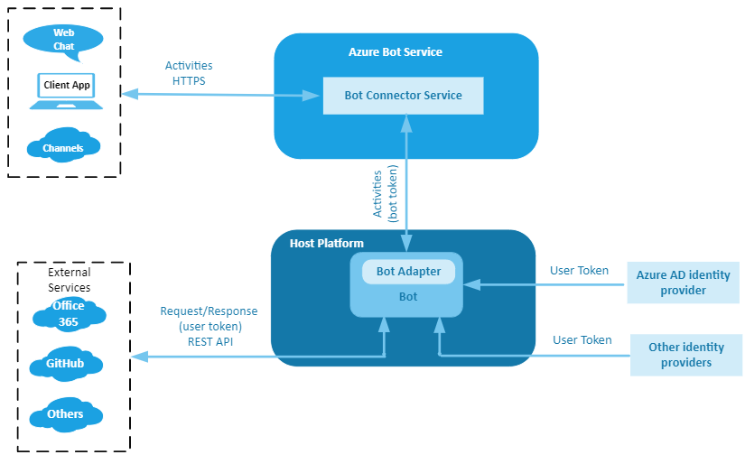

# Follow the token

## Overview

In the Bot Framework, two broad authentication categories exist: **bot authentication** and **user authentication**. Each has an associated **token** to allow access to secured resources. The following figure shows the elements involved in both bot and user authentication.

## Bot authentication

A bot is identified by the **MicrosoftAppID** and **MicrosoftAppPassword** which are kept within the bot's settings files: `appsettings.json` (.NET), `.env` (JavaScript), `config.py` (Python), or the **Azure Key Vault**. For more information, see [MicrosoftAppID and MicrosoftAppPassword](https://docs.microsoft.com/azure/bot-service/bot-service-manage-overview?view=azure-bot-service-4.0#microsoftappid-and-microsoftapppassword).

When you register a bot with Azure, for example via the **Bot Channels Registration**, Azure creates an Active Directory registration application if you perform the registration using the Azure portal. If you use the CLI, you must create it in a separate step. The registration application has an application ID (`MicrosoftAppID`) and client secret (`MicrosoftAppPassword`). These values are used to generate a **token** to allow the bot to access secure resources.

When a channel sends a request to a bot, via the Bot Connector service, it specifies a **token** in the **Authorization header** of the request. The bot authenticates calls from the Bot Connector service by verifying the authenticity of the token.

For more information, see [Authenticate requests from the Bot Connector service to your bot](https://docs.microsoft.com/en-us/azure/bot-service/rest-api/bot-framework-rest-connector-authentication?view=azure-bot-service-4.0#connector-to-bot).

When the bot sends a request to a channel via the **Bot Connector service**, it must specify the **token** in the **Authorization header** of the request.
All requests must include the access token which is verified by the Bot Connector service to authorize the request.

For more information, see [Authenticate requests from your bot to the Bot Connector service](https://docs.microsoft.com/en-us/azure/bot-service/rest-api/bot-framework-rest-connector-authentication?view=azure-bot-service-4.0#bot-to-connector).

The described operations are automatically performed by the Bot Framework SDK.

### Channels

Channels communicate with a bot via the **Bot Connector service** this means that the previous authentication principles generally apply. You may want to notice the specific characteristics of the channels described next.

#### Direct Line

Besides the standard supported channels, a client application can communicate with a bot using the Direct Line channel.

The client application authenticates requests to Direct Line ( version 3.0) either by using a **secret** obtained from the [Direct Line channel configuration](https://docs.microsoft.com/en-us/azure/bot-service/bot-service-channel-connect-directline?view=azure-bot-service-4.0) page in the Azure portal or, better, by using a **token** that obtained at runtime. The secret or token are specified in the Authorization header of each request.

> [!NOTE]
> A Direct Line secret is a master key that can be used to **access any conversation** that belongs to the associated bot. A secret can also be used to obtain a token. **Secrets do not expire**.
> A Direct Line token is a key that can be used to **access a single conversation**. **A token expires but can be refreshed**.

For more information, see [Authentication](https://docs.microsoft.com/en-us/azure/bot-service/rest-api/bot-framework-rest-direct-line-3-0-authentication?view=azure-bot-service-4.0).

#### Web Chat

When embedding a Web Chat control in a web page, you can use a either a **secret** or, better, a **token** obtained at runtime.
For more information, see [Connect a bot to Web Chat](https://docs.microsoft.com/en-us/azure/bot-service/bot-service-channel-connect-webchat?view=azure-bot-service-4.0).

When you create a bot with Azure Bot Service, the Web Chat channel is automatically configured to allow testing of the bot.

### Skills

TBD

### Emulator

The emulator has its own authentication flow, and its own tokens.  Emulator tokens, and the validation path for them, are a little different from channel tokens, and skill tokens

## User authentication

At times a bot must access secured online resources on behalf of the user. To do that the bot must be authorized. This is because to perform certain operations such as checking email, checking on flight status, or placing an order, the bot will need to call an external service such as Microsoft Graph, GitHub, or a company's REST service. OAuth is used to authenticate the user and authorize the bot.
The user's identity is used to provide role-based access control, as well as to serve personalized content.

> [!NOTE]
> Two macro-steps are involved for a bot to access a user's resources.
>
> - **Authentication**. The process of verifying the user's identity.
> - **Authorization**. The process of verifying that the bot can access the user's resources.
> If the first step is successful then a token based on the user's credentials is issued. In the second step, the bot uses the token to access the user's resources.

For more information, see [User authentication](https://docs.microsoft.com/en-us/azure/bot-service/bot-builder-concept-authentication?view=azure-bot-service-4.0).

### Identity providers

An identity provider authenticates user or client identities and issues consumable security tokens. It provides user authentication as a service.

Client applications, such as web applications, delegate authentication to a trusted identity provider.

A trusted identity provider does the following:

- Enables single sign-on (SSO) features, allowing an application to access multiple secured resources.
- Facilitates connections between cloud computing resources and users, decreasing the need for users to re-authenticate.

Notice that user's authentication is performed by a channel using an identity provider specific to the channel. For more information, see [Identity providers](https://docs.microsoft.com/en-us/azure/bot-service/bot-builder-concept-identity-providers?view=azure-bot-service-4.0&tabs=adv1%2Cga2).

> [!NOTE]
> The token issued during **Bot authentication** is not the same token issued during **User authentication**. The first is used to establish secure communication between a bot, channels and, ultimately, client applications. The second is used to authorize the bot to access secured resource on behalf of the user.

<!--
**Questions**
- [x] Q1: Are the channels the only way to interact with a bot? No!

    - The user can interact with a bot via channels (**channel token**).
    - You can connect the bot to a custom app by using the **Direct Line channel** (**channel token**).
    - You can use skills to interact with a bot (**skills token**)
    - Even if you are using most of the Bot Framework you could still potentially build a bot that could be accessed through its endpoint directly (**no token**).
    - The emulator has its own auth flow, and its own tokens.  (**emulator token**)

- [x] Q2: As corollary to the first question, is the bot connector the only way to *connect* to a bot? What is its relevance in authentication?
- [x] Q3: What is the role of the adapter? What is its relevance in authentication?

    - The channel connector services are separate web services from the bot running on separate servers and hosted by Microsoft. They forward messages from third-party channels to the bot.
    If you do use the channel connector services then the bot will receive Bot Framework activities. The Bot Framework adapter used in that case will not need to translate the incoming messages into Bot Framework activities because the channel connector services will have already done that translation, so the Bot Framework adapter just creates a turn context, etc.
    - A channel adapter will allow your bot to receive messages from a third-party channel directly.
    The channel adapters like the Slack adapter need to do everything the Bot Framework adapter does and also translate the incoming Slack messages into Bot Framework activities on top of that.
-->
<!--
## Appendix

### Definitions

- **Bot framework service**. The framework is an Azure cloud service and *translates* the data from the APIs of multiple channels into the bot framework protocol in a form that a bot understands. This allows the bot to communicate with multiple channels, without having to understand which channel the data is coming from. The framework handles both inbound and outbound requests.
- **Bot connector service**. This Azure cloud service forwards information from a bot to a channel (user) in the form of activity objects. When a bot sends a request to the connector service, it must include information that the connector service can use to **verify its identity**. The connector handles only outbound requests.
- **Bot framework adapter**. The bot adapter encapsulates **authentication processes** and sends activities to and receives activities from the bot connector service. When a bot receives an activity, the adapter creates a turn context object, passes it to the bot application logic, and sends responses back to the connector (user's channel).
- **Middleware**. The adapter processes and directs incoming activities through the bot middleware pipeline to the bot logic and then back out again. As each activity flows in and out of the bot, each piece of middleware can inspect or act upon the activity, both before and after the bot logic runs.

## References

- [Connectors](https://docs.microsoft.com/en-us/connectors/connectors)
- [Create a bot with the Bot Connector service](https://docs.microsoft.com/en-us/azure/bot-service/rest-api/bot-framework-rest-connector-quickstart?view=azure-bot-service-4.0)
- [Authentication](https://docs.microsoft.com/en-us/azure/bot-service/rest-api/bot-framework-rest-connector-authentication?view=azure-bot-service-4.0) as it applies to bot/connector connection
- [BotFrameworkAdapter class](https://docs.microsoft.com/en-us/javascript/api/botbuilder/botframeworkadapter?view=botbuilder-ts-latest)

- [Enterprise-grade conversational bot](https://docs.microsoft.com/azure/architecture/reference-architectures/ai/conversational-bot) - Bot ecosystem
- [The Bot Framework](https://www.ais.com/the-bot-framework/) - Bot architecture simple
- [Bot Framework Service vs Bot Connector Service](https://stackoverflow.com/questions/59984775/bot-framework-service-vs-bot-connector-service)
- [azure bot framework architecture](https://www.google.com/search?rlz=1C1CHBF_enUS858US858&sxsrf=ALeKk02L17FDl9D6GVx2BwVes4VPYdZ5Iw:1599328888923&source=univ&tbm=isch&q=azure+bot+framework+architecture&sa=X&ved=2ahUKEwj09bWyzNLrAhWpIjQIHamNAYgQsAR6BAgKEAE&biw=1920&bih=937#imgrc=N3d6QINPtzp4QM) - Google search

-->