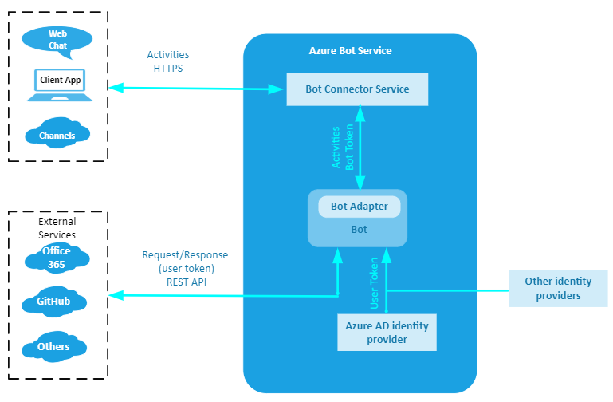

# Follow the token

## Overview

This notes try to shed some light on authentication within the Bot Framework ecosystem.
From the outset let's say that there are 2 broad authentication categories:
**bot authentication** and **user authentication**.
The **token** is a key element applicable to both categories, we intend to *follow the token* to make sense of the authentication intricacies.

## Bot authentication

A bot is identified by the **MicrosoftAppID** and **MicrosoftAppPassword** which are kept within the bot's settings files: `appsettings.json` (.NET), `.env` (JavaScript), `web.config` (Python), or the **Azure Key Vault**. For more information, see [MicrosoftAppID and MicrosoftAppPassword](https://docs.microsoft.com/azure/bot-service/bot-service-manage-overview?view=azure-bot-service-4.0#microsoftappid-and-microsoftapppassword).

**TO DO**
- [ ] Update the article [Connect a bot to channels](https://docs.microsoft.com/azure/bot-service/bot-service-manage-channels?view=azure-bot-service-4.0). Show the connector and mention bot/connector authentication.

### Bot to connector authentication

Register a bot with Azure, for example via the **Bot Channels Registration**. Azure creates an Active Directory registration application. This application has an application ID (`MicrosoftAppID`) and client secret (`MicrosoftAppPassword`). Use these two values to request an **access token**. If the bot is deployed in Azure the two values are used to implicitly generate the token.

When the bot sends a request to the **Bot Connector service**, it must specify the **access token** in the **Authorization header** of the request.
All requests sent to the Bot Connector service must include the access token in the Authorization header. If the token is correctly formed, is not expired, and was generated by the the Azure AD v2 account login service, the Bot Connector service will authorize the request. Additional checks are performed to ensure that the token belongs to the bot that sent the request.

For more information, see [Authenticate requests from your bot to the Bot Connector service](https://docs.microsoft.com/en-us/azure/bot-service/rest-api/bot-framework-rest-connector-authentication?view=azure-bot-service-4.0#bot-to-connector).

### Connector to bot authentication

When the Bot Connector service sends a request to a bot, it specifies a **signed token** in the **Authorization header** of the request. The bot can authenticate calls from the Bot Connector service by verifying the authenticity of the signed token.

For more information, see [Authenticate requests from the Bot Connector service to your bot](https://docs.microsoft.com/en-us/azure/bot-service/rest-api/bot-framework-rest-connector-authentication?view=azure-bot-service-4.0#connector-to-bot).

**TO DO**
- [ ] Rename the article **Connector authentication**.

### Channels

Channels communicate with a bot via the **Bot Connector service** this means that the previous authentication principles generally apply. You may want to notice the particularities of the channels described next.

#### Direct Line

A client application can authenticate requests to Direct Line API 3.0 either by using a **secret** that you obtain from the [Direct Line channel configuration](https://docs.microsoft.com/en-us/azure/bot-service/bot-service-channel-connect-directline?view=azure-bot-service-4.0) page in the Bot Framework Portal or, better, by using a **token** that you obtain at runtime. The secret or token should be specified in the Authorization header of each request.

You can connect the bot to a custom app by using the Direct Line channel.

> [!NOTE]
> A Direct Line secret is a master key that can be used to **access any conversation** that belongs to the associated bot. A secret can also be used to obtain a token. **Secrets do not expire**.
> A Direct Line token is a key that can be used to **access a single conversation**. **A token expires but can be refreshed**.

For more information, see [Authentication](https://docs.microsoft.com/en-us/azure/bot-service/rest-api/bot-framework-rest-direct-line-3-0-authentication?view=azure-bot-service-4.0).

**TO DO**
- [ ] Change title to **Direct Line Authentication**.

#### Web Chat

When embedding a Web Chat control in a web page, you can use a either a **secret** or, better, a **token** you obtain at runtime.
For more information, see [Connect a bot to Web Chat](https://docs.microsoft.com/en-us/azure/bot-service/bot-service-channel-connect-webchat?view=azure-bot-service-4.0).

When you create a bot with Azure Bot Service, the Web Chat channel is automatically configured. This channel allows users to interact with your bot directly in a web page.

## User authentication

At times a bot must access secured online resources on behalf of the user. To do that the bot must be authorized. This is because to perform certain operations such as checking email, checking on flight status, or placing an order, the bot will need to call an external service such as Microsoft Graph, GitHub, or a company's REST service. OAuth is used to authenticate the user and authorize the bot.
The user's identity is used to provide role-based access control, as well as to serve personalized content.

> [!NOTE]
> Two macro-steps are involved for a bot to access a user's resources.
>
> - **Authentication**. The process of verifying the user's identity.
> - **Authorization**. The process of verifying that the bot can access the user's resources.
> If the first step is successful then a token based on the user's credentials is issued. In the second step, the bot uses the token to access the user's resources.

For more information, see [User authentication](https://docs.microsoft.com/en-us/azure/bot-service/bot-builder-concept-authentication?view=azure-bot-service-4.0).

### Identity providers

An identity provider authenticates user or client identities and issues consumable security tokens. It provides user authentication as a service.

Client applications, such as web applications, delegate authentication to a trusted identity provider.

A trusted identity provider:

- Enables single sign-on (SSO) features, allowing an application to access multiple secured resources.
- Facilitates connections between cloud computing resources and users, decreasing the need for users to re-authenticate.

For more information, see [Identity providers](https://docs.microsoft.com/en-us/azure/bot-service/bot-builder-concept-identity-providers?view=azure-bot-service-4.0&tabs=adv1%2Cga2).

The users authenticate themselves using whatever mechanism is provided by their channel of communication with the bot.

> [!NOTE]
> The token issued during **Bot authentication** is not the same token issued during **User authentication**. The first is used to establish secure communication between a bot, channels and, ultimately, client applications. The second is used to authorize the bot to access secured resource on behalf of the user.

The following figure shows the elements involved in both Bot and User authentication.

**Questions**
- [ x ] Q1: Are the channels the only way to interact with a bot? I can see the user doing that. But what about programmatically from an app?
Yes the channels are the only way both for the users and custom apps. You can connect the bot to a custom app by using the **Direct Line channel**.
- [ ] Q2: As corollary to the first question, is the bot connector the only way to *connect* to a bot? What is its relevance in authentication?
- [ ] Q3: What is the role of the adapter? What is its relevance in authentication?

## Appendix

The following simplified architecture highlights the **Bot Connector** position between the **Bot** and the **Channels**.

## Definitions

Before we get into bot and user authentication details, let's define some terminology for later use.

- **Bot framework service**. The framework is an Azure cloud service and *translates* the data from the APIs of multiple channels into the bot framework protocol in a form that a bot understands. This allows the bot to communicate with multiple channels, without having to understand which channel the data is coming from. The framework handles both inbound and outbound requests.
- **Bot connector service**. This Azure cloud service forwards information from a bot to a channel (user) in the form of activity objects. When a bot sends a request to the connector service, it must include information that the connector service can use to **verify its identity**. The connector handles only outbound requests.
- **Bot framework adapter**. The bot adapter encapsulates **authentication processes** and sends activities to and receives activities from the bot connector service. When a bot receives an activity, the adapter creates a turn context object, passes it to the bot application logic, and sends responses back to the connector (user's channel).
- **Middleware**. The adapter processes and directs incoming activities through the bot middleware pipeline to the bot logic and then back out again. As each activity flows in and out of the bot, each piece of middleware can inspect or act upon the activity, both before and after the bot logic runs.

See the following diagram depicting the main bot logic.

## References

- [Connectors](https://docs.microsoft.com/en-us/connectors/connectors)
- [Create a bot with the Bot Connector service](https://docs.microsoft.com/en-us/azure/bot-service/rest-api/bot-framework-rest-connector-quickstart?view=azure-bot-service-4.0)
- [Authentication](https://docs.microsoft.com/en-us/azure/bot-service/rest-api/bot-framework-rest-connector-authentication?view=azure-bot-service-4.0) as it applies to bot/connector connection
- [BotFrameworkAdapter class](https://docs.microsoft.com/en-us/javascript/api/botbuilder/botframeworkadapter?view=botbuilder-ts-latest)

- [Enterprise-grade conversational bot](https://docs.microsoft.com/azure/architecture/reference-architectures/ai/conversational-bot) - Bot ecosystem
- [The Bot Framework](https://www.ais.com/the-bot-framework/) - Bot architecture simple
- [Bot Framework Service vs Bot Connector Service](https://stackoverflow.com/questions/59984775/bot-framework-service-vs-bot-connector-service)
- [azure bot framework architecture](https://www.google.com/search?rlz=1C1CHBF_enUS858US858&sxsrf=ALeKk02L17FDl9D6GVx2BwVes4VPYdZ5Iw:1599328888923&source=univ&tbm=isch&q=azure+bot+framework+architecture&sa=X&ved=2ahUKEwj09bWyzNLrAhWpIjQIHamNAYgQsAR6BAgKEAE&biw=1920&bih=937#imgrc=N3d6QINPtzp4QM) - Google search