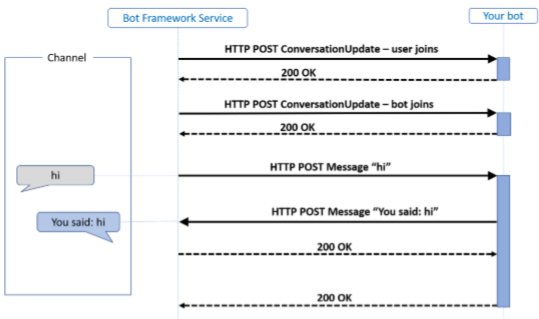
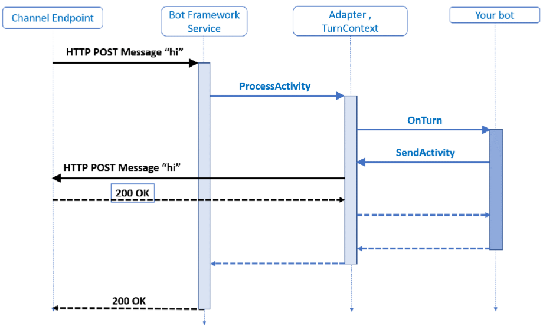

# Bot Framework Elements

## Overview

The [Bot Framework](https://dev.botframework.com/) provides a platform for developers to build **intelligent conversation agents**, aka **bots**, and connect them via growing list of **channels** such as Skype, Facebook Messenger,Slack, Telegram and an embed web chat widget.
If combined with the services and APIs offered in [Microsoft Cognitive Services](https://azure.microsoft.com/en-us/services/cognitive-services/), such as [Language Understanding Intelligent Service (LUIS)](https://azure.microsoft.com/en-us/services/cognitive-services/language-understanding-intelligent-service/), bots have the potential to provide rich and useful interactions with users.

A bot is a web app and users interact with it in a conversational way via **text**, **graphics** (such as cards or images), or **speech**.
Every interaction between the user and the bot generates an **activity**.

Typically, a bot is implemented as a **standard Web service which exposes a REST API**. You can implement it with any web technology stack you prefer.
Microsoft provides a [Bot Framework SDK](https://docs.microsoft.com/en-us/azure/bot-service/?view=azure-bot-service-4.0) for .NET (C#} and JavaScript (Node.js).
Both SDKs are free, open source and hosted on GitHub at this location: [botframework-sdk](https://github.com/microsoft/botframework-sdk)
The Bot Framework SDK gives you two primary tools for building your bot.

The **Bot Framework Service**, which is a component of the **Azure Bot Service**, sends information between the user's bot-connected app (channels such as Facebook, Skype, Slack, etc. which we call the channel) and the bot. Each channel may include additional information in the activities they send.

The following picture provides a bird's eye view of the Microsoft Bot Framework context.

> [!IMPORTANT]
> A bot is made up of many elements and design patterns, described next, which make possible an intelligent interaction with a user. 

## Activities

Activities are the events that a bot receives from its users. Probably the two most prominent activities are `conversationUpdate` and `message`. While message is self-explanatory (a message sent from the user to the bot), the `conversationUpdate` is triggered when a user or the bot join a conversation. Other Activities include `contactRelationUpdate` (when user adds or removes the bot to/from the contact list) or `typing` (triggered when the user is typing). A full list of all supported Activities can be found at [Entities and activity types](https://docs.microsoft.com/en-us/azure/bot-service/bot-service-activities-entities?view=azure-bot-service-4.0&tabs=js#activity-types).

Before creating bots, it is important to understand how a bot uses **activity** objects to communicate with its users. Let's take a look at activities that are exchanged when running a simple echo bot.

The 2 activity types illustrated in the picture are: **conversation update** and **message**.
The Bot Framework Service may send a conversation update when a party joins the conversation. For example, on starting a conversation with the Bot Framework Emulator, you will see two **conversation update activities**:

- User joining the conversation.
- Bot joining the conversation.

The **message activity** carries conversation information between the parties.
In an echo bot example it implies:

- Carrying simple text and the channel will render this text.
- Alternatively, the message activity might carry text to be spoken, suggested actions or cards to be displayed.

In the example, the bot created and sent a message activity in response to the inbound message activity it had received.

However, a bot can respond in other ways to a received message activity; it is not uncommon for a bot to respond to a conversation update activity by sending some welcome text in a message activity. For more information, see [Entities and activity types](https://docs.microsoft.com/en-us/azure/bot-service/bot-service-activities-entities?view=azure-bot-service-4.0&tabs=cs).

### HTTP Details

 1. Activities arrive at the bot from the Bot Framework Service via an HTTP POST request.
 1. The bot responds to the inbound POST request with a 200 HTTP status code.
 1. Activities sent from the bot to the channel are sent on a
separate HTTP POST to the Bot Framework Service.
 1. This, in turn, is acknowledged with a 200 HTTP status code. 

The protocol doesn’t specify the order in which these POST requests and their acknowledgments are made. However, to fit with common HTTP service frameworks, typically these requests are nested, meaning that the outbound HTTP request is made from the bot within the scope of the inbound HTTP request. This pattern is illustrated in the diagram above. Since there are two distinct HTTP connections back to back, the security model must provide for both.

## Adapter

The Adapter is a necessary component of every bot. After the web service endpoint (under **/api/messages**) receives a message from the user (or generally speaking, an **Activity**), it is forwarded to the **Adapter**. The Adapter unwraps it, performs authentication, maps it to the user, etc. Then it creates an **TurnContext** object, which the actual bot code can process in the current **Turn**.

## Turn

In a conversation, people often speak one-at-a-time, taking turns speaking. With a bot, it generally reacts to user input.

Within the Bot Framework SDK, a **turn** consists of

1. The user's incoming activity to the bot.
1. Any activity the bot sends back to the user as an immediate response.

You can think of a turn as the **processing associated with the arrival of a given activity**.

The **turn context object** provides information about the activity such as:

- The sender and receiver
- The channel
- Other data needed to process the activity
- Information during the turn across various layers of the bot

The **turn context is one of the most important abstractions** in the SDK. It mainly does the following:

- Carries the inbound activity to all the middleware components and the application logic.
- Provides the mechanism whereby the middleware components and the application logic can send outbound activities.

The Bot Framework v4 represents interactions between users and the bot as Turns. **Each Activity a user performs generates a new Turn**. For example, a message from the user to the bot will imply a new Turn, but there are numerous activities that also imply a new turn.
For each Turn, the bot receives a TurnContext object, generated by the Adapter. The TurnContext contains information about the current conversation, the activity that triggered the turn, the user state and further data points.

## Activity Processing Stack

Let's analyze the previous diagram focusing on the arrival of a message activity

In the example, the bot replied to the message activity with another message activity containing the same text message.

1. The processing starts with the HTTP POST request, with the activity information carried as a JSON payload, arriving at the bot framework service.
    - In C# the service will typically be an ASP.NET project.
    - in a JavaScript Node.js project this is likely to be one of the popular frameworks such as Express or Restify. 
1. The activity is carried as JSON in the HTTP POST body. This JSON is deserialized to create the **Activity** object that is then handed to the **adapter** with a call to process activity method. The adapter, an integrated component of the SDK, is the core of the SDK runtime.
1. On receiving the activity, the adapter creates a **turn context** and calls the middleware.

The turn context provides the mechanism for the bot to send outbound activities,most often in response to an inbound activity. To achieve this, the turn context provides **send**, **update**, and **delete** activity response methods. Each response method runs in an asynchronous process.

> [!IMPORTANT]
> The thread handling the primary bot turn deals with disposing of the context object when it is done. Be sure to await any activity calls so the primary thread will wait on the generated activity before finishing it's processing and disposing of the turn context. Otherwise, if a response (including its handlers)takes any significant amount of time and tries to act on the context object, it may get a *context disposed error*.

## Bot Logic

The bot processes **incoming activities** from one or more channels and generates **outgoing activities** in response. For more information, see [Bot logic](https://docs.microsoft.com/en-us/azure/bot-service/bot-builder-basics?view=azure-bot-service-4.0&tabs=csharp#bot-logic) official documentation.

The bot controller, following the standard MVC structure, lets you determine the routing of messages and HTTP POST requests. 

- For the echo bot, we pass the incoming request on to the adapter's process async activity method as explained in the activity processing stack section above. In that call, we specify the bot and any other authorization information that may be required.
- The controller implements `ControllerBase`, holds the adapter and bot that we set in Startup.cs (that are available here through dependency injection), and passes the necessary information on to the bot when it receives an incoming HTTP POST.
- Here, you'll see the class preceded by route and controller attributes. These assist the framework to route the messages appropriately and know which controller to use. If you change the value in the route attribute, that changes the endpoint the emulator or other channels use to access the bot.

## Activity Handlers

When the bot receives an activity, it passes it on to its **activity handlers**. Actually, the activity is routed to the base handler, the **turn handler**, which then calls the specific activity handler based on the type of activity received.

### [C#](#tab/csharp)

For example, if the bot receives a message activity, the turn handler would see that incoming activity and send it to the `OnMessageActivityAsync` activity handler.

- Your bot logic for handling and responding to messages will go in this `OnMessageActivityAsync` handler.
- Likewise, the logic for handling members being added to the conversation will go in your `OnMembersAddedAsync` handler, which is called whenever a member is added to the conversation.

To implement your logic, you will override the methods as shown in the [Bot Logic](#bot_logic) section. For each of these handlers, there is no base implementation, so just add the logic that you want in your override.

There are certain situations where you will want to **override the base turn handler**, such as saving state at the end of a turn. If you do so, be sure to call await `base.OnTurnAsync(turnContext, cancellationToken)` first; this is to make sure the base implementation of `OnTurnAsync` is run before your additional code. The base implementation is, among other things, responsible for calling the rest of the activity handlers such as `OnMessageActivityAsync`.

### [JavaScript](#tab/javascript)

For example, if the bot receives a message activity, the turn handler would see that incoming activity and send it to the `onMessage` activity handler.

- Your bot logic for handling and responding to messages will go in this `onMessage` handler. 
- Likewise, your logic for handling members being added to the conversation will go in your `onMembersAdded` handler, which is called whenever a member is added to the conversation.

To implement your logic for these handlers, you will override these methods in as shown in the [Bot Logic](#bot_logic) section. For each of these handlers, define your bot logic, then be sure to call `next()` at the end. By calling next() you ensure that the next handler is run.

There aren't any common situations where you will want to override the base turn handler, so be careful if you try to do so. For things such as saving state that you want to do at the end of a turn, there is a special handler called `onDialog`. The `onDialog` handler runs at the end, after the rest of the handlers have run, and is not tied to a certain activity type. As with all the above handlers, be sure to call `next()` to ensure the rest of the process wraps up.

## Middleware

The Adapter produces the TurnContext object by passing the initial request through the Bot Framework’s Middleware. The Middleware is a pipeline that for example restores the state of the conversation, and potentially performs language understanding or translation. This Middleware pipeline can be extended with additional processing steps and is executed on every incoming message.

The Middleware is a set of components which are executed in a predefined order (pipeline) to operate on an activity.

- The final stage of the pipeline is a **callback to the turn handler** on the bot class with which the application has registered the adapter's process activity method. The turn handler is generally `OnTurnAsync` in C# and `onTurn` in JavaScript.
- The turn handler takes a **turn context** as its argument, typically the application logic running inside the turn handler function will process the inbound activity’s content and generate one or more activities in response, sending these out using the send activity function on the turn context. 
- Calling send activity on the turn context will cause the middleware components to be invoked on the outbound activities. 
- Middleware components execute before and after the bot turn handler function. The execution is inherently nested and, as such, sometimes referred to being like a Russian Doll. For more information, see the [Middleware](https://docs.microsoft.com/en-us/azure/bot-service/bot-builder-concept-middleware?view=azure-bot-service-4.0).

## State and Persistency

The Middleware component automatically restores the conversation state (e.g., the dialog in which the conversation with the user is in) and also restores any custom user state. In contrast to Bot Framework v3, in v4 you are responsible for manually updating both states. Both Azure Blob and CosmosDB are supported targets for persisting state.

## Conversation Flow

This is probably the area where the most changes happened in v4.
First of all, **Dialogs** are not a “must” in v4. For example, bots and assistants that perform single-shot operations, e.g. “turn off the lights” you probably do not need to use any dialogs, but rather just use regular classes and call their methods.
However, **Dialogs** are necessary for more complex and nested conversations.
A Dialog is composed of one or more **WaterfallSteps**. This allows for a linear conversation flow, as indicated in this example:

    1. Dialog starts
       1. Waterfall Step 1: Bot asks something
          1. User answers
       1. Waterfall Step 2: Bot processes the response and asks something else
          1. User answers
       1. Waterfall Step 3: Bot processes the response and answers
    1. Dialog ends

    In this example, the Dialog would contain 3 WaterfallStep entries.
    Step 1 and 2 would contain a Prompt. A Prompt is a single-step Dialog that asks the user something. The concept of Prompts is similar its counterpart in v3 and several built-in Prompts are included. However, custom Prompts with custom Validators can be written for better reusability of code.

    How does a Dialog receive data? Similar to v3, either by passing (or having it passed) into the Dialog via the TurnContext object or by accessing the custom user state data.

    Multiple Dialogs and Prompts are grouped together in a **DialogSet**. As a Dialog can not have child-Dialogs any more, DialogSets are the way to group Dialogs and Prompts. 
    In v3, we often used a Root Dialog and routed to the individual sub-dialogs. In v4, we would have a DialogSet as the Root Dialog, containing all our sub-Dialogs.
For more information, see the [Dialogs Libraries](https://docs.microsoft.com/en-us/azure/bot-service/bot-builder-concept-dialog?view=azure-bot-service-4.0)

## Language Understanding Intelligent Service (LUIS)

The Bot Framework SDK facilitates the integration of [LUIS](https://azure.microsoft.com/en-us/services/cognitive-services/language-understanding-intelligent-service/), models for language understanding. LUIS helps a bot to parse messages to understand the user’s intent and any related entities.

### Training LUIS

LUIS actively learns based on the messages it receives, so it is continuously improving. You can review recognized and unrecognized messages to further train LUIS for your model.
The [LuisDialog](https://docs.botframework.com/en-us/csharp/builder/sdkreference/d8/df9/class_microsoft_1_1_bot_1_1_builder_1_1_dialogs_1_1_luis_dialog.html) class in the Bot Framework SDK makes it simple to wire up a LUIS application to call the appropriate methods on your Dialog based on Intent parsing, and passing any parsed entities along the way.

## Beyond Text

The latest release of the Bot Framework SDK includes support for richer content such as **cards**, **carousels** and **buttons**. Channels that are not capable to display the richer content, and others (like SMS texting) fall back to text.

You can also integrate other services with your bot, such as the [Bing Speech API](https://www.microsoft.com/cognitive-services/en-us/speech-api/) and Bing search APIs like [Web](https://www.microsoft.com/cognitive-services/en-us/bing-web-search-api), [Image](https://www.microsoft.com/cognitive-services/en-us/bing-image-search-api) and [Video](https://www.microsoft.com/cognitive-services/en-us/bing-video-search-api). 
You can also integrate big data analytics and machine learning through technologies such as [Cortana](https://docs.microsoft.com/en-us/azure/bot-service/bot-service-channel-connect-cortana?view=azure-bot-service-4.0), to help build even more intelligent bots.

## Glossary

1. **Activity**. Interaction between the user and the bot. Any interaction generates an **activity** object. Examples of activity are:
    - **conversation update**
    - **message**
1. **Turn**. It consists of the following:
    - The user's incoming activity to the bot.
    - Any activity the bot sends back to the user as an immediate response.
1. **Middleware**. It is a set of components which are executed in a predefined order (pipeline) to operate on an activity.
1. **Adapter**. It is an integrated component of the SDK, is the core of the SDK runtime. An activity is carried as JSON in the HTTP POST body. This JSON is deserialized to create the **activity** object that is then handed to the **adapter** with a call to process activity method. On receiving the activity, the adapter creates a **turn context** and calls the middleware.

## References

| Topic | Description |
| :--- | :--- |
| [Bot Framework SDK](https://www.appliedis.com/the-bot-framework/)| Architectural notes |
| [LUIS](https://azure.microsoft.com/en-us/services/cognitive-services/language-understanding-intelligent-service/)|Language Understanding Intelligent Service|
|[Logical architectures for chatbots](https://www.techinasia.com/talk/primer-chatbots-logical-architecture)|A primer on logical architectures for chatbots|
|[Typical architecture of an AI chatbot?](https://www.quora.com/What-is-the-typical-architecture-of-an-AI-chatbot)|What is the typical architecture of an AI chatbot?|
|[Microsoft Bot Framework v4 explained](https://clemenssiebler.com/microsoft-bot-framework-v4-explained-javascript/)|Microsoft Bot Framework v4 explained (JavaScript)|
|[Overview of the architecture of chatbots](https://bigdata-madesimple.com/how-do-chatbots-work-an-overview-of-the-architecture-of-a-chatbot/)|How do chatbots work? An overview of the architecture of chatbots|
|[Guide To Chatbot Tech Stack](https://chatbotsmagazine.com/the-ultimate-guide-to-designing-a-chatbot-tech-stack-333eceb431da)|The Ultimate Guide To Designing A Chatbot Tech Stack|
|[Using Microsoft Bot Framework v3](https://www.udemy.com/using-microsoft-bot-framework-luis-and-cognitive-services/)|Using Microsoft Bot Framework v3, LUIS, Cognitive Services (Udemy) |
|[Getting Started - Building the first Hello Bot](https://social.technet.microsoft.com/wiki/contents/articles/37922.microsoft-bot-framework-getting-started-building-the-first-hello-bot.aspx)|Microsoft Bot Framework : Getting Started - Building the first Hello Bot TechNet|
|[Bot components: roles, diagrams, overview](https://techcommunity.microsoft.com/t5/IIS-Support-Blog/Bot-components-roles-diagrams-overview/ba-p/393113)|Bot components: roles, diagrams, overview |
