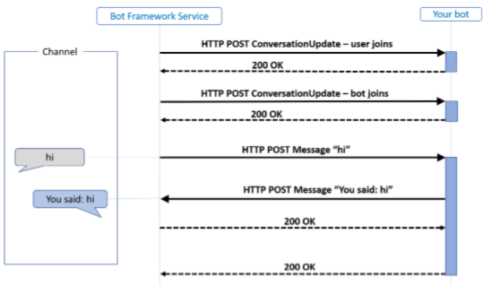
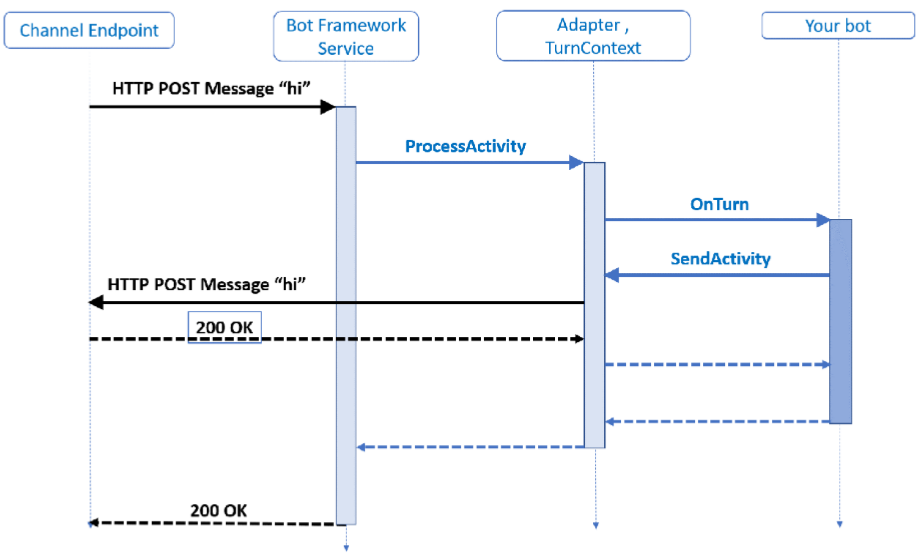

# How Bots Work

A bot is a web app and users interact with it in a conversational way via **text**, **graphics** (such as cards or images), or **speech**.
Every interaction between the user and the bot generates an **activity**.

The **Bot Framework Service**, which is a component of the **Azure Bot Service**, sends information between the user's bot-connected app (channels such as Facebook, Skype, Slack, etc. which we call the channel) and the bot. Each channel may include additional information in the activities they send. 

Before creating bots, it is important to understand how a bot uses **activity** objects to communicate with its users. Let's first take a look at activities that are exchanged when running a simple echo bot.



The 2 activity types illustrated in the picture are: **conversation update** and **message**.
The Bot Framework Service may send a conversation update when a party joins the conversation. For example, on starting a conversation with the Bot Framework Emulator, you will see two **conversation update activities**:

1. User joining the conversation.
1. Bot joining the conversation.

To distinguish these conversation update activities, check whether the members added property includes a member other than the bot.

The **message activity** carries conversation information between the parties.
In an echo bot example it implies:

- Carrying simple text and the channel will render this text.
- Alternatively, the message activity might carry text to be spoken, suggested actions or cards to be displayed.

In the example, the bot created and sent a message activity in response to the inbound message activity it had received.

However, a bot can respond in other ways to a received message activity; it is not uncommon for a bot to respond to a conversation update activity by sending some welcome text in a message activity.
  
## HTTP Details

 1. Activities arrive at the bot from the Bot Framework Service via an HTTP POST request.
 1. The bot responds to the inbound POST request with a 200 HTTP status code. 
 1. Activities sent from the bot to the channel are sent on a
separate HTTP POST to the Bot Framework Service. 
 1. This, in turn, is acknowledged with a 200 HTTP status code. 

The protocol doesn’t specify the order in which these POST requests and their acknowledgments are made. However, to fit with common HTTP service frameworks, typically these requests are nested, meaning that the outbound HTTP request is made from the bot within the scope of the inbound HTTP request. This pattern is illustrated in the diagram above. Since there are two distinct HTTP connections back to back, the security model must provide for both.

## What is a turn

In a conversation, people often speak one-at-a-time, taking turns speaking. With a bot, it generally reacts to user input.

Within the Bot Framework SDK, a **turn** consists of

1. The user's incoming activity to the bot.
1. Any activity the bot sends back to the user as an immediate response.

You can think of a turn as the **processing associated with the arrival of a given activity**.

The **turn context object** provides information about the activity such as:

- The sender and receiver
- The channel
- Other data needed to process the activity
- Information during the turn across various layers of the bot

The turn context is one of the most important abstractions in the SDK. It mainly does the following:

- Carries the inbound activity to all the middleware components and the application logic.
- Provides the mechanism whereby the middleware components and the application logic can send outbound activities.

## Activity Processing Stack
Let's analyze the previous diagram focusing on the arrival of a message activity




In the example, the bot replied to the message activity with another message activity containing the same text message.

1. The processing starts with the HTTP POST request, with the activity information carried as a JSON payload, arriving at the web service.
    - In C# the service will typically be an ASP.NET project.
    - in a JavaScript Node.js project this is likely to be one of the popular frameworks such as Express or Restify. 
1. The activity is carried as JSON in the HTTP POST body. This JSON is deserialized to create the **Activity** object that is then handed to the **adapter** with a call to process activity method. The adapter, an integrated component of the SDK, is the core of the SDK runtime. 
1. On receiving the activity, the adapter creates a **turn context** and calls the middleware.

The turn context provides the mechanism for the bot to send outbound activities,most often in response to an inbound activity. To achieve this, the turn context provides **send**, **update**, and **delete** activity response methods. Each response method runs in an asynchronous process.

> [!IMPORTANT]
> The thread handling the primary bot turn deals with disposing of the context object when it is done. Be sure to await any activity calls so the primary thread will wait on the generated activity before finishing it's processing and disposing of the turn context. Otherwise, if a response (including its handlers)takes any significant amount of time and tries to act on the context object, it may get a *context disposed error*.

## Activity Handlers

When the bot receives an activity, it passes it on to its **activity handlers**. Actually, the activity is routed to the base handler, the **turn handler**, which then calls the specific activity handler based on the type of activity received.

### [C#](#tab/csharp)

For example, if the bot receives a message activity, the turn handler would see that incoming activity and send it to the `OnMessageActivityAsync` activity handler.

- Your bot logic for handling and responding to messages will go in this `OnMessageActivityAsync` handler.
- Likewise, the logic for handling members being added to the conversation will go in your `OnMembersAddedAsync` handler, which is called whenever a member is added to the conversation.

To implement your logic, you will override the methods as shown in the [Bot Logic](#bot_logic) section below. For each of these handlers, there is no base implementation, so just add the logic that you want in your override.

There are certain situations where you will want to **override the base turn handler**, such as saving state at the end of a turn. If you do so, be sure to call await `base.OnTurnAsync(turnContext, cancellationToken)` first; this is to make sure the base implementation of `OnTurnAsync` is run before your additional code. The base implementation is, among other things, responsible for calling the rest of the activity handlers such as `OnMessageActivityAsync`.

### [JavaScript](#tab/javascript)

For example, if the bot receives a message activity, the turn handler would see that incoming activity and send it to the `onMessage` activity handler.

- Your bot logic for handling and responding to messages will go in this `onMessage` handler. 
- Likewise, your logic for handling members being added to the conversation will go in your `onMembersAdded` handler, which is called whenever a member is added to the conversation.

To implement your logic for these handlers, you will override these methods in as shown in the [Bot Logic](#bot_logic) section below. For each of these handlers, define your bot logic, then be sure to call `next()` at the end. By calling next() you ensure that the next handler is run.

There aren't any common situations where you will want to override the base turn handler, so be careful if you try to do so. For things such as saving state that you want to do at the end of a turn, there is a special handler called `onDialog`. The `onDialog` handler runs at the end, after the rest of the handlers have run, and is not tied to a certain activity type. As with all the above handlers, be sure to call `next()` to ensure the rest of the process wraps up.

## Middleware

Middleware is a set of components which are executed in a predefined order (pipeline) to operate on an activity.

- The final stage of the pipeline is a **callback to the turn handler** on the bot class with which the application has registered the adapter's process activity method. The turn handler is generally `OnTurnAsync` in C# and `onTurn` in JavaScript.
- The turn handler takes a **turn context** as its argument, typically the application logic running inside the turn handler function will process the inbound activity’s content and generate one or more activities in response, sending these out using the send activity function on the turn context. 
- Calling send activity on the turn context will cause the middleware components to be invoked on the outbound activities. 
- Middleware components execute before and after the bot turn handler function. The execution is inherently nested and, as such, sometimes referred to being like a Russian Doll. For more in depth information about middleware, see the [Middleware](TBD).

## Bot Structure
Let's analyze the key components of  the echo bot. For more details about the bot, see [echo bot C#](https://docs.microsoft.com/en-us/azure/bot-service/dotnet/bot-builder-dotnet-sdk-quickstart?view=azure-bot-service-4.0) or [echo bot JavaScript](https://docs.microsoft.com/en-us/azure/bot-service/javascript/bot-builder-javascript-quickstart?view=azure-bot-service-4.0).

### [C#](#tab/csharp)

The VSIX template generates a [ASP.NET MVC Core](https://dotnet.microsoft.com/apps/aspnet/mvc) web app. If you look at the [ASP.NET fundamentals](https://docs.microsoft.com/aspnet/core/fundamentals/index?view=aspnetcore-2.1&tabs=aspnetcore2x), you'll see similar code in files such as **Program.cs** and **Startup.cs**. These files are required for all web apps and are not bot specific.

### [JavaScript](#tab/javascript)

The Yeoman generator creates a type of restify web application. If you look at the restify quickstart in their docs, you'll see an app similar to the generated **index.js** file. We describe some of the key files generated by the template. Code in some files won't be copied, but you will see it when you run the bot, and you can refer to the [Node.js echobot](https://aka.ms/js-echobot-sample) sample.

`package.json`. Specifies dependencies and their associated versions for your bot. This is all set up by the template and your system.

`.env file`. Specifies the configuration information for your bot, such as the *port number*, *app ID*, and *password* among other things. If using certain technologies or using this bot in production, you will need to add your specific keys or URL to this configuration. For this Echo bot, however, you don't need to do anything here right now; the app ID and password may be left undefined at this time.
To use the .env configuration file, the template needs an extra package included. First, get the dotenv package from npm:

```npm install dotenv```

### Bot Logic

The bot processes **incoming activities** from one or more channels and generates **outgoing activities** in response. For more information, see [Bot logic](https://docs.microsoft.com/en-us/azure/bot-service/bot-builder-basics?view=azure-bot-service-4.0&tabs=csharp#bot-logic) official documentation.

The bot controller, following the standard MVC structure, lets you determine the routing of messages and HTTP POST requests. 

- For the echo bot, we pass the incoming request on to the adapter's process async activity method as explained in the activity processing stack section above. In that call, we specify the bot and any other authorization information that may be required.
- The controller implements `ControllerBase`, holds the adapter and bot that we set in Startup.cs (that are available here through dependency injection), and passes the necessary information on to the bot when it receives an incoming HTTP POST.
- Here, you'll see the class proceeded by route and controller attributes. These assist the framework to route the messages appropriately and know which controller to use. If you change the value in the route attribute, that changes the endpoint the emulator or other channels use access your bot.


## Manage Bot Resources 

The bot resources, such as app ID, passwords, keys or secrets for connected services, will need to be managed appropriately. For more information, see [Manage bot resources](https://docs.microsoft.com/en-us/azure/bot-service/bot-file-basics?view=azure-bot-service-4.0) and [Managing state](https://docs.microsoft.com/en-us/azure/bot-service/bot-builder-concept-state?view=azure-bot-service-4.0).


## Glossary

1. **Activity**. Interaction between the user and the bot. Any interaction generates an **activity** object. Examples of activity are:
    - **conversation update**
    - **message**
1. **Turn**. It consists of the following:
    - The user's incoming activity to the bot.
    - Any activity the bot sends back to the user as an immediate response.
1. **Middleware**. It is a set of components which are executed in a predefined order (pipeline) to operate on an activity.
1. **Adapter**. It is an integrated component of the SDK, is the core of the SDK runtime. An activity is carried as JSON in the HTTP POST body. This JSON is deserialized to create the **activity** object that is then handed to the **adapter** with a call to process activity method. On receiving the activity, the adapter creates a **turn context** and calls the middleware.
