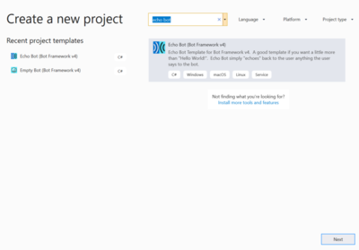
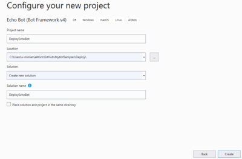
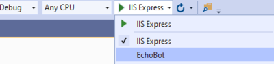
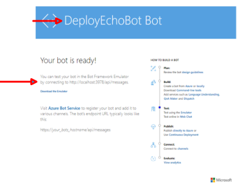
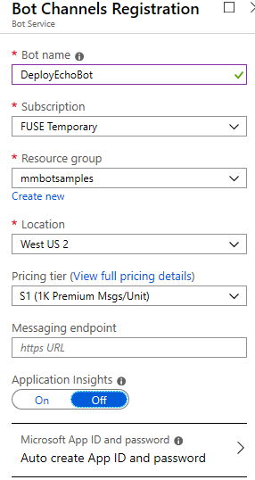
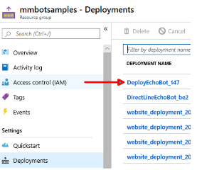
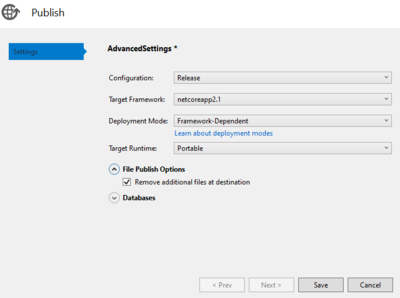
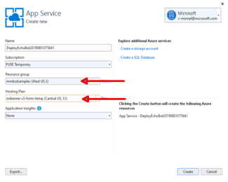
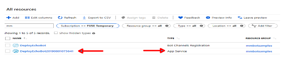

# Deploy a bot in Azure

## Table of Content

- [Prerequisites](#prerequisites)
- [Build a simple echo bot](#build-echo-bot)
    - [Test the bot locally](#test-the-bot-locally)
- [Deploy the bot in Azure](#deploy-the-bot-in-Azure)
    - [Test the bot remotely](#test-the-bot-remotely)
- [Connect **Skype channel**](#connect-skype-channel)
    - [Test the bot using Skype](#test-the-bot-using-skype)

## Prerequisites

Before you proceed, assure that the following requirements are satisfied:

1. [Visual Studio 2019 (or higher)](https://visualstudio.microsoft.com/vs/) with the following workloads:
    1. ASP.NET and web development
    1. Azure development
    1. .NET Core cross-platform development
1. [Bot Builder V4 SDK Template for Visual Studio](https://marketplace.visualstudio.com/items?itemName=BotBuilder.botbuilderv4)
1. [Bot Framework Emulator](https://github.com/Microsoft/BotFramework-Emulator/releases/)
1. [Microsoft Azure Subscription](https://azure.microsoft.com/en-us/free/?v=18.23)

## Create the Project

1. Open Visual Studio and **Create a new project**.
1. A new dialog opens. In the search box enter *Echo Bot*.

    

1. Select the **Echo Bot** template and click the **Next** button.
1. Name the project **DeployEchoBot**.

    

1. Click the **Create** button.

### Test the bot locally

Let's have the first debug run out of the box.

1. In the top menu bar, assure that Debug is selected and that "EchoBotDL" is selected in the run box.

    

1. If needed, click **Yes** in the popup asking to trust the ASP.NET Core SSL certificate. Install the certificate.
1. Click the green arrow to run the bot. You can also enter **F5**. If F5 is not working, assure that **FLock** is pressed. 
1. Your default web browser opens. It displays the EchoBotDL bot service splash page.

    

1. Open the **Bot Framework Emulator**. It emulates a client application using the HelloWorld Bot (web service) running on the localhost.
1. In the right pane, click the **Open Bot** button.
1. In the opened dialog, enter the bot endpoint described earlier.

    

1. Click the **Connect** button. The emulator connects with the bot which displays the predefined *Hello and Welcome* message.
1. Enter a nmessage and the bot echoes it back to you.

## Deploy the bot in Azure

? [!WARNING]
> Soon to be deprecated.

1. In your browser, navigate to the [Azure portal](https://portal.azure.com/).
1. In the left pane, click **Create a resource**.
1. In the right pane, in the search box enter *bot*.
1. In the drop-down list, click **Bot Channels Registration**.
1. In the displayed window, click the **Create** button.  

    

1. Enter information similar to the following and click the **Create** button.

    

    Wait for the registration to complete.
1. In the left panel, click **All Resource**, you resource should be listed with the name you used in the previous step, in the example is *DirectLineEchoBot* and here it is:

### Get AppId and password

Let's now get the AppID and password to use in our bot.

1. In resource list, click on the resource group associated with the Azure App Service resource just created. In the example is *mmbotsamples*.
1. Im the resource group blade, click on **Deployments**.
1. In the right pane, click on the name of your deployment.

    

1. In the displayed blade, click **Inputs**.
1. In the right pane, copy the **appid** and the **appSecret** values and store them in safe place.

### Assign AppId and password

1. Go back to the bot project in Visual Studio.
1. Open the `appsettings.json` file.
1. Assign the **appid** value to `MicrosoftAppId`.
1. Assign the **appSecret** value to `MicrosoftAppPassword`.
1. Save the `appsettings.json` file.

### Perform deployment

The following are the final steps you must perform to deploy the bot in Azure.

1. In Visual Studio, in the *Solution Explorer*, right-click on the project name.
1. In the drop-down menu, click **Publish**.  
1. In the displayed dialog, click the **Advanced** link.
1. In the next displayed dialog, click the **File Publish Options**, and check the box by **Remove additional files at destination**.  

    
1. Click the **Save** button and then the **Publish** button.
1. In the final dialog click the **Create** button. This will create the bot **App Service**.

    
1. In your default browser, the bot App Service (default) page is displayed.
1. In Visual Studio the bot deployed information is displayed. Copy and save the site URL (end point) where the App Service is running.
1. Click the **Publish** button.
1. The **App Service** for the bot is created in Azure which shows in the list of your Azure resources.

    

## Test the bot deployment secrets

After the deployment is completed, you can test the bot deployment secrets using the echo bot emulator. Follow this steps:

1. Open the **Bot Framework Emulator**.
1. In the left pane, click the **Configuration** link.
1. In the opened dialog, enter the bot name, the remote endpoint, the Microsoft App ID and Microsoft App password obtained earlier. The following is an example: 
1. Click the **Save and connect** button. The emulator connects with the bot which displays the predefined welcome message.
1. Enter a message and the bot echoes it back to you. This will prove that the bot has been deployed and works as expected.

## Connect Skype channel

1. Let's go back to the **Web Bot App** dialog. In the right pane, click the **Channels** link.

    
1. Click the **Skype** button.
1. Click the **Publish** button. Enter the required information similar to the one shown next. Then click the **Save** button.

   

1. Accept the **Terms of Service** agreement.
1. Click the **Cancel** button in the next dialog. This takes you back to the **Connect to channels** page.

    

1. Click the **Skype** link. This will take you to page that allows you to add the Bot to your Skype contacts.
1. Click the Add to Contacts button.

    

1. **Open Skype**, if you have it installed on your computer. Follow the Wizard steps. At the end the Bot is added to your Skype contacts. Then you can start communicating with the Bot.

    

### Test the bot using Skype

