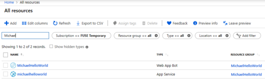
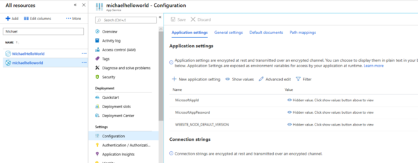
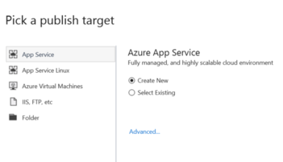
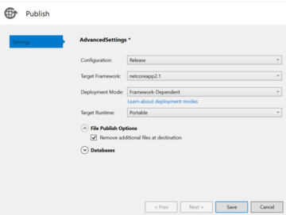
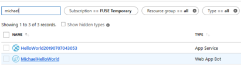
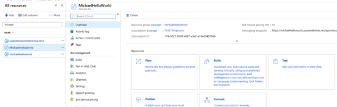
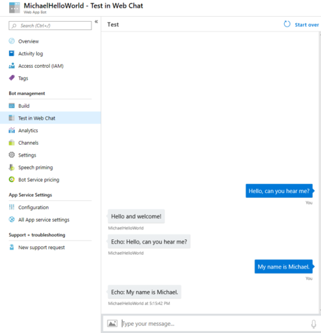

# .NET Echo Bot

## Table of Content

- [Overview](#overview)
- [Prerequisites](#prerequisites)
- [Create the Project](#create-the-project)
- [Run Out of the Box](#run-out-of-the-box)
- [Add direct line extension](#add-direct-line-extension)
- [Deploy the Bot](#deploy-the-bot)
- [Connect Skype Channel](#connect-skype-channel)


## Overview


This article describes how to create a **direct line app extension enabled** bot using Microsoft Bot Framework V4, and deploy it in Azure.  

You will learn:

- How to build a simple echo bot by using a **C# template**.
- Add the **direct line extension**.
- Deploy the bot in the **Azure Framework Service**.

- Test the Bot using **Web Chat**.
- Connect **Skype channel**.
- Test the Bot using Skype.

## Prerequisites

Before you proceed, assure that the following requirements are satisfied:

1. [Visual Studio 2019 (or higher)](https://visualstudio.microsoft.com/vs/) with the following workloads:
    1. ASP.NET and web development
    1. Azure development
    1. .NET Core cross-platform development
1. [Bot Builder V4 SDK Template for Visual Studio](https://marketplace.visualstudio.com/items?itemName=BotBuilder.botbuilderv4)
1. [Bot Framework Emulator](https://github.com/Microsoft/BotFramework-Emulator/releases/)
1. [A Microsoft Azure Subscription](https://azure.microsoft.com/en-us/free/?v=18.23)

## Create the Project

1. Open Visual Studio and **Create a new project**.
1. A new dialog opens. In the search box enter *Echo Bot*.

    

1. Select the **Echo Bot** template and click the **Next** button.
1. Name the project **EchoBotDL**.

    

1. Click the **Create** button.

## Run Out of the Box

Let's have the first debug run out of the box.

1. In the top menu bar, assure that Debug is selected and that "EchoBotDL" is selected in the run box.

    

1. If needed, click **Yes** in the popup asking to trust the ASP.NET Core SSL certificate. Install the certificate.
1. Click the green arrow to run the bot. You can also enter **F5**. If F5 is not working, assure that **FLock** is pressed. 
1. Your default web browser opens. It displays the EchoBotDL bot service splash page.

    

1. Open the **Bot Framework Emulator**. It emulates a client application using the HelloWorld Bot (web service) running on the localhost.
1. In the right pane, click the **Open Bot** button.
1. In the opened dialog, enter the bot endpoint described earlier.

    

1. Click the **Connect** button. The emulator connects with the bot which displays the predefined *Hello and Welcome* message.
1. Enter a nmessage and the bot echoes it back to you.

## Add direct line extension

1. In the *Solution Explorer*, right click on the project.
1. In the drop-down menu, **Manage NuGet Packages**.
1. In the left pane, under the **Browse** tab, check the box **Include prerelease** to display the preview packages.
1. In the search box enter **Microsoft.Bot.Builder.StreamingExtensions**.
1. Select it and click the **Install** button; read and agree to the license agreement.

    

1. Allow your app to use the Bot Framework NamedPipe. To do son, open the Startup.cs file.
1. Add the this namespace reference: `using Microsoft.Bot.Builder.StreamingExtensions;`
1. In the `Configure` method, add this line: `app.UseBotFrameworkNamedPipe()` as shown next.

```csharp
public void Configure(IApplicationBuilder app, IHostingEnvironment env)
{
    if (env.IsDevelopment())
    {
        app.UseDeveloperExceptionPage();
    }
    else
    {
        app.UseHsts();
    }

    app.UseDefaultFiles();
    app.UseStaticFiles();

    app.UseBotFrameworkNamedPipe();

    app.UseMvc();
}

```

For more information, see [02.echo.bot code sample](https://github.com/microsoft/BotBuilder-Samples/tree/master/experimental/directline-app-service-extension/csharp_dotnetcore/02.echo-bot)

## Deploy the Bot

Let's deploy the HelloWorld bot to the Azure cloud.

1. In your browser, navigate to [Azure](https://azure.microsoft.com/).
1. In the top right, click the **Sign in** link.
1. Go to the portal or dashboard.
1. In the left pane, click **Create a resource**.
1. In the right pane, in the search box, enter bot. In the selection list, click **Web App Bot**.

    

1. In the displayed dialog, click the **Create** button.

     

1. Enter configuration info similar to the following:

    

1. Click the **Create** button. The bot is created and the deployment begins.
1. After the deployment is completed, in the left pane select **All Resources**.
1. In the right pane, enter filter values similar to the one shown next.
    

    Where 
    - **Web App Bot** – This is the Azure resource that will communicate with th Bot code contained in the App Service. This allows the Bot to connect to the Microsoft Bot Framework service that allows to connect to users via popular channels.
    - **App Service**. This is the Azure resource that contains the Bot code. This is the location **where you publish your code**.
1. In the right pane, click on the App Service link on the left.
1. In the *Settings* section, click on **Configuration**.

1. In the right side, under *Application settings*, un-hide and copy  the **MicrosoftAppId** and **MicrosoftAppPassword**. 
1. Return to Visual Studio.
1. Open the **appsettings.json** file and paste the above values in the proper locations.  
1. Save the file.
1. Right-click on the project name and select **Publish**.
1. In the displayed dialog, select **Create New** and then click the **Advanced** link.

    
1. In the displayed dialog, expand the *File Publish* drop-down and select **Remove additional files and destination**.

      

1. Click the **Save** button.
1. Click the **Publish** button.
1. In the displayed dialog, enter information similar to the following and then click **OK**. The cod is published in the **App Service**.

    .
1. The Bot will be available online at the [HelloWorld Bot](https://helloworld20190707043053.azurewebsites.net/) location.
1. Go to your Azure dashboard.
1. In the left pane, click on the **All Resources"" link.
1. In the right pane, filter based on the name of the Bot.
1. Click on the Web App Bot link on the left.

    .
1. In the right pane, click on test box all the way to the right.
1. Click on the Web App Bot link on the left, **Test your bot online in Web Chat**.

    .
1. The follwing UI is displayed:

   

1. Start entering your messages for the Bot.

    

## Connect Skype Channel

1. Let's go back to the **Web Bot App** dialog. In the right pane, click the **Channels** link.

    
1. Click the **Skype** button.
1. Click the **Publish** button. Enter the required information similar to the one shown next. Then click the **Save** button.

   

1. Accept the **Terms of Service** agreement.
1. Click the **Cancel** button in the next dialog. This takes you back to the **Connect to channels** page.

    

1. Click the **Skype** link. This will take you to page that allows you to add the Bot to your Skype contacts.
1. Click the Add to Contacts button.

    

1. **Open Skype**, if you have it installed on your computer. Follow the Wizard steps. At the end the Bot is added to your Skype contacts. Then you can start communicating with the Bot.

    


> [!NOTE]
> We made it. Good job!!
> You can download the project source code at this location [TBD](tbd) on GitHub.
