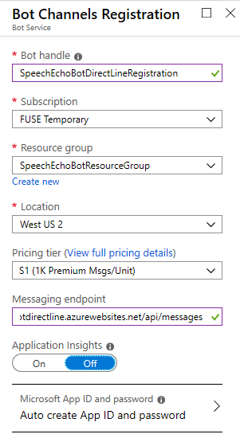

# Using a voice enabled bot via Direct Line Speech channel 

This tutorial shows how a client application uses a voice enabled Echo Bot via a **Direct Line Speech** channel. The client app lets you speak to the bot which then responds back to you.

At the completion of the steps described in this article, you will accomplish the following:

1. A client application connected to the Echo Bot via Direct Line Speech channel.
1. Audio is recorded from the default microphone on button press or continuously recorded. Optionally, gating audio streaming to the cloud.
1. The audio is passed to the speech recognition service and transcribed to text.
1. The recognized text is passed to the Echo Bot as an activity
1. The response text is turned into audio by the Text-to-Speech (TTS) service, and streamed back to the client application for playback.

## Create a resource group

You are going to use a resource group to create individual resources for the Bot Framework, the Direct Line Speech channel, and Speech Services. The client app uses a handful of Azure services. For performance, assure that these services are located in the same Azure region.

1. In your browser navigate to the [**Azure portal**][azure-portal].
1. In the left navigation panel, select **Resource groups**.
1. Click **Add** to add a new resource group. You are prompted to provide some information:
    1. **Subscription** Use your existing subscription.
    1. **Name** Enter tne name for the resource group. For example,  *SpeechEchoBotResourceGroup*.
    1. From the Region drop-down, select *West US*, or a region close to your services.
    1. Click **Review and create** button. You should see a banner that reads *Validation passed*.
    1. Click the **Create** button. It may take a few minutes to create the resource group. The following picture is an example.

        

> [!TIP]
> As with the resources you'll create later in this tutorial, it's a good idea to pin this resource group to your dashboard for easy access. If you'd like to pin this resource group, click the pin icon in the upper right of the dashboard.

### About Azure regions and Direct Line speech channel

If you'd like to use a different region for this tutorial these factors may limit your choices:
- The Direct Line Speech channel is a preview service. As such, it may be limited to specific Azure regions. For more information about available regions, see [Voice-first virtual assistants][voice-first].
- The Direct Line Speech channel uses the text-to-speech service, which has standard and neural voices. Neural voices are limited to [specific Azure regions][standard-neural-voices].

Free trial keys may be restricted to a specific region. For more information about regions, see [Azure locations](https://azure.microsoft.com/global-infrastructure/locations/).

## Create resources

Let's now create the resources needed to build the example used in this article. We are going to add these resources to the resource group created before.  

### Speech service resource

1. In your browser navigate to the [**Azure portal**][azure-portal].
1. In the left navigation panel, select **Create a resource**.
1. In the search box, type *Speech*. Select the **Speech** card from the search results.
1. Click **Create**.
1. You'll be asked to provide the following information: 
     1. **Name**. Enter tne name for the service resource. For example,  *SpeechEchoBot*.
     1. **Subscription**. You can use an existing subscription.
     1. **Location**. Select *West US*.
     1. **Resource Group**. Select *SpeechEchoBotResourceGroup* you created earlier.
     1. **Pricing Tier**. Select *F0*, free tier.
     1. Click **Create**. It may take a few minutes to create the resource. The following picture is an example.

        

### Azure app service plan

1. In your browser navigate to the [**Azure portal**][azure-portal].
1. In the left navigation panel, select **Create a resource**.
1. In the search box, type *App Service Plan*. Select the **App Service Plan** card from the search results.
1. Click **Create**.
1. You'll be asked to provide the following information: 
    1. **Subscription**. You can use an existing subscription.
    1. **Resource Group**. Select *SpeechEchoBotResourceGroup* you created earlier.
    1. **Name**. Enter tne name for the service plan. For example,  *SpeechEchoBotAppServicePlan*. 
    1. **Operating System**. Select *Windows*.
    1. **Region**. Select *West US*.
    1. **Pricing Tier**. Make sure that *Standard S1* is selected. This should be the default value.
    1. Click **Review and create** button. You should see a banner that reads *Validation passed*.
    1. Click **Create**. It may take a few minutes to create the app service plan. The following picture is an example.

        

At this point, check the resource group *SpeechEchoBotResourceGroup*, it has two resources:

## Create the echo bot

With the preliminary settings done, let's focus on the creation of the echo bot to use in this article. We are going to use the code sample stored in the GitHub repository: [microsoft/BotBuilder-Samples][bot-samples].

1. Clone [microsoft/BotBuilder-Samples][bot-samples].
2. The C# echo bot sample modified to use the **Direct Line Speech** channel can be found in this folder: `experimental/directline-speech/csharp_dotnetcore/02.echo-bot`. Make a copy of the project or use it directly from the downloaded location.
1. Launch Visual Studio.
1. From the toolbar select **File->Open->Project/Solution** and open the echo bot project.

### Test the echo bot using the Bot Framework Emulator

1. In Visual Studio, run the project in *Debug* mode.
1. Launch the emulator.
1. Enter the local end point for the bot, usually `http://localhost:3978/api/messages`.
1. Enter some text messages and verify that the bot echoes them back.

## Deploy the echo bot to Azure

The following steps allow to create an **Azure App Service** to host the bot.

1. In Visual Studio, in the *Solution Explorer* right-click on the project name.
1. In the drop-down menu, select **Publish**. 
1. In the pop-up wizard, select **APP Service** on the left and **Create New** on the right.
1. Click **Publish**.
1. In the next dialog window, enter information similar to the following:

    

1. Click **Create**. 
1. If the deployment completes successfully, you should see it reflected in Visual Studio. Moreover, a page is displayed in your default browser saying *Your bot is ready!*. 
1. Check your resource group, the bot should be listed along with the other resources. This picture is an example:

    

## Enable web sockets in the echo bot

You must make a small change in the bot configuration so it can communicate with the Direct Line Speech channel using web sockets.

1. In the resource group, click on the bot name (link).
1. In the right panel, in the blade, under *Settings*, click **Configuration**.
1. Select the **General settings** tab. 
1. Set the **Web Sockets** toggle to **On**.
1. Click **Save**.

## Register the bot with direct line speech channel

### Create a bot channel registration app

After creating the *Azure App Service* to host your bot, you must create a **Bot Channels Registration** app which is needed for registering the bot with the **Direct Line Speech** channel.

1. In your browser navigate to the [**Azure portal**][azure-portal].
1. In the left navigation panel, select **Create a resource**.
1. In the right panel selection box enter "bot". And in the drop-down list, select **Bot Channels Registration**. 
1. Click the **Create** button.
1. In the **Bot Service** blade, provide the requested information about your bot. For the *Messaging endpoint* enter the URL of the app service followed by `/api/messages`. For example, `https://speechechobotdirectline.azurewebsites.net/api/messages`.
 The following picture shows an example:

    

1. Click **Create**.

The registration resource will be added to the resource group as shown in this picture:

 

> [!NOTE]
> The Bot Channels Registration resource will show the **Global** region even though you selected West US. This is expected.

### Register the direct line speech channel with the bot

1. In the Azure portal, open the registration just created.
1. In the left navigation panel, select **Channels**.
1. Under *More channels**, select **Direct Line Speech**.
1. Review the documentation in the linked page. 
1. Click **Save**.
1. Two **Secret keys** were generated which are unique for your bot. You need these keys when creating a client app using the [Speech SDK](https://docs.microsoft.com/azure/cognitive-services/speech-service/).  You must provide one of these keys to establish a connection between the client app, the Direct Line Speech channel, and your bot service.
1. Click **Show** and copy one of the keys to a file and save it.  
1. In the left navigation panel, click **Settings**. 
1. Check the box labeled **Enable Streaming Endpoint**. This enables a web sockets protocol between the bot and the Direct Line Speech channels. 
1. Click **Save**.

## Create Direct Line Speech client

1. Navigate to the GitHub repository for the [Direct Line Speech Client](https://github.com/Azure-Samples/Cognitive-Services-Direct-Line-Speech-Client/blob/master/README.md).
1. Follow the instructions provided. In particular, follow the steps below.
1. In your browser navigate to the [**Azure portal**][azure-portal].
1. In the left navigation panel, select **Create a resource**.
1. In the search box, type *Speech*. Select the **Speech** card from the search results.

    

1. Click **Create**. Enter the required information. The following picture shows an example:

    

1. Click **Create**.
1. Select the resource just created. 
1. In the left blade, select **QuickStart**.
1. In the right panel, copy the subscription key and save it to a file. This key is used to access the Cognitive Services API. 

### Run the client

1. In Visual Studio, build the client app using **Release x64** modality.
1. If you have problems with NuGet packages, follow the steps described in: [Restore packages manually using Visual Studio](https://docs.microsoft.com/en-us/nuget/Consume-Packages/package-restore#restore-packages-manually-using-visual-studio). 
1. Bring a command terminal and change the directory to where the client app executable is.
1. Run the executable. A setting page is displayed. Enter the required information.
1. For the region use one of the applicable value from [Speech-to-text, text-to-speech, and translation](https://docs.microsoft.com/en-us/azure/cognitive-services/speech-service/regions#speech-to-text-text-to-speech-and-translation).
1. Update the Language field as needed to select a different language code from the [Speech-to-text list](https://docs.microsoft.com/en-us/azure/cognitive-services/speech-service/language-support).The following picture shows an example:

    

1. Click **OK**.
1. In the main window, enter your **bot secret key**. This is one of the two channel secret keys provided when you registered the bot with the Direct Line Speech channel.
1. Click the **Reconnect** button in the upper right. The application will try to connect to your bot via Direct Line Speech channel. The message New conversation started -- type or press the microphone button will appear below the text bar if the connection succeeded.
1. You'll be prompted to allow microphone access. If you want to use the microphone, allow access.
1. Press the microphone icon to begin recording. While speaking, intermediate recognition results will be shown in the application. The microphone icon will turn red while recording is in progress. It will automatically detect end of speech and stop recording.
1. If everything works, you should see the bot's response on the screen and hear it speaks the response. 
1. You can click on lines in the Activity Log window to see the full activity payload from the bot in JSON. Note: You'll only hear the bot's voice response if the Speak field in the bot's output activity was set.

## References
1. [ Connect a bot to channels](https://docs.microsoft.com/azure/bot-service/bot-service-manage-channels?view=azure-bot-service-4.0)
1. [Connect a bot to Direct Line Speech (Preview)](https://docs.microsoft.com/azure/bot-service/bot-service-channel-connect-directlinespeech?view=azure-bot-service-4.0)

For more information, see [Register a bot with Azure Bot Service](../bot-service-quickstart-registration.md).

<!-- Footnote-style links -->

[azure-portal]: https://ms.portal.azure.com/#home
[voice-first]: https://docs.microsoft.com/azure/cognitive-services/speech-service/regions#voice-first-virtual-assistants
[standard-neural-voices]: https://docs.microsoft.com/azure/cognitive-services/speech-service/regions#standard-and-neural-voices
[bot-samples]: https://github.com/microsoft/BotBuilder-Samples

