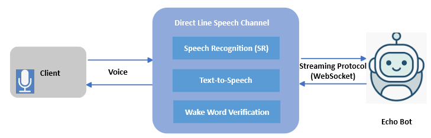
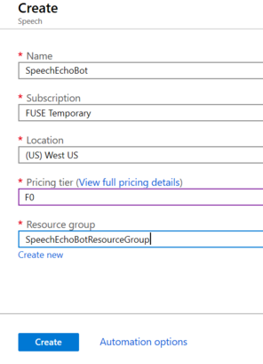

# Using a voice enabled bot via Direct Line Speech channel 

This tutoria shows you how a client application uses a voice enabled Echo Bot via a **Direct Line Speech** channel. The client app lets you speak to the bot which then responds back to you.

At the completion of the steps described in this article, you will accomplish the following:

1. A client application connected to the Echo Bot via Direct Line Speech channel.
1. Audio is recorded from the default microphone on button press or continuously recorded. Optionally, gating audio streaming to the cloud.
1. The audio is passed to the speech recognition service and transcribed to text.
1. The recognized text is passed to the Echo Bot as an activity
1. The response text is turned into audio by the Text-to-Speech (TTS) service, and streamed back to the client application for playback.

## Create a resource group

You are going to use a resource group to create individual resources for the Bot Framework, the Direct Line Speech channel, and Speech Services. The client app uses a handful of Azure services. For performance, assure that these services are located in the same Azure region.

1. In your browser navigate to the [**Azure portal**][azure-portal].
1. In the left navigation panel, select **Resource groups**.
1. Click **Add** to add a new resource group. You are prompted to provide some information:
    1. **Subscription** Use your existing subscription.
    1. **Name** Enter tne name for the resource group. For example,  *SpeechEchoBotResourceGroup*.
    1. From the Region drop-down, select *West US*, or a region close to your services.
    1. Click **Review and create** button. You should see a banner that reads *Validation passed*.
    1. Click the **Create** button. It may take a few minutes to create the resource group. The following picture is an example.

        

> [!TIP]
> As with the resources you'll create later in this tutorial, it's a good idea to pin this resource group to your dashboard for easy access. If you'd like to pin this resource group, click the pin icon in the upper right of the dashboard.

### About Azure regions and Direct Line speech channel

If you'd like to use a different region for this tutorial these factors may limit your choices:
- The Direct Line Speech channel is a preview service. As such, it may be limited to specific Azure regions. For more information about available regions, see [Voice-first virtual assistants][voice-first].
- The Direct Line Speech channel uses the text-to-speech service, which has standard and neural voices. Neural voices are limited to [specific Azure regions][standard-neural-voices].

Free trial keys may be restricted to a specific region. For more information about regions, see [Azure locations](https://azure.microsoft.com/global-infrastructure/locations/).

## Create resources

Let's now create the resources needed to build the example used in this article. We are going to add these resources to the resource group created before.  

### Speech service resource

1. In your browser navigate to the [**Azure portal**][azure-portal].
1. In the left navigation panel, select **Create a resource**.
1. In the search box, type *Speech*. Select the **Speech** card from the search results.
1. Click **Create**.
1. You'll be asked to provide the following information: 
     1. **Name**. Enter tne name for the service resource. For example,  *SpeechEchoBot*.
     1. **Subscription**. You can use an existing subscription.
     1. **Location**. Select *West US*.
     1. **Resource Group**. Select *SpeechEchoBotResourceGroup* you created earlier.
     1. **Pricing Tier**. Select *F0*, free tier.
     1. Click **Create**. It may take a few minutes to create the resource. The following picture is an example.

        

### Azure app service plan

1. In your browser navigate to the [**Azure portal**][azure-portal].
1. In the left navigation panel, select **Create a resource**.
1. In the search box, type *App Service Plan*. Select the **App Service Plan** card from the search results.
1. Click **Create**.
1. You'll be asked to provide the following information: 
    1. **Subscription**. You can use an existing subscription.
    1. **Resource Group**. Select *SpeechEchoBotResourceGroup* you created earlier.
    1. **Name**. Enter tne name for the service plan. For example,  *SpeechEchoBotAppServicePlan*. 
    1. **Operating System**. Select *Windows*.
    1. **Region**. Select *West US*.
    1. **Pricing Tier**. Make sure that *Standard S1* is selected. This should be the default value.
    1. Click **Review and create** button. You should see a banner that reads *Validation passed*.
    1. Click **Create**. It may take a few minutes to create the app service plan. The following picture is an example.

        

At this point, check the resource group *SpeechEchoBotResourceGroup*, it has two resources:

## Create the echo bot

With the preliminary settings done, let's focus on the creation of the echo bot to use in this article. We are going to use the code sample stored in the GitHub repository: [microsoft/BotBuilder-Samples][bot-samples].

1. Clone [microsoft/BotBuilder-Samples][bot-samples].
2. The C# echo bot sample modified to use the **Direct Line Speech** channel can be found in this folder: `experimental/directline-speech/csharp_dotnetcore/02.echo-bot`. Make a copy of the project or use it directly from the downloaded location.
1. Launch Visual Studio.
1. From the toolbar select **File->Open->Project/Solution** and open the echo bot project.

### Test the echo bot using the Bot Framework Emulator

1. In Visual Studio, run the project in *Debug* mode.
1. Launch the emulator.
1. Enter the local end point for the bot, usually `http://localhost:3978/api/messages`.
1. Enter some text messages and verify that the bot echoes them back.

## Deploy the echo bot to Azure

1. In Visual Studio, in the *Solution Explorer* right-click on the project name.
1. In the drop-down menu, select **Publish**. 
1. In the pop-up wizard, select **APP Service** on the left and **Create New** on the right.
1. Click **Publish**.
1. In the next dialog window, enter information similar to the following:

    

1. Click **Create**. 
1. If the deployment completes successfully, you should see it reflected in Visual Studio. Moreover, a page is displayed in your default browser saying *Your bot is ready!*. 
1. Check your resource group, the bot should be listed along with the other resources. This picture is an example:

    

## Enable web sockets in the echo bot

You must make a small change in the bot configuration so it can communicate with the Direct Line Speech channel using web sockets.

1. In the resource group, click on the bot name (link).
1. In the right panel, in the blade, under *Settings*, click **Configuration**.
1. Select the **General settings** tab. 
1. Set the **Web Sockets** toggle to **On**.
1. Click **Save**.

<!-- Footnote-style links -->

[azure-portal]: https://ms.portal.azure.com/#home
[voice-first]: https://docs.microsoft.com/azure/cognitive-services/speech-service/regions#voice-first-virtual-assistants
[standard-neural-voices]: https://docs.microsoft.com/azure/cognitive-services/speech-service/regions#standard-and-neural-voices
[bot-samples]: https://github.com/microsoft/BotBuilder-Samples

