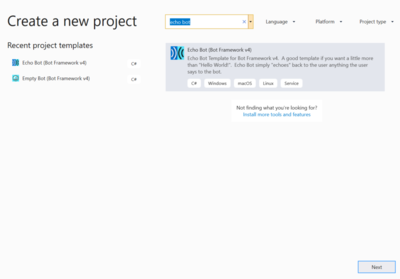
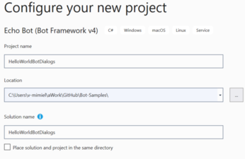
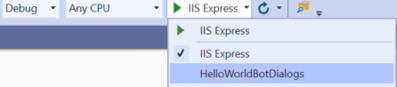
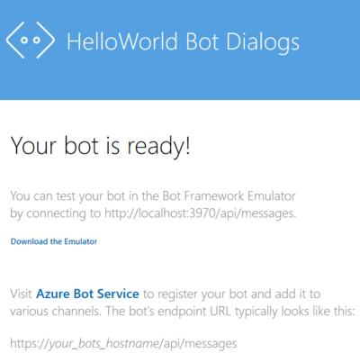
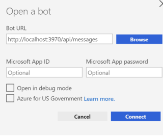
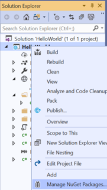

# Add Dialogs to .NET Hello World Bot

## Table of Content

- [Overview](#overview)
- [Prerequisites](#prerequisites)
- [Create the Project](#create-the-project)
- [Run Out of the Box](#run-out-of-the-box)
- [Modify the Bot](#modify-the-bot)
- [Deploy the Bot](#deploy-the-bot)
- [Connect Skype Channel](#connect-skype-channel)

## Overview

This article describes how to add dialogs to the HelloWorld Bot created in the article [Hello World Bot](HelloWorldBot.md).  

### About Dialogs

- A dialog encapsulates application logic like a function in a program.
- It allows you to perform a specific task, such as gathering the details of a user’s profile, and then possibly of reusing the code when needed.
- Dialogs can also be chained together in **DialogSets**.

- The **Microsoft Bot Builder SDK v4** includes two built-in features to help you manage conversations using dialogs:

  - **DialogSets**
    - They are a collection of dialogs. To use dialogs, you must first create a dialog set and add dialogs to it.
    - A dialog can contain only a single or multiple **waterfall steps**.

  - **Prompts**
    - They provide the methods you can use to ask users for different types of information. For example, a text input, a multiple choice, or a date or number input. 
    - A prompt dialog uses at least two functions, one to prompt the user to input data, and another function to process and respond to the data.

## Prerequisites

Before you proceed, assure that the following requirements are satisfied:

1. [Visual Studio 2019 (or higher)](https://visualstudio.microsoft.com/vs/) with the following workloads:
    1. ASP.NET and web development
    1. Azure development
    1. .NET Core cross-platform development
1. [Bot Builder V4 SDK Template for Visual Studio](https://marketplace.visualstudio.com/items?itemName=BotBuilder.botbuilderv4)
1. [Bot Framework Emulator](https://github.com/Microsoft/BotFramework-Emulator/releases/)
1. [A Microsoft Azure Subscription](https://azure.microsoft.com/en-us/free/?v=18.23)

## Create the Project

1. Open Visual Studio and **Create a new project**.
1. A new dialog opens. In the search box enter *Echo Bot*.

    
1. Select the **Echo Bot** template and click the **Next** button.
1. Name the project **HelloWorldBotDialogs** and click the **Create** button.

    

## Run Out of the Box

Let's have the first debug run out of the box.

1. Just to have a feel of how the pieces fit together, let's do a simple customization.
    - In the *Solution Explorer*, expand the **Properties** node and open for edit the
    `launchSettings.json` file.
        - Assign this value  **"applicationUrl": "http://localhost:3970/"**.
        - Save and close the `launchSettings.json` file.
    - In the *Solution Explorer*, expand the **wwwroot** node and open for edit the `default.htm` file.
        - Assign this value **Hello World Bot Dialogs** to the **title** tag and to the div tag **header text**.
        - Change the URL in the connecting explanation with `http://localhost:3970/api/messages`.
    - In the *Solution Explorer*, expand the **Bots** node and open for edit the `EchoBots.cs` file.
        - In the `OnMembersAddedAsync` function, change the welcome message to *"Hello, I am a simple echo bot waiting for dialogs!"*.
1. In the top menu bar, assure that Debug is selected and that *HelloWorldDialogs* is selected in the run box.

    

1. If needed, click **Yes** in the popup asking to trust the ASP.NET Core SSL certificate. Install the certificate.
1. Click the green arrow to run the bot. You can also enter **F5**. If F5 is not working, assure that **FLock** is pressed.
1. Your default web browser opens. It displays the Hello World bot service default page.

    
1. This is the `default.htm` page provided by the template.  It contains the bot localhost **end point** (web address): `http://localhost:3970/api/messages`. We'll use it in the emulator to talk to the bot.

1. Open the **Bot Framework Emulator**. It emulates a client application using the HelloWorld Bot (web service) running on the localhost.
1. In the right pane, click the **Open Bot** button.
1. In the opened dialog, enter the bot endpoint described earlier.

    

1. Click the **Connect** button. The emulator connects with the bot which displays the customized *Hello, I am a simple echo bot waiting for dialogs!* message.

## Add Dialogs 

The HelloWord bot we have built so far has inherent limitations such as:

- All code logic is in the main path.
- No easy way to encapsulate individual logic.
- No way to reuse code logic.
- As the code gets bigger it will not be manageable.

### Dialogs to the Rescue

Dialogs allow us to solve the previous issues. To add dialog to the bot follow these steps:

1. In the *Solutiuon Explorer*, right-click on the project name and select **Manage NuGet Packages**.

    
1. In the package manager left pane, click the **Browse** link in the upper left.
1. In the search box, enter *Microsoft.Bot.Builder.Dialogs*.
1. Select the **Microsoft.Bot.Builder.Dialogs** package.
1. In the right pane, click the **Install** button.

