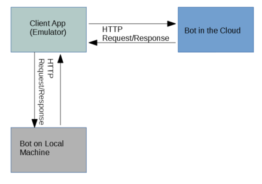

# Examples Prerequisites

The following are the prerequisites to build examples using the Bot Framework v4 SDK.

## Build Environment

1. Download  and install [Visual Studio](https://visualstudio.microsoft.com/downloads/) (community version 2017 or higher).
1. After Visual Studio installation is completed, install **ASP.NET and web developer workload**.
1. Download [Bot Framework v4 SDK Templates](https://marketplace.visualstudio.com/items?itemName=BotBuilder.botbuilderv4) for Visual Studio.
1. After the download, click the **.vsix** file to install the templates in Visual Studio.
1. Download and install [GitHub desktop](https://desktop.github.com/).

> [!TIP]
> You can find the community examples at: [BotBuilder-Samples](https://github.com/Microsoft/BotBuilder-Samples/) on GitHub.

## Test a Bot with the Bot Framework Emulator 

The Bot Framework Emulator is a desktop application that allows developers to test and debug bots on localhost or running remotely through a tunnel.

1. Install the [Bot Framework Emulator](https://github.com/Microsoft/BotFramework-Emulator/releases) version 4.3.0 or greater.
1. Connect to the bot using Bot Framework Emulator
    1. Launch Bot Framework Emulator
    1. File -> Open Bot
    1. Enter a Bot URL of `http://localhost:3978/api/messages`

## Deploy Bot to Azure Cloud

1. Create an [Azure account](https://azure.microsoft.com/en-us/account/).
1. Latest version of the [Azure CLI](https://docs.microsoft.com/cli/azure/?view=azure-cli-latest).

## References

- [Visual Studio Keyboard Shortcuts](http://visualstudioshortcuts.com/2017/)
