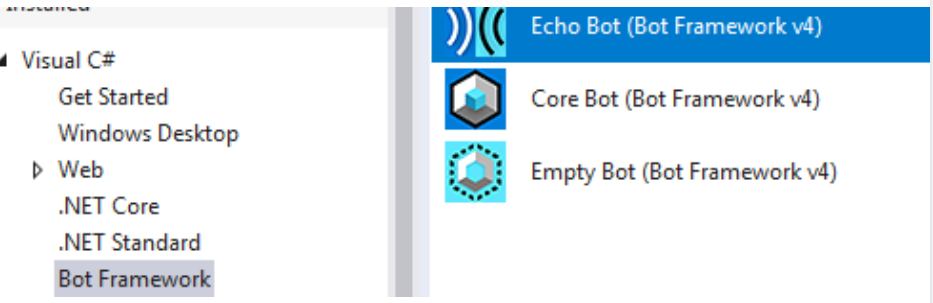
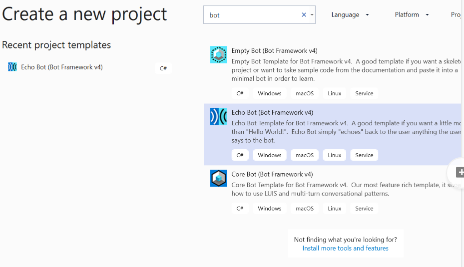
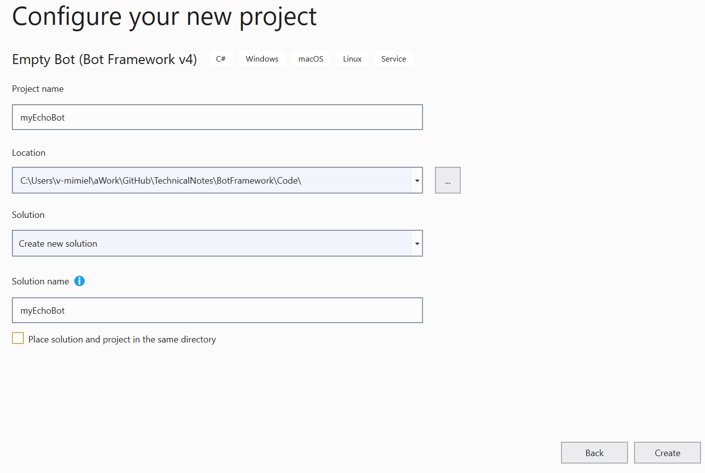
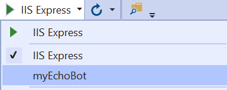
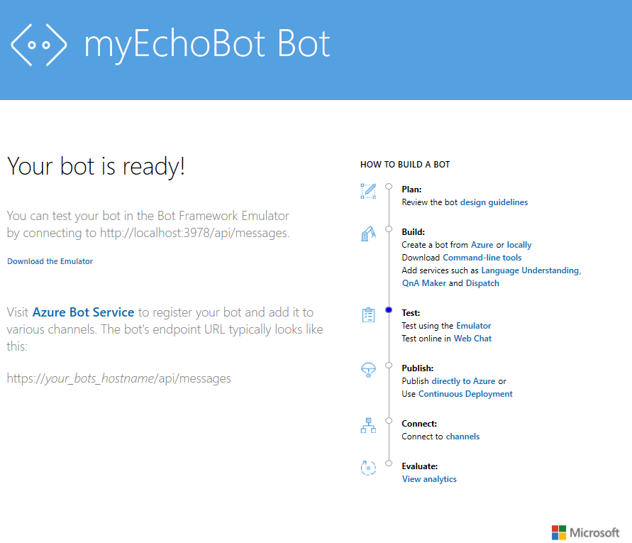
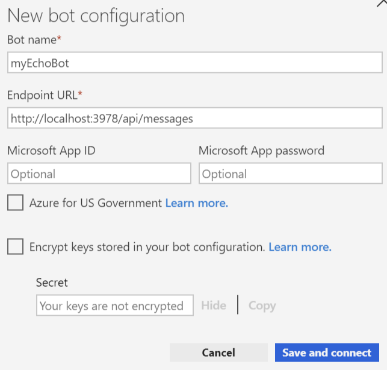
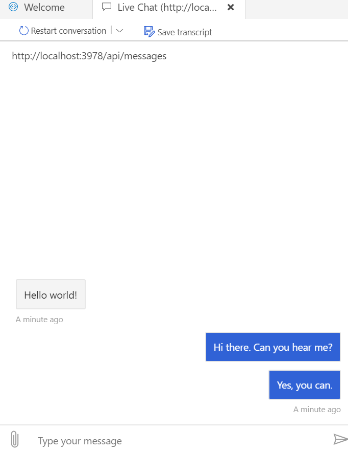

# .NET Echo Boot in Csharp

This example shows

- How to build a simple echo bot by using the **C# template**
- Test it using the Bot Framework Emulator.

> [!NOTE]
> You can create a bot in two ways: **locally** or via the **Azure Bot Service**.  

For more information, see [Create a bot with the Bot Framework SDK for .NET](https://docs.microsoft.com/en-us/azure/bot-service/dotnet/bot-builder-dotnet-sdk-quickstart?view=azure-bot-service-4.0).

> [!WARNING]
> Before you execute the next steps, assure that you satisfy the following [Example Prerequisites](../ExamplePrerequisites.md).

## Create the Echo Bot

1. Launch Visual Studio.
1. Create a new bot project using the Echo Bot template from the Bot Framework V4.
Remember that ASP.NET and web developer workload must be installed to be able to select this template.
1. Select **File->New->Project**. 
1. In VS 2017 follow these steps:
    1. In the left pane, expand **Visual C#**, then **Web**.
    1. Select **Bot Framework**.
    
    1. In the right pane, select **Echo Bot**.
    1. Click **OK**.
1. In VS 2019 follow these steps:
    1. In the Create Project wizard in the search box,  look the Bot Framework templates; just start typing bot.
    1. Select the **Echo Bot** (Bot Framework v4).
    
    1. Click the **Next** button.
    1. In the next wizard select the project name and the location of the project.
    
    1. Click the **Create** button.
1. The echo bot app is created.

## Test the Echo Bot

1. In the top menu bar, in the Run box click the down arrow and select the name of the application. In this example is *MyEchoBot*.

1. Click the green arrow to run the app on the localhost.
1. Click **Yes** in the popup asking to trust the ASP.NET Core SSL certificate.
1. Install the certificate.
1. A window of your default browser opens telling that the echo bot is running.

1. Launch the **Bot Framework Emulator**.
1. In the left pane, click the configuration.
1. Fill out the fields for your bot, then click the Save and connect button. In particular use the following endpoint URL: **http://localhost:3978/api/messages** to connect to the echo bot. You get this URL from the previous bot web page.

1. Click the **Save and connect** button.
1. As soon the emulator is up and running, start typing messages. The bot will echo them back to you.

> [!NOTE]
> Congratulations!! You made it, Close all the apps.

You can find the complete echo bot code project at this location: [myEchoBot](https://github.com/mmiele/Bot-Samples/tree/master/myEchoBot) on GitHub. 

## Deploy the Echo Bot to Azure Cloud

> [!NOTE]
> When you create a bot using Visual Studio or Yeoman templates, the source code generated contains a **deploymentTemplates** folder with ARM templates. The deployment process documented here uses the ARM template to provision required resources for the bot in Azure by using the Azure CLI.

[Azure portal](https://ms.portal.azure.com/#home)

## Glossary

1. **Azure Resource Manager** (ARM) templates. Azure Resource Manager templates are used to deploy resources into resource groups programatically. ARM provides full Infrastructure as Code capability for Azure. The format is very flexible and enables the configuration of multiple resources and the dependencies between them. For more information, see [Azure Resource Manager overview](https://docs.microsoft.com/en-us/azure/azure-resource-manager/resource-group-overview).
