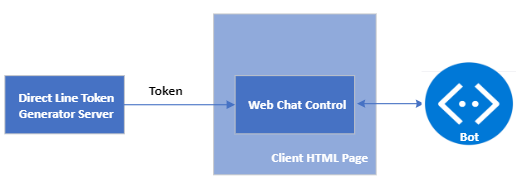

# Web Chat with Direct Line

This example demonstrates how to embed a Web Chat in an HTML page in a way that does not expose the **Direct Line secret**.

The following figure shows the components involved:

1. The **server** that generates the token from the **Direct Line secret**.
1. The **client HTML page** that contains the Web Chat.
1. The **bot** the Web Chat communicates with.




## Prerequisites

A registered bot. For more information, see [Register a bot with Azure Bot Service](https://docs.microsoft.com/azure/bot-service/bot-service-quickstart-registration?view=azure-bot-service-3.0).

## Web Chat secret

When embedding a Web Chat in an HTML page, you can provide either a **Direct Line secret** or a **Direct Line token** so the Web Chat can communicate with the bot.

- The Direct Line secret can be used to access all of the bot's conversations; it doesn't expire.
- The Direct Line token can only be used to access a single conversation; it does expire.
 For more information, see the [Direct Line Authentication](https://docs.microsoft.com/en-us/azure/bot-service/rest-api/bot-framework-rest-direct-line-3-0-authentication?view=azure-bot-service-4.0) article.

> [!WARNNG] The use of the Direct Line secret in an HTML page is strongly discouraged. The recommended approach is to exchange the secret for a token with the help of a Direct Line token generator server.

## User impersonation

The Web Chat allows to specify a **user ID**, which is sent to the bot.
Typically, the user ID is not verified an that potentially may allow **user impersonation** by hackers. This is a security risk if the bot stores sensitive data based on user ID. For example, the built-in [user authentication support in Azure Bot Service](https://docs.microsoft.com/en-us/azure/bot-service/bot-builder-concept-authentication?view=azure-bot-service-4.0) associates access tokens with user IDs.

To avoid impersonation, the recommended approach is for the server to **bind a user ID to the Direct Line token**. Then any conversation using that token will send the bound user ID to the bot.
However, if the client provides the user ID to the server, it is important for the server to validate the ID.

In this example the server generates a random user ID and binds it to the Direct Line token. This mitigates impersonation concerns but the users will have a different ID every time they talk to the bot.
For a consistent and validated user ID, see the [Direct Line user token sample](https://github.com/navzam/user-direct-line-token-sample).

## Architecture

This sample contains three components:

- **Direct Line Server**. It generates the Direct Line token acquisition and a random user ID that is bound to the token.
- **Client**. It contains a static HTML page that can be hosted using any web server. It makes a POST request to the backend API and uses the resulting Direct Line token to render WebChat.
- **Bot** The example assumes that you already have a bot deployed on Azure. For more information, see [Tutorial: Create and deploy a basic bot](https://docs.microsoft.com/azure/bot-service/bot-builder-tutorial-basic-deploy?view=azure-bot-service-4.0&tabs=csharp%2Cvs)

After receiving the Direct Line token, the client uses it to render the Web Chat. The bot will receive the randomly-generated user ID on every activity.

## Code highlights

### Constructing the user ID

In this example, the user is anonymous, so the server randomly generates a user ID:

<details><summary>JavaScript</summary>

```js
// server.js

async function generateRandomUserId() {
    const buffer = await randomBytesAsync(16);
    return `dl_${buffer.toString('hex')}`;
}
```

</details>

<details><summary>C#</summary>

```csharp
// DirectLineTokenController.cs

private static string GenerateRandomUserId()
{
    byte[] tokenData = new byte[16];
    using var rng = new RNGCryptoServiceProvider();
    rng.GetBytes(tokenData);

    return $"dl_{BitConverter.ToString(tokenData).Replace("-", "").ToLower()}";
}
```

</details>

The user ID is prefixed with "dl_" as required by the [Direct Line token API](https://docs.microsoft.com/en-us/azure/bot-service/rest-api/bot-framework-rest-direct-line-3-0-authentication?view=azure-bot-service-4.0#generate-token).

### Retrieving a user-specific Direct Line token

The API calls the Direct Line API to retrieve a Direct Line token. Notice that we pass the user ID in the body of the request:

<details><summary>JavaScript</summary>

```js
// fetchDirectLineToken.js

const response = await fetch('https://directline.botframework.com/v3/directline/tokens/generate', {
    headers: {
        'Content-Type': 'application/json',
        Authorization: `Bearer ${secret}`,
    },
    method: 'post',
    body: JSON.stringify({ user: { id: userId } })
});
```

</details>

<details><summary>C#</summary>

```csharp
// DirectLineTokenService.cs

httpClient.BaseAddress = new Uri("https://directline.botframework.com/");

...

var fetchTokenRequestBody = new { user = new { id = userId } };

var fetchTokenRequest = new HttpRequestMessage(HttpMethod.Post, "v3/directline/tokens/generate")
{
    Headers =
    {
        { "Authorization", $"Bearer {directLineSecret}" },
    },
    Content = new StringContent(JsonSerializer.Serialize(fetchTokenRequestBody), Encoding.UTF8, MediaTypeNames.Application.Json),
};

var fetchTokenResponse = await _httpClient.SendAsync(fetchTokenRequest, cancellationToken);
```

</details>

The resulting Direct Line token will be bound to the passed user ID.

### Calling the API and rendering WebChat

The UI calls the API and uses the resulting Direct Line token to render WebChat:

```js
// index.html

const res = await fetch('http://localhost:3000/api/direct-line-token', { method: 'POST' });
const { token } = await res.json();

window.WebChat.renderWebChat(
    {
    directLine: window.WebChat.createDirectLine({ token }),
    },
    document.getElementById('webchat')
);
```

Note that we do *not* specify a user ID when initiating WebChat. Direct Line will handle sending the user ID to the bot based on the token.

## Running the sample locally


### Run the bot

1. Navigate to the `bot` directory.
1. Fill in the environment variables in the `.env` file, according to the following table:
    | Variable | Description | Example value |
    | -------- | ----------- | ------------- |
    | `PORT` | The port on which the bot server will run. | 3978 |
    | `MICROSOFT_APP_ID` | The app ID of the registered Bot Framework bot. Can be found in the Azure Bot Channels Registration resource. | |
    | `MICROSOFT_APP_SECRET` | The app secret of the registered Bot Framework Bot. Issued during registration. | |
1. Run `npm install` to install the required dependencies.
1. Run `npm start` to start the bot.
1. Run `ngrok` to expose your bot to a public URL. For example:
    ```bash
    ngrok http -host-header=rewrite 3978
    ```
1. Update the messaging endpoint in your Bot Channels Registration to the ngrok URL. For example: `https://abcdef.ngrok.io/api/messages`

### Run the API

The sample API is available in multiple languages. Choose one and expand the corresponding section for specific steps.

<details><summary>JavaScript API</summary>

1. Navigate to the `api/javascript` directory.
1. Fill in the environment variables in the `.env` file. See the table below for descriptions.
1. Run `npm install` to install the required dependencies.
1. Run `npm start` to start the server.

| Variable | Description | Example value |
| -------- | ----------- | ------------- |
| `PORT` | The port on which the API server will run. | 3000 |
| `DIRECT_LINE_SECRET` | The Direct Line secret issued by Bot Framework. Can be found in the Azure Bot Channels Registration resource after enabling the Direct Line channel. |  |

</details>

<details><summary>C# API</summary>

1. Add the required secrets to the .NET Core secret manager. See the table below for descriptions.
    ```bash
    cd ./api/csharp
    dotnet user-secrets set "DirectLine:DirectLineSecret" "YOUR-DIRECT-LINE-SECRET-HERE"
    ```
1. (optional) Change the port specified in `./Properties/launchSettings.json`.
1. Run `dotnet run` to start the server. (Alternatively, open and run the project in Visual Studio.)

| Variable | Description | Example value |
| -------- | ----------- | ------------- |
| `DirectLine:DirectLineSecret` | The Direct Line secret issued by Bot Framework. Can be found in the Azure Bot Channels Registration resource after enabling the Direct Line channel. |  |

</details>

### Run the UI
1. Navigate to the `ui` directory.
1. Open `index.html` in a browser. (Alternatively, you can serve `index.html` on `localhost` using a web server, or use a local development server such as the [Live Server Visual Studio Code extension](https://marketplace.visualstudio.com/items?itemName=ritwickdey.LiveServer).)