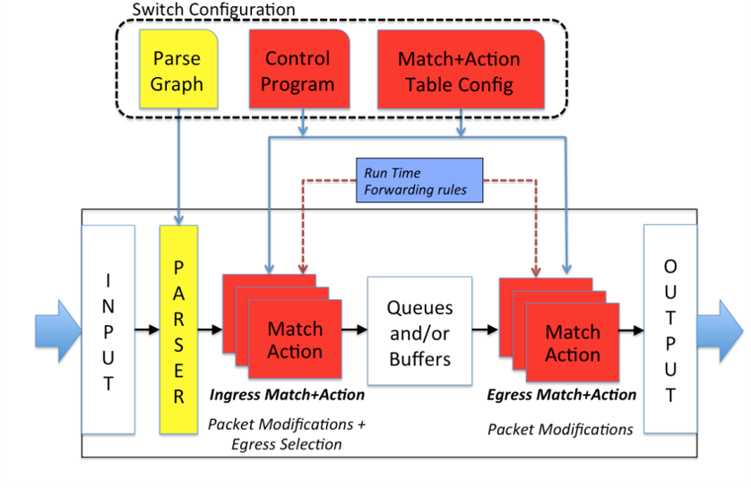
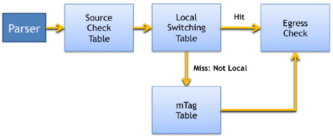

# P4 language details


## Background


The P4 language was desogned based on the following main requirements:

1. **Reconfigurability**. Programmers should be able
to change the way switches process packets once they are
deployed. 
1. **Protocol independence**. Switches should not be tied to any specific network protocols.
1. **Target independence**. Programmers should be able to describe packet processing functionality independently of the specifics of the underlying hardware. 


We'll show an example on how to use P4 to configure a switch to add a new hierarchical label.

From [Programming Protocol-Independent Packet Processors](https://www.cs.princeton.edu/~jrex/papers/of2.pdf)


## Overview

The **Programming Protocol-independent Packet Processors** (P4) is a domain-specific language that is designed to be implementable on a large variety of targets including programmable **network interface cards** (NIC), **FPGAs**, **software switches**, and **hardware ASICs**. As such, the language is restricted to constructs that can be efficiently implemented on all of these platforms. 

The P4 language itself is meant to implement an abstraction on top of compliant hardware. This abstraction will support the dual modes of hardware operation: **configuration** and **population**. 
In order to do so, a P4 program contains definitions of the following key components:

- **Header types** describe the format (the set of fields and their sizes) of each header within a packet.
- **Parsers** describe the permitted sequences of headers within received packets, how to identify those header sequences, and the headers and fields to extract from packets.
- **Tables** associate user-defined keys with actions. P4 tables **generalize traditional switch tables**. They can be used to implement **routing tables**, **flow lookup tables**, **access-control lists**, and other user-defined table types, including complex multi-variable decisions.
- **Actions** are code fragments that describe how packet header fields and metadata are manipulated. Actions can include data, which is supplied by the control-plane at runtime.
- **Match-action units** perform the following sequence of operations:
    - Construct lookup keys from packet fields or computed metadata.
    - Perform table lookup using the constructed key, choosing an action (including the associated data) to execute.
    - Finally, execute the selected action.
- **Control flow** expresses an **imperative program that describes packet-processing on a target**, including the data-dependent sequence of match-action unit invocations. **Deparsing** (packet reassembly) can also be performed using a control flow.
- **Extern objects** are **architecture-specific constructs** that can be manipulated by P4 programs through well-defined APIs, but **whose internal behavior is hard-wired** (e.g., checksum units) and **hence not programmable using P4**.
- **User-defined metadata** are user-defined data structures associated with each packet.
- **Intrinsic metadata** is metadata **provided by the architecture associated with each packet** (e.g., the input port where a packet has been received).


## P4 language abstract model

The P4 machine operates with only a few simple rules as shown in the following high level representation of the P4 abstract model. From [P4 Language Specification](https://p4.org/p4-spec/p4-14/v1.0.5/tex/p4.pdf#:~:text=The%20P4%20language%20uses%20a%20%EF%AC%82at%20typing%20structure%2C,expressed%20in%20P4%20in%20binary%2C%20decimal%20and%20hexadecimal).

**P4 abstract model**



1. For **each packet**, the parser produces a **parsed representation** on which **match+action** tables operate.
1. The **match+action tables** in the **ingress pipeline** generate an **egress specification** which determines the **set of ports** and number of **packet instances** for each port to which the packet will be sent.
1. The **queuing mechanism** processes this **egress specification**, generates the necessary **instances of the packet** and submits each to the **egress pipeline**. Egress
queuing may buffer packets when there is over-subscription for an output port, although this is not mandated by P4.
1. A **packet instance’s physical destination** is determined before entering the *egress
pipeline*. Once it is in the *egress pipeline**, this destination is assumed not to
change (though the packet may be dropped or its headers further modified).
1. After all processing by the *egress pipeline* is complete, the packet instance’s header
is formed from the **parsed representation** (as modified by match+action processing) and the resulting packet is transmitted.
Although not shown in this diagram, P4 supports recirculation and cloning of packets.

P4 focuses on the **specification of the parser**, **match+action tables** and the **control flow** through the pipelines. Programmers control this by writing a P4 program which **specifies the switch configuration** as shown at the top of the figure.
A machine that runs a P4 program is called **target**. Although a target may directly execute a P4 program, it is assumed that the program is compiled into a suitable configuration for the target. 
For example, currently, P4 does not expose the functionality of the queuing Mechanism and does not specify the semantics of the egress specification beyond what is mentioned above. Currently they are defined in target specific input to the compiler and exposed in conjunction with other interfaces that provide run time system management and configuration. 
Future versions of P4 may expose configuration of these mechanisms allowing consistent management of such resources from the P4 program.


## Hardware assumptions

P4 is intended to be target-independent so that one P4 program can be compiled to switches supplied by multiple
different vendors. Compliant hardware platforms will have to satisfy some basic requirements:

1. The switch must support two modes of execution:
    1. A **configuration mode** in which information about **packet formats** and the **structure of match+action tables** 
    is communicated to the switch for planning purposes.
    1. A **population mode** in which **rules** conforming to the specifications are **added and removed from the tables**. 
    
1. To implement P4 in its full generality, it must be possible to **configure the hardware’s packet parser** to identify and 
extract new fields from a packet. 
1. Tables within the target must support matching of all defined fields. 
1. The target must support implementation of a range of protocol-independent packet-processing primitives, 
including **copying**, **addition**, **removal**, and **modification** of both old and new fields as well as metadata.

This model makes more requirements of the underlying hardware than conventional OpenFlow. In particular, 

- OpenFlow assumes a fixed parser, whereas P4 model supports a **programmable parser** that allows new headers to be defined.
- OpenFlow assumes the **match+action tables** are laid out in sequence whereas P4 supports both sequential and parallel
processing units. 
- Finally, P4 requires **actions to be defined using reusable, protocol-independent primitives**.


## Analyzing P4 program structure 

From [Programming Protocol-Independent Packet Processors](https://www.cs.princeton.edu/~jrex/papers/of2.pdf). 

This section shows how each of the components described above contributes to the definition of an **idealized mTag packet processor** in P4.
The mTag combines the hierarchical routing with simple tags. In particular

- The routes through the core are encoded by a **32-bit tag** composed of **four single-byte fields**. 
- The 32-bit tag can carry a **source route** or a **destination locator** (like a Pseudo MAC). 
- Each core switch need only examine one byte of the tag and switch on that information.

In the example, the tag is added by the first ToR switch, although it could also be added by the end-host NIC.


### Header formats

A P4 program design begins with the **specification of header formats**.
Several domain-specific languages have been proposed and P4 borrows a number of ideas from them.
In general, each header is specified by declaring an **ordered list of field names along with their widths**. 
Optional field annotations allow constraints on value ranges or maximum lengths for variable-sized fields. 
For example, standard **Ethernet** and **VLAN** headers are specified as follows:

```p4
header ethernet {
    fields {
        dst_addr : 48; // width in bits
        src_addr : 48;
        ethertype : 16;
    }
}

header vlan {
    fields {
        pcp : 3;
        cfi : 1;
        vid : 12;
        ethertype : 16;
    }
}
```

The **mTag** (custom) header can be added without altering existing declarations. 

- The **field names indicate that the core has two layers of aggregation**. 
- Each **core switch** is programmed with rules to examine one of the specified bytes depending on its location in the hierarchy 
and the direction of travel (up or down).

```p4
header mTag {
    fields {
        up1 : 8;
        up2 : 8;
        down1 : 8;
        down2 : 8;
        ethertype : 16;
    }
}
```

### Packet parser

P4 assumes the following:

- The underlying switch can implement a **state machine** that **traverses packet headers** from start to finish, **extracting field values** as it goes. 
- The **extracted field values** are sent to the **match+action tables for processing**.

P4 **describes this state machine** directly as the **set of transitions from one header to the next**. 
Each transition may be triggered by values in the preceding header. 

The following example describes the **mTag state machine**. The parser for mTag is very simple—it has just four different states. Parsers in real networks require many more states.

```p4
// start state
parser start{
    ethernet;
}

// ethernet state
parser ethernet {
    switch(ethertype) {
        case 0x8100: vlan;
        case 0x9100: vlan;
        case 0x800: ipv4;
        // Other cases
    }
}

// vlan state
parser vlan {
    switch(ethertype) {
        case 0xaaaa: mTag;
        case 0x800: ipv4;
        // Other cases
    }
}

// mTag state
parser mTag {
    switch(ethertype) {
        case 0x800: ipv4;
        // Other cases
    }
}
```
The folllowing are the state machine steps:

1. Parsing begins in the **start state** and proceeds until an explicit **stop state** is reached or an unhandled case is encountered (which may be marked as an error). 
1. Upon reaching a state for a new header, the state machine extracts the header using its specification and proceeds to compute its next transition. 
1. The extracted header is **forwarded to match+action processing** in the back-half of the switch pipeline.



### Table Specification

The programmer describes how the defined **header fields are to be matched in the match+action stages**. For example, should they be 
exact matches, ranges, or wildcards?, and what actions should be performed when a match occurs.

In the simple mTag example, the **edge switch matches on the L2 destination and VLAN ID**, and **picks an mTag to add to the header**. 

The programmer therefore specifies a table to match on these fields, with the action to add the mTag header. 

The **reads attribute** declares which fields to match, qualified by the match type (exact, ternary, etc).
The **actions attribute** lists the possible actions which may be applied to a packet by the table.  Actions are explained in the following section. 
The max size attribute specifies how many entries the table should support.
The table specification allows a compiler to decide how much memory it needs, and the type (e.g., TCAM or SRAM) to implement the table.

```p4
table mTag_table {
    reads {
        ethernet.dst_addr : exact;
        vlan.vid : exact;
    }
    actions {
        // At runtime, entries are programmed with params
        // for the mTag action. See below.
        add_mTag;
    }
    max_size : 20000;
}
```


## References
- [P4 Network Programming Language—what is it all about?](https://codilime.com/blog/p4-network-programming-language-what-is-it-all-about/). This is a very good starting point; step by step intro. 
- [P4 Language Specification](https://p4.org/p4-spec/p4-14/v1.0.5/tex/p4.pdf#:~:text=The%20P4%20language%20uses%20a%20%EF%AC%82at%20typing%20structure%2C,expressed%20in%20P4%20in%20binary%2C%20decimal%20and%20hexadecimal) PDF format with good diagrams and definitions about the P4 langauge structure. 
- [Programming Protocol-Independent Packet Processors](https://www.cs.princeton.edu/~jrex/papers/of2.pdf). A white paper and another good intro to the language and the underlying principles. 
- [P4 Language Tutorial](https://cs344-stanford.github.io/lectures/Lecture-2-P4-tutorial.pdf) Power point and diagrams.
- [BEHAVIORAL MODEL (bmv2)](https://github.com/p4lang/behavioral-model)
- [Why Does the Internet Need a Programmable Forwarding Plane with Nick McKeown](https://www.youtube.com/watch?v=zR88Nlg3n3g)

