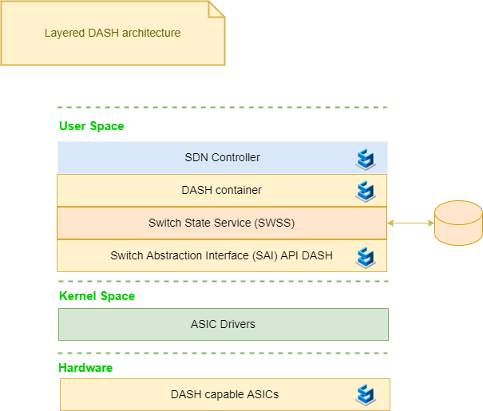

# DASH High Level Design 

## Overview

The following is a high level view of the DASH architecture main layers. 

## SDN controller

The SDN controller is **primarily responsible for controlling the DASH overlay services**, while the traditional SONiC stack is used to manage the underlay (L3 routing) and hardware platform. The **SDN controller communicates to a DASH device through a gNMI endpoint served by a new DASH SDN agent running inside a new SONiC DASH container**.  

The SDN controller controls the overlay built on top of the physical layer of the infrastructure.  From the point of view of the SDN control plane, when a customer creates an operation (ex: VNET creation) in a portal, the controller allocates the resources, placement management, capacity, etc. via the 'NorthBound' interface APIs.

## DASH container

Microsoft will spearhead the development of the SDN Agent (container) and solicit Community participation. In particular 
- The **SONiC orchagent** will be enhanced to translate these objects into SAI_DB objects, including the new DASH-specific SAI objects. 
- An enhanced syncd will then configure the dataplane using the vendor-specific SAI library.

## Switch State Service (SWSS)

## Switch Abstraction Interface (SAI) DASH

An **enhanced syncd** configures the dataplane using the vendor-specific SAI library.

## ASIC Drivers

## DASH capable ASICs

## References
- [Difference between Underlay Network and Overlay Network](https://ipwithease.com/difference-between-underlay-network-and-overlay-network/)
- [https://ipwithease.com/](https://ipwithease.com/)
