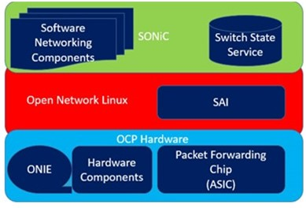
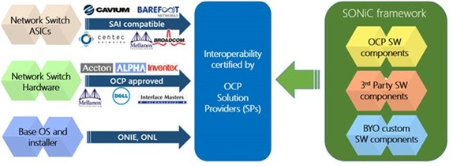

# Glossary #

<a href="#a" >A</a> <a href="#b">B</a> <a href="#c" >C</a> <a href="#d">D</a> <a href="#e" >E</a> <a href="#f">F</a> <a href="#g" >G</a> <a href="#h">H</a> <a href="#i" >I</a> <a href="#j">J</a> <a href="#k" >K</a> <a href="#l">L</a> <a href="#m" >M</a> <a href="#n">N</a> <a href="#o" >O</a> <a href="#p">P</a> <a href="#q" >Q</a> <a href="#r">R</a> <a href="#s" >S</a> <a href="#t">T</a> <a href="#u" >U</a> <a href="#v">V</a> <a href="#w" >W</a> <a href="#x">X</a> <a href="#y" >Y</a> <a href="#z">Z</a>  

## A ##

### ASIC ###  

An **[Application Specific Integrated Circuit](https://en.wikipedia.org/wiki/Application-specific_integrated_circuit)** (ASIC) is an integrated circuit (IC) chip customized for a particular use, rather than intended for general-purpose use. For example, a chip designed to run in a digital voice recorder is an ASIC. ASIC chips are typically built using metal-oxide-semiconductor (MOS) technology, as MOS integrated circuit chips. 

## F ##

### FPGA ###  

A **[Field Programmable Gate Array](https://en.wikipedia.org/wiki/Field-programmable_gate_array)** (FPGA) is an integrated circuit designed to be configured by a customer or a designer after manufacturing, hence the term field-programmable. The FPGA configuration is generally specified using a hardware description language (HDL), similar to that used for an application-specific integrated circuit (ASIC). 

## D ##

### DASH ###  

Microsoft Azure has created a sub-group of [SONiC](#sonic) (Software for Open Networking in the Cloud) that extends SONiC’s functionality to stateful workloads also known as **Disaggregated APIs for SONiC Hosts** or SONiC DASH. The goals are the following:

- With the help of network hardware vendors, create an open forum that capitalizes on the use of **programmable networking hardware** including [SmartNICs](https://blogs.nvidia.com/blog/2021/10/29/what-is-a-smartnic/), SmartToRs, SmartAppliances. 
- Optimize [Stateful L4](#stateful-l4) performance and connection scale by 10x or even 100x when compared to implementations that make extensive use of software. As host networking in the cloud is performed at L4 the resulting performance improvements should be truly significant.

## L ##

### Layers ###

The [OSI](#osi) model partitions the flow of data in a communication system into **seven abstraction layers**, from the physical implementation of transmitting bits across a communications medium to the highest-level representation of data of a distributed application. **Each intermediate layer serves a class of functionality to the layer above it and is served by the layer below it**. Classes of functionality are realized in software by standardized communication protocols.

This [list of network protocols](https://en.wikipedia.org/wiki/List_of_network_protocols_(OSI_model)) article categorize the network protoocol by the nearest layer in the Open Systems Interconnection model. This list is not exclusive to only the OSI protocol family. Many of these protocols are originally based on the Internet Protocol Suite (TCP/IP) and other models and they often do not fit neatly into the OSI layers.

## O ##

### OCP ###

The [Open Compute Project Foundation](https://www.opencompute.org/) (OCP) was created in 2011 with a mission to apply the benefits of open source and open collaboration to hardware and rapidly increase the pace of innovation around the data center. The OCP is a collaborative community focused on redesigning hardware technology to efficiently support the growing demands on compute infrastructure. 

In 2009 Facebook started a project to **design the world’s most energy efficient data center**, one that could handle unprecedented scale at the lowest possible cost. A small team of engineers spent the next two years designing and building one from the ground up: **software, servers, racks, power supplies, and cooling**. The result now stands in Prineville, Oregon.

It was 38% more energy efficient to build and 24% less expensive to run than the company’s previous facilities and has led to even greater innovation.

In 2011, Facebook shared its designs with the public and—along with Intel and Rackspace, Goldman Sachs and Andy Bechtolsheim—launched the **Open Compute Project** and incorporated the **Open Compute Project Foundation**. The five members hoped to create a movement in the hardware space that would bring about the same kind of creativity and collaboration we see in open source software. 

### ONIE ###

Created by Cumulus Networks, Inc. in 2012, the [Open Network Install Environment](https://www.opencompute.org/wiki/Networking/ONIE) (ONIE) Project is a small operating system, pre-installed as firmware on bare metal network switches, that provides an environment for automated operating system provisioning.

Incubated and adopted by the [OCP](#ocp) in 2013, the ONIE project enables a bare metal network switch ecosystem where end users can choose among different network operating systems. ONIE enables switch hardware suppliers to manage their operations based on a small number of hardware SKUs. This in turn creates economies of scale in manufacturing and distribution enabling a thriving ecosystem of both network hardware and operating system alternatives.

### ONL ###

Initially proposed at [OCP](#ocp) engineering workshop in San Antonio by [Big Switch Networks](http://bigswitch.com/) in 2013, [Open Network Linux](http://opennetlinux.org/) (ONL) is a Linux distribution for "bare metal" switches.

Adopted by the [OCP](#ocp) in 2014, ONL is the reference Network Operating System for the [OCP](#ocp).

### OSI ###

The [Open Systems Interconnection](https://en.wikipedia.org/wiki/OSI_model#Layer_4:_Transport_layer) (OSI) model is a conceptual model that characterizes and standardizes the communication functions of a telecommunication or computing system without regard to its underlying internal structure and technology. Its goal is the interoperability of diverse communication systems with standard communication protocols.

## S ##

### SAI ### 

The **Switch Abstraction Interface** (SAI), on which SONiC is built, defines a standard API. Network hardware vendors can use it to develop innovative hardware platforms that can achieve great speeds while keeping the programming interface to ASIC (application-specific integrated circuit) consistent. Microsoft open sourced SAI in 2015. This approach enables operators to take advantage of the rapid innovation in silicon, CPU, power, port density, optics, and speed, while preserving their investment in one unified software solution across multiple platforms.

### Stateful L4 ###

The stateful layer-4 (L4) load balancers scale out services hosted in cloud datacenters by mapping packets destined to a service with a virtual IP address (VIP) to a pool of servers with multiple direct IP addresses (DIPs or DIP pool). L4 load balancing is a critical function for inbound trac to the cloud and trac across tenants. A study reports that an average of 44% of cloud trac is VIP trac and thus needs load balancing function. For more information see [Making Stateful Layer-4 Load Balancing Fast and
Cheap Using Switching ASICs](http://cs.yale.edu/homes/yu-minlan/writeup/sigcomm17.pdf). 

### SONiC ###

Microsoft has pioneered the **Software for Open Networking in the Cloud** (SONiC), for network switch operations and management. It is a **collection of software networking components** required to build network devices with rich functionality and addresses the following main requirements, when runnig a cloud platform like Microsoft Azure:

- Use best-of-breed switching hardware for the various tiers of the network.
- Deploy new features without impacting end users.
- Roll out updates securely and reliably across the fleet in hours instead of weeks.
- Utilize cloud-scale deep telemetry and fully automated failure mitigation.
- Enable software-defined networking software to easily control all hardware elements in the network using a unified structure to eliminate duplication and reduce failures.

Microsoft open-sourced this innovation to the community, making it available on [SONiC GitHub](https://azure.github.io/SONiC/) repository.  It can **run on various switching platforms conformant to the [SAI](#sai) Switch Abstraction Interface specification**. SONiC enables cloud operators to take advantage of hardware innovation while giving them a **framework to build upon an open source code for network switch apps and the ability to integrate with multiple platforms**.  For more information, see [SONiC: The networking switch software that powers the Microsoft Global Cloud](https://azure.microsoft.com/en-us/blog/sonic-the-networking-switch-software-that-powers-the-microsoft-global-cloud/). 

<figcaption><i>Simplified view of the SONiC context</i></figcaption> 

#### SONiC and the OCP community ####

The OCP is the best platform to grow a fully open sourced stack holistically from the ground up. Open sourcing SONiC under the OCP umbrella is a logical step to growing the stack holistically at the OCP. SONiC brings together all the **building blocks to form an open sourced, fully functional, secure, and reliable cloud switch**. It gives the freedom to choose the hardware and software that is best suited for the required networking needs.

SONiC integrates with the standardized [SAI](#sai) interface and allows to exploit new hardware faster and enables to keep the pace with [ASIC](#asic) innovation while simultaneously being able to operate on multiple platforms. Initial contributions of SONiC also come with supported open source platform drivers for certain switches, enabling SONiC to run as a fully functional Layer2/Layer3 switch.

All his can be extended into a new scenario where Linux distributions could offer support for SONiC and SAI through kernel modules. More vendors can open source their platform drivers. Existing OCP certified switches can integrate with SAI via the Open Network Linux (ONL). Additionally, more software components can be open sourced.

#### SONiC and SAI ####

[SAI](#sai) is a key step towards open networking and a stepping stone to SONiC. Since its inception, SAI continues to grow within the community, attracting increasing numbers of contributors, consumers and features. Some SAI contributors fro SONiC adoption are Barefoot Networks, Broadcom, Cavium, Centec, Dell, Mellanox and Metaswitch.

After being accepted by the OCP, SAI is includes key features such as unified tunneling, an approach to have common APIs to address tunnels and L3 ingress and egress interfaces, and warm reboot, in service restart and upgrade of SAI without impacting the data plane. This is in addition to features that ensure full L3 routing functionality as well as other complex features such as Quality of Service (QoS). It also introduced a Python Test Framework (PTF), an effort to drive towards SAI compliancy at the OCP.

Both SAI and SONiC are available in binary and source code for vendor supported platforms. As a consumer, you can either get a binary or build one depending on supported platforms and versions for both SAI and SONiC to prototype your own data center switch. As a contributor, developers can contribute to both SAI and SONiC via the GitHub repositories. 

#### SONiC ecosystem ####

The following are highlights of the ecosystem in which SONiC operates.

<figcaption><i>Simplified view of the SONiC ecosystem</i></figcaption> 

##### Network switch ASICs #####

An Application Specific Integrated Circuit (ASIC) is purpose built for a particular use. In this case, these are built to provide as much network throughput as possible. They are two orders of magnitude faster than general purpose CPUs for forwarding packets. While these ASICs can do x Billion PPS, with careful software work, CPUs can do x 10s of Millions PPS. For more information, see [A summary of High Speed Ethernet ASICs](https://medium.com/the-elegant-network/a-summary-of-high-speed-ethernet-asics-260637c50583).

##### Network switch hardware #####

A network switch (also called switching hub, bridging hub, and, by the IEEE, MAC bridge) is networking hardware that connects devices on a computer network by using packet switching to receive and forward data to the destination device.

A network switch is a multiport network bridge that uses MAC addresses to forward data at the data link layer (layer 2) of the OSI model. Some switches can also forward data at the network layer (layer 3) by additionally incorporating routing functionality. Such switches are commonly known as layer-3 switches or multilayer switches. For more information, see [Network switch](https://en.wikipedia.org/wiki/Network_switch). 

## References ##

- [SONiC Wiki](https://azure.github.io/SONiC/)
- [SONiC Source Repositories](https://github.com/Azure/SONiC/blob/master/sourcecode.md)
- [Microsoft showcases “Software for Open Networking in the Cloud (SONiC)](https://azure.microsoft.com/en-us/blog/microsoft-showcases-software-for-open-networking-in-the-cloud-sonic/)

