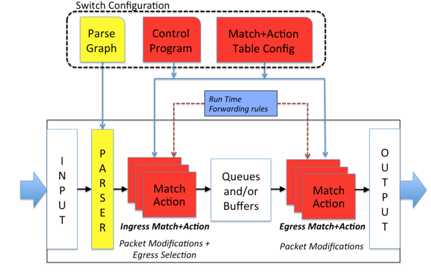
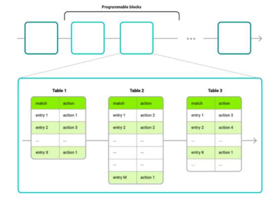
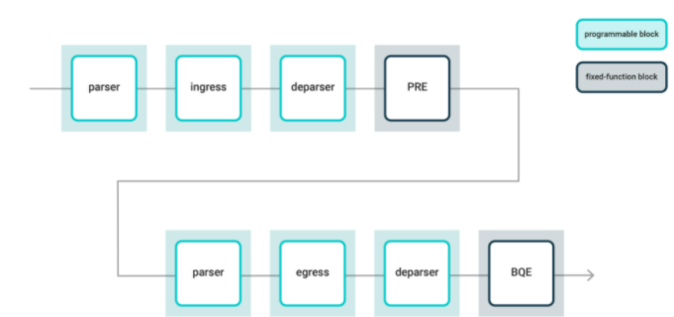
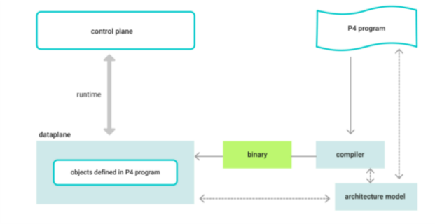
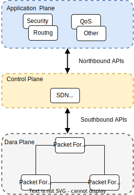
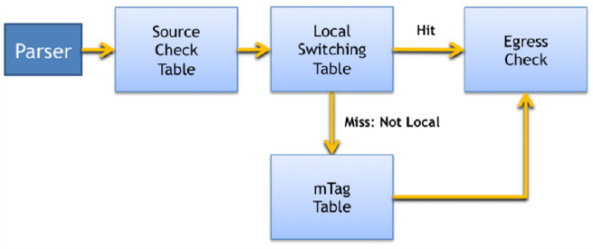

# P4 language details


## Background

The P4 language was desogned based on the following main requirements:

1. **Reconfigurability**. Programmers should be able
to change the way switches process packets once they are
deployed. 
1. **Protocol independence**. Switches should not be tied to any specific network protocols.
1. **Target independence**. Programmers should be able to describe packet processing functionality independently of the specifics of the underlying hardware. 


We'll show an example on how to use P4 to configure a switch to add a new hierarchical label.

From [Programming Protocol-Independent Packet Processors](https://www.cs.princeton.edu/~jrex/papers/of2.pdf)


## Overview

The **Programming Protocol-independent Packet Processors** (P4) is a domain-specific language that is designed to be implementable on a large variety of targets including programmable **network interface cards** (NIC), **FPGAs**, **software switches**, and **hardware ASICs**. As such, the language is restricted to constructs that can be efficiently implemented on all of these platforms. 

The P4 language itself is meant to implement an abstraction on top of compliant hardware. This abstraction will support the dual modes of hardware operation: **configuration** and **population**. 
In order to do so, a P4 program contains definitions of the following key components:

- **Header types** describe the format (the set of fields and their sizes) of each header within a packet.
- **Parsers** describe the permitted sequences of headers within received packets, how to identify those header sequences, and the headers and fields to extract from packets.
- **Tables** associate user-defined keys with actions. P4 tables **generalize traditional switch tables**. They can be used to implement **routing tables**, **flow lookup tables**, **access-control lists**, and other user-defined table types, including complex multi-variable decisions.
- **Actions** are code fragments that describe how packet header fields and metadata are manipulated. Actions can include data, which is supplied by the control-plane at runtime.
- **Match-action units** perform the following sequence of operations:
    - Construct lookup keys from packet fields or computed metadata.
    - Perform table lookup using the constructed key, choosing an action (including the associated data) to execute.
    - Finally, execute the selected action.
- **Control flow** expresses an **imperative program that describes packet-processing on a target**, including the data-dependent sequence of match-action unit invocations. **Deparsing** (packet reassembly) can also be performed using a control flow.
- **Extern objects** are **architecture-specific constructs** that can be manipulated by P4 programs through well-defined APIs, but **whose internal behavior is hard-wired** (e.g., checksum units) and **hence not programmable using P4**.
- **User-defined metadata** are user-defined data structures associated with each packet.
- **Intrinsic metadata** is metadata **provided by the architecture associated with each packet** (e.g., the input port where a packet has been received).


## P4 language abstract model

The P4 machine operates with only a few simple rules as shown in the following high level representation of the P4 abstract model. From [P4 Language Specification](https://p4.org/p4-spec/p4-14/v1.0.5/tex/p4.pdf#:~:text=The%20P4%20language%20uses%20a%20%EF%AC%82at%20typing%20structure%2C,expressed%20in%20P4%20in%20binary%2C%20decimal%20and%20hexadecimal).

**P4 abstract model**



1. For **each packet**, the parser produces a **parsed representation** on which **match+action** tables operate.
1. The **match+action tables** in the **ingress pipeline** generate an **egress specification** which determines the **set of ports** and number of **packet instances** for each port to which the packet will be sent.
1. The **queuing mechanism** processes this **egress specification**, generates the necessary **instances of the packet** and submits each to the **egress pipeline**. Egress
queuing may buffer packets when there is over-subscription for an output port, although this is not mandated by P4.
1. A **packet instance’s physical destination** is determined before entering the *egress
pipeline*. Once it is in the *egress pipeline**, this destination is assumed not to
change (though the packet may be dropped or its headers further modified).
1. After all processing by the *egress pipeline* is complete, the packet instance’s header
is formed from the **parsed representation** (as modified by match+action processing) and the resulting packet is transmitted.
Although not shown in this diagram, P4 supports recirculation and cloning of packets.

P4 focuses on the **specification of the parser**, **match+action tables** and the **control flow** through the pipelines. Programmers control this by writing a P4 program which **specifies the switch configuration** as shown at the top of the figure.
A machine that runs a P4 program is called **target**. Although a target may directly execute a P4 program, it is assumed that the program is compiled into a suitable configuration for the target. 
For example, currently, P4 does not expose the functionality of the queuing Mechanism and does not specify the semantics of the egress specification beyond what is mentioned above. Currently they are defined in target specific input to the compiler and exposed in conjunction with other interfaces that provide run time system management and configuration. 
Future versions of P4 may expose configuration of these mechanisms allowing consistent management of such resources from the P4 program.


## Hardware assumptions

P4 is intended to be target-independent so that one P4 program can be compiled to switches supplied by multiple
different vendors. Compliant hardware platforms will have to satisfy some basic requirements:

1. The switch must support two modes of execution:
    1. A **configuration mode** in which information about **packet formats** and the **structure of match+action tables** 
    is communicated to the switch for planning purposes.
    1. A **population mode** in which **rules** conforming to the specifications are **added and removed from the tables**. 
    
1. To implement P4 in its full generality, it must be possible to **configure the hardware’s packet parser** to identify and 
extract new fields from a packet. 
1. Tables within the target must support matching of all defined fields. 
1. The target must support implementation of a range of protocol-independent packet-processing primitives, 
including **copying**, **addition**, **removal**, and **modification** of both old and new fields as well as metadata.

This model makes more requirements of the underlying hardware than conventional OpenFlow. In particular, 

- OpenFlow assumes a fixed parser, whereas P4 model supports a **programmable parser** that allows new headers to be defined.
- OpenFlow assumes the **match+action tables** are laid out in sequence whereas P4 supports both sequential and parallel
processing units. 
- Finally, P4 requires **actions to be defined using reusable, protocol-independent primitives**.

## Analyzing P4 program structure 

[P4 Network Programming Language—what is it all about?](https://codilime.com/blog/p4-network-programming-language-what-is-it-all-about/).

P4 allows a programmer to fully **arbitrarily define how packets traversing programmable dataplane blocks will be processed**. The commonly used term in P4 is a **target**, which represents a variety of devices—switch, router, Network Interface Card (NIC) inserted into the server, a software switch—which in general can be programmed using P4. The great advantage of P4 is that it allows for processing not only standard well-known protocol headers (e.g. Ethernet, IP, TCP, etc.) like traditional switches or routers normally do, but also **fully custom ones**, as presented in the example P4 code below:

```p4
// Ethernet header definition
header ethernet_t {
    bit<48>     dst_addr;
    bit<48>     src_addr;
    bit<16>     ethertype;
}
// IPv4 header definition
header ipv4_t {
    bit<4>       ver;
    bit<4>       ihl;
    bit<8>       diffserv;
    bit<16>      totlen;
    bit<16>      identification;
    bit<3>       flags;
    bit<13>      frag_offset;
    bit<8>       ttl;
    bit<8>       proto;
    bit<16>      hdrCSM;
    bit<32>      src_addr;
    bit<32>      dst_addr;
}
 
// custom protocol header definition
header myCustomProtocol_t {
    bit<16>      proto_id;
    bit<8>       vrtual_connection_id
    bit<8>       flags
    bit<16>      src_node_id;
    bit<16>      dst_node_id;
}
 
// a struct combining all headers
struct headers {
    ethernet_t     ethernet;
    myCustomProtocol_t myCustomProtocol;
    ipv4_t             ipv4;
}

```

It is the programmer's responsisbility to perform the folloeing tasks:

- Explicitly define in the P4 program the **header types**,both well-known and custom, as well as the **way they are parsed**. 
- Design a **match-action pipeline** within the **given dataplane block**. This pipeline can be composed of one or multiple tables where **matching against parsed header fields** takes place.




The example below the key section of the `my_table` table includes two match fields: `hdr.ipv4.dst_addr` and `hdr.tcp.dst_port`, corresponding to destination IP address and destination TCP port, respectively. 

```p4
action drop() {
        mark_to_drop();
}
     
action my_action_1(some_type_t arg1, bit<16> arg2) {
 
    //my_action_1 behaviour implementation here
    //(...)
}
 
action my_action_2(bit<8> arg1) {
 
    //my_action_2 behaviour implementation here
    //(...)
}
     
table my_table {
    key = {
        ph_hdr.ipv4.dst_addr: lpm;
        ph_hdr.tcp.dst_port: exact;    
    }
    actions = {
        my_action_1;
        my_action_2;
        drop;
        NoAction;
    }
    size = 1024;
    default_action = drop();
}
```
For each table, one or more actions can be assigned to be executed at runtime. 

Actions define what to do with the packet: 

- modify the values of selected header fields
- drop the packet
- forward the packet to the chosen physical port
- etc. 

Moreover, not only can packet header fields be processed in the tables, but so can standard or user-defined metadata assigned to packets. 

All the aspects related to tables and their internal structure (like number of tables, match fields and actions for each table, action’s behaviour, etc.) are left to the P4 programmer. This makes P4 a powerful solution.


### P4 architecture model

P416 language specification introduces the architecture model. 

The P4 architecture model (in short, P4 architecture) does the following: 

- Identifies the **function blocks** that are present for a given dataplane target. 
- Specifies the **interfaces between them**. 

Both fixed-function blocks and programmable blocks can exist for a given target. 
The behavior of the fixed-function blocks is determined by the target manufacturer, 
leaving this fixed behavior outside of the P4 programmer’s control. 
Programmable blocks in turn are left to be programmer using P4. 
It is worth noting that **P4 programs are not expected to be portable across different architecture models**. 
However, **programs created for the same architecture should be portable across all targets that conform to the architecture model**.


The **detailed specification of the architecture must be provided by the target manufacturer**.  
For that purpose **the manufacturer provides a library P4 file** (`some_architecture_model.p4`) containing 
- All necessary declarations of functional blocks existing in the target pipeline.
- Their types as well as other data types, constants, externs, etc. 
- Only declarations of **programmable blocks** are included in the architecture definition model since, on principle, 
no single fixed-function block (if they are present in the target processing pipeline) can be manipulated by any P4 program. 
- The programmable block has to be **marked as a parser or control function**. 


The role of the **parser is to correctly identify the headers present in each incoming packet**. 
- As mentioned above, the header types, their structures as well as parser’s behavior must be defined in the P4 program (this responsibility falls to the P4 program developer, not the architecture model provider). 
- For each packet, the parser produces a parsed representation of all relevant headers, which is then passed to the first control block. 
- The sequence of control blocks in turn further processes the packet. This includes match-action table chain execution, checksum verification and recalculation, deparsing etc. 

The architecture file must contain at least one declaration for a package. 
This is where the most high-level functional declaration of the architectural model takes place, since all references to previously declared function blocks are grouped together here.

The following snippet of code (source: official P416 Language Specification v.1.2.0) presents declaration of programmable function blocks and package declarations for an example architecture:

```p4
// Very Simple Switch P4 declaration
// (...)
/**
 * Programmable parser.
 * @param <H> type of headers; defined by user
 * @param b input packet
 * @param parsedHeaders headers constructed by parser
 */
parser Parser<H>(packet_in b, out H parsedHeaders);
/**
* Match-action pipeline
* @param <H> type of input and output headers
* @param headers headers received from the parser and sent to the deparser
* @param parseError error that may have surfaced during parsing
* @param inCtrl information from architecture, accompanying input packet
* @param outCtrl information for architecture, accompanying output packet
*/
control Pipe<H>(inout H headers,
    in error parseError, // parser error
    in InControl inCtrl,// input port
    out OutControl outCtrl); // output port
/**
* VSS deparser.
* @param <H> type of headers; defined by user
* @param b output packet
* @param outputHeaders headers for output packet
*/
control Deparser<H>(inout H outputHeaders, packet_out b);
/**
* Top-level package declaration - must be instantiated by user.
* The arguments to the package indicate blocks that
* must be instantiated by the user.
* @param <H> user-defined type of the headers processed.
*/
package VSS<H>(Parser<H> p,
    Pipe<H> map,
    Deparser<H> d);

```

For P4 programs to operate on a given target an **architecture model description must be provided by a target manufacturer** in order to 
- Indicate all the capabilities. 
- Define architectural constraints. 

However, standard architecture specifications also exist.

#### Portable Switch Architecture (PSA)

The **Portable Switch Architecture** (PSA) is intended for **multi-port Ethernet targets** like a switch with multiple Ethernet interfaces. As stated in the [PSA specification](https://p4.org/p4-spec/docs/PSA.html), *the PSA is to the P416 language as the C standard library is to the C programming language*. 
It defines a set of standard data types, externs, counters, meters, etc. that can be used by P4 programmers according to their needs. The assumption is that such P4 programs will be **portable across different targets supporting PSA**. Moreover, the [P4.org](https://p4.org/) *Architecture working Group*, which owns the PSA specification, believes some of those standard PSA constructs could be supported in other architectural models as well.

The PSA model specifies **six programmable blocks** and **two fixed-function blocks**, as depicted in the figure below.



- The **Buffer Queuing Engine** (BQE) and  the Packet buffer and **Replication Engine** (PRE) are target dependent blocks. Configurations of those two blocks may vary for different devices. 
- The six remaining blocks are fully programmable using P4. 
    - Three of them are designated to provide an implementation of **ingress packet processing** (with parser, match-action treatment and deparser blocks). 
    - The other three blocks represent **egress processing** based on the same principle.

Another quasi-standard architecture is **v1.0 switch model**, also known as **V1Model**. V1Model was introduced to propose a kind of interim architecture until the PSA standard is ready and properly defined. V1Model is in fact a P416 switch architecture that models a fixed switch architecture from the P414 specification. In that context, V1Model facilitates the translation of P4 programs originally written in P414 to the P416 version. 
An example target that supports V1model is a **software switch** called **BMv2**, a popular tool for testing P4 programs, e.g. in **emulated network environments like mininet**.

### How to make it work?

P4 is a relatively simple language but the entire P4 environment may seem complex at first glance. If you want to write a P4 program for a given target, you must do the following:

1. Check which architecture model the target supports. Your P4 code must be in line with the architecture, i.e. with the limitations it introduces and capabilities it offers. 
1. The target manufacturer provides the compiler, which takes your P4 program code as an input and generates a target-specific configuration binary, which is then loaded into the target. 
1. At this oint, tables and other objects defined in your P4 code are present in the **data plane**. 
1. The only entity that is still missing is the **control plane**. 
    1. You can either build it on your own. 
    1. Or use software. like an **SDN controller**, by extending it with a set of functions enabling effective communication with your newly created dataplane. 
This gives you the whole picture. The data plane can now be manipulated by the control plane during runtime as shown in the figure below.




The **SDN controller** is the center of the most important component of the SDN architecture. It controls all the data plane devices. It also controls the applications in the **application layer**. The SDN controller communicates and controls these upper and lower layers with northbound and southebound APIs respectivley as shown in the figure below.



### P4 use cases

There are interesting use cases for both datacenter networks, enterprise networks and telco networks. Some examples have been grouped into categories below.

#### Flexible leaf-spine fabric

P4 can help in building flexible multi-purpose **leaf-spine fabric**. It could be based on white box switches, for instance, and thanks to using a P4-programmable data plane, the fabric would be easily reconfigured when needed. Such a fabric can serve various workloads related to web-scale, enterprise or telco applications whilst allowing for effective processing of different traffic patterns like flat IP/Ethernet, VLAN-tagged flows (including QinQ), MPLS flows, tunnelled traffic (VXLAN, GRE) etc. at the same time.

#### VNF-offloading

Deploying VNFs on x86 servers follows general NFV principles and as such can provide a lot of benefits. However, in many scenarios this may be not the optimal way to execute some network functions. Recently, the concept of CUPS (Control and User Plane Separation) has been gaining popularity. CUPS decomposes a given network function into control and user plane parts. An example might be a vBNG or vSPGW. 
In such a case, protocol-specific headers like PPPoE and GTP, respectively are processed by the P4 fabric switch while the control plane part is still deployed as a virtual appliance on the server. Another interesting example of VNF offloading would be to execute some typical network functions directly on a programmable HW like a switch or smartNIC in the DC environment. An example of such functions would be a firewall, a NAT or a load balancer.

#### Service chaining

This use case can be relevant for a wide variety of targets like **physical switches**, **NIC**, **software switches**, etc. The idea is to employ a P4-defined data plane in the process of creating service chains between virtual or physical service appliances (or mixed). Thanks to the high flexibility P4 offers, sophisticated forwarding rules can be defined and executed for the traffic flows. The matching can be handled using a combination of protocol header fields and user-defined metadata.

#### Inband Network Telemetry (INT)

Some people believe this use case is the **P4 killer-app**. This is because **P4 allows you to program data plane to gather much more information about the network state** than what we can determine today using traditional tools, with the simplest of those being the well-known ping and traceroute. The idea of INT is to gather telemetry metadata for each packet such as 
- packet routing paths 
- ingress and egress timestamps 
- latency the packet has experienced 
- queue occupancy in a given node
- egress port link utilization etc. 

Those metrics can be generated by each network node and sent to the monitoring system in the form of a report. 

Another method is to embed them into packets at every node the packet visits on its routing path and finally remove them in designated nodes that will send them aggregated to the monitoring system.

## Analyzing P4 program structure take two 

From [Programming Protocol-Independent Packet Processors](https://www.cs.princeton.edu/~jrex/papers/of2.pdf). 


The P4 language implements an abstraction on top of compliant hardware. 
This abstraction supports the dual modes of hardware operation: switch **configuration** and **population**. 
In order to do so, a P4 program contains definitions of the following key components:

- **Headers**. A header definition describes the sequence and structure of a series of fields. It includes information
about field width, as well as constraints on field values.
- **Parsers**. A parser definition determines the presence and order of headers within a packet.
- **Tables**. **Match+action tables** are the mechanism for packet processing. The P4 program defines the fields on which a
table may match and the actions it may execute.
- **Actions**. P4 supports construction of complex actions from simpler protocol-independent primitives. 
These complex actions are available within **match+action tables**.
- **Control Program**. The control program determines the order of matches and actions that are applied to a packet. 
Simple imperative programs describe the flow of control between match+action tables.


This section shows how each of the components described above contributes to the definition of an **idealized mTag packet processor** in P4.
The mTag combines the hierarchical routing with simple tags. In particular

- The routes through the core are encoded by a **32-bit tag** composed of **four single-byte fields**. 
- The 32-bit tag can carry a **source route** or a **destination locator** (like a Pseudo MAC). 
- Each core switch need only examine one byte of the tag and switch on that information.

In the example, the tag is added by the first ToR switch, although it could also be added by the end-host NIC.


### Header formats

A P4 program design begins with the **specification of header formats**.
Several domain-specific languages have been proposed and P4 borrows a number of ideas from them.
In general, each header is specified by declaring an **ordered list of field names along with their widths**. 
Optional field annotations allow constraints on value ranges or maximum lengths for variable-sized fields. 
For example, standard **Ethernet** and **VLAN** headers are specified as follows:

```p4
header ethernet {
    fields {
        dst_addr : 48; // width in bits
        src_addr : 48;
        ethertype : 16;
    }
}

header vlan {
    fields {
        pcp : 3;
        cfi : 1;
        vid : 12;
        ethertype : 16;
    }
}
```

The **mTag** (custom) header can be added without altering existing declarations. 

- The **field names indicate that the core has two layers of aggregation**. 
- Each **core switch** is programmed with rules to examine one of the specified bytes depending on its location in the hierarchy 
and the direction of travel (up or down).

```p4
header mTag {
    fields {
        up1 : 8;
        up2 : 8;
        down1 : 8;
        down2 : 8;
        ethertype : 16;
    }
}
```

### Packet parser

P4 assumes the following:

- The underlying switch can implement a **state machine** that **traverses packet headers** from start to finish, **extracting field values** as it goes. 
- The **extracted field values** are sent to the **match+action tables for processing**.

P4 **describes this state machine** directly as the **set of transitions from one header to the next**. 
Each transition may be triggered by values in the preceding header. 

The following example describes the **mTag state machine**. The parser for mTag is very simple—it has just four different states. Parsers in real networks require many more states.

```p4
// start state
parser start{
    ethernet;
}

// ethernet state
parser ethernet {
    switch(ethertype) {
        case 0x8100: vlan;
        case 0x9100: vlan;
        case 0x800: ipv4;
        // Other cases
    }
}

// vlan state
parser vlan {
    switch(ethertype) {
        case 0xaaaa: mTag;
        case 0x800: ipv4;
        // Other cases
    }
}

// mTag state
parser mTag {
    switch(ethertype) {
        case 0x800: ipv4;
        // Other cases
    }
}
```
The folllowing are the state machine steps:

1. Parsing begins in the **start state** and proceeds until an explicit **stop state** is reached or an unhandled case is encountered (which may be marked as an error). 
1. Upon reaching a state for a new header, the state machine extracts the header using its specification and proceeds to compute its next transition. 
1. The extracted header is **forwarded to match+action processing** in the back-half of the switch pipeline.


### Table specification

The programmer describes how the defined **header fields are to be matched in the match+action stages**. For example, should they be 
exact matches, ranges, or wildcards?, and what actions should be performed when a match occurs.

In the simple mTag example, the **edge switch matches on the L2 destination and VLAN ID**, and **picks an mTag to add to the header**. 

The programmer therefore specifies a table to match on these fields, with the action to add the mTag header. 

The **reads attribute** declares which fields to match, qualified by the match type (exact, ternary, etc).
The **actions attribute** lists the possible actions which may be applied to a packet by the table.  Actions are explained in the following section. 
The max size attribute specifies how many entries the table should support.
The table specification allows a compiler to decide how much memory it needs, and the type (e.g., TCAM or SRAM) to implement the table.

```p4
table mTag_table {
    reads {
        ethernet.dst_addr : exact;
        vlan.vid : exact;
    }
    actions {
        // At runtime, entries are programmed with params
        // for the mTag action. See below.
        add_mTag;
    }
    max_size : 20000;
}
```

For completeness and for later discussion, we present brief definitions of other tables that are referenced by the control program (control plane).

```p4
table source_check {
    // Verify mtag only on ports to the core
    reads {
    mtag : defined; // Was mtag parsed?
    metadata.ingress_port;
    }
    actions {
    // If inappropriate mTag, send to CPU
    fault_to_cpu;
    // If mtag found, strip and record in metadata
    strip_mtag;
    // Otherwise, allow the packet to continue
    pass;
    }
    max_size : 64; // One rule per port
}
```

```p4
    table local_switching {
    // Reads destination and checks if local
    // If miss occurs, goto mtag table.
    }
```

```p4
    table egress_check {
    // Verify egress is resolved
    // Do not retag packets received with tag
    // Reads egress and whether packet was mTagged
}
```

### Action specifications
P4 defines a collection of primitive actions from which more complex actions are built. 
To keep the table specification simple, actions are defined in action functions. 
Each P4 program declares **its own action functions**.

The add mTag action referred above is implemented as follows:

```p4
action add_mTag(up1, up2, down1, down2, egr_spec) {
    add_header(mTag);
    // Copy VLAN ethertype to mTag
    copy_field(mTag.ethertype, vlan.ethertype);
    // Set VLAN’s ethertype to signal mTag
    set_field(vlan.ethertype, 0xaaaa);
    set_field(mTag.up1, up1);
    set_field(mTag.up2, up2);
    set_field(mTag.down1, down1);
    set_field(mTag.down2, down2);
    // Set the destination egress port as well
    set_field(metadata.egress_spec, egr_spec);
}
```
If an action needs parameters (e.g., the up1 value for the mTag), it is supplied **from the match table at runtime**.

In this example, the switch performs the following actions:

- Inserts the mTag after the VLAN tag.
- Copies the VLAN tag’s ethertype into the mTag to indicate what follows.
- Sets the VLAN tag’s ethertype to `0xaaaa` to signal mTag. 

The programmer would also define a table and action to strip mTags from packets in
the egress edge switch. This action would copy the mTag’s ethertype back to the VLAN tag.

P4’s primitive actions include:
- set field: Set a specific field in a header to a value. Masked sets are supported.
- copy field: Copy one field to another.
- add header: Set a specific header instance (and all its fields) as valid.
- remove header: Delete (“pop”) a header (and all its fields) from a packet.
- increment: Increment or decrement the value in a field.
- checksum: Calculate a checksum over some set of header fields (e.g., an IPv4 checksum).

It is expected that most switch implementations would restrict action processing to permit only header modifications that are consistent with the specified packet format.

### Control program

Once **tables** and **actions** are defined, the only remaining task is to specify the **flow of control from one table to the next**. 
**Control flow** is specified as a program via a collection of:
- functions
- conditionals
- table references

**mTag control flow**



The previous figure shows the control flow for the **mTag implementation on edge switches**. 
After parsing, the `source_check` table verifies consistency between the received packet and the ingress port. 
For example, mTags should only be seen on ports connected to core switches. This table also strips mTags from the packet, but records whether the packet had an mTag in metadata. 
Tables later in the pipeline may analyze the metadata to avoid retagging the packet.
A `local_switching` table is then executed. If this table *misses*, it indicates that the packet is not destined for a locally connected host. 
In that case, the `mTag-table` is applied to the packet. 
Both **local** and **core forwarding** control can be processed by the `egress_check` table which handles the case of an unknown destination by
sending a notification up the SDN control stack. 
The imperative representation of this packet processing pipeline is as follows:


```P4
control main() {
    // Verify mTag state and port are consistent
    table(source_check);
    // If no error from source_check, continue
    if (!defined(metadata.ingress_error)) {
        // Attempt to switch to end hosts
        table(local_switching);
        if (!defined(metadata.egress_spec)) {
        // Not a known local host; try mtagging
        table(mTag_table);
        }
    // Check for unknown egress state or
    // bad retagging with mTag.
    table(egress_check);
    }
}

```

## Compiling a program 

For a network to implement a P4 program, you need a compiler to **map the target-independent description** onto
the **target switch’s specific hardware or software platform**.

This involves **allocating the target’s resources** and **generating appropriate configuration** for the device.

### Compiling packet parser

For devices with programmable parsers, the compiler **translates the parser description into a parsing state machine**.
For fixed parsers, the compiler merely verifies that the parser description is **consistent with the target’s parser**. 

The following table shows state table entries for the vlan and mTag
sections of the parser. Each entry specifies the current state, the field value to match, and a next state. 
Other columns are omitted for brevity.

**Parser state table entries for the mTag**

|current state|lookup value|next state|
|-------------|------------|----------|
| vlan | 0xaaaa| mTag|
| vlan | 0x800 | ipv4|
| vlan| * | stop |
| mTag | 0x800 | ipv4 |
| mTag | * | stop |


### Compiling control programs

The imperative control-flow representation in a convenient way to specify the logical forwarding behavior of a switch, but does not explicitly 
call out dependencies between tables or opportunities for concurrency. We therefore eemploy a compiler to analyze the control program to identify
dependencies and look for opportunities to process header fields in parallel. 
Finally, the compiler generates the target configuration for the switch. There are many potential targets: for example, 
a software switch, a multicore software switch, an NPU, a fixed function switch, or a reconfigurable match table (RMT) pipeline.

A two-stage compilation process is applied: 
1. Convert the control program to an intermediate table graph representation. The table graph is an extension of the tables declared in the P4 program. 
The nodes of the graph are the table declarations, and the edges indicate the order of processing. Conditional tests in the control program (e.g., if defined(mTag)) 
are replaced with “static” table instances with fixed entries whose actions determine the next table to execute, rather than populated at runtime.
1. The compiler analyzes the table graph to generate a device-specific configuration for the target switch. 
Each target supporting P4 requires a dedicated compiler (or compiler back-end) with knowledge of the table resources and
supported parallelism of the target to enable the correct mapping of tables. 

Let's briefly examine how the mTag example would be implemented in different kinds of switches:
- **Software switches**. A software switch provides complete flexibility: the table count, table configuration, and parsing
are under software control. The compiler directly maps the mTag table graph to switch tables. 
The compiler uses table type information to constrain table widths, heights, and matching criterion (e.g., exact, prefix, or wildcard) of each
table. The compiler might also optimize ternary or prefix matching with software data structures.
- **Hardware switches with RAM and TCAM**. A compiler can configure hashing to perform efficient exact-matching using RAM, for the mTag table in edge switches. 
In contrast, the core mTag forwarding table that matches on a subset of tag bits would be mapped to TCAM.
- **Switches supporting parallel tables**. The compiler can detect data dependencies and arrange tables in parallel or in series. In the mTag example, the tables `local_switching`
and `mTag_table` can execute in parallel up to the execution of the action of setting an mTag. 
- **Switches that apply actions at the end of the pipeline**. For switches with action processing only at the end of a
pipeline, the compiler can tell intermediate stages to generate metadata that is used to perform the final writes. 
In the mTag example, whether the mTag is added or removed could be represented in metadata.
- **Switches with a few tables**. The compiler can map a large number of P4 tables to a smaller number of physical tables. 
In the mTag example, the local switching could be combined with the mTag table. 
When the controller installs new rules at runtime, the compiler’s rule translator can “compose” the rules in the two P4 tables to generate
the rules for the single physical table.

## References
- [P4 Network Programming Language—what is it all about?](https://codilime.com/blog/p4-network-programming-language-what-is-it-all-about/). This is a very good starting point; step by step intro. 
- [P4 Language Specification](https://p4.org/p4-spec/p4-14/v1.0.5/tex/p4.pdf#:~:text=The%20P4%20language%20uses%20a%20%EF%AC%82at%20typing%20structure%2C,expressed%20in%20P4%20in%20binary%2C%20decimal%20and%20hexadecimal) PDF format with good diagrams and definitions about the P4 langauge structure. 
- [Programming Protocol-Independent Packet Processors](https://www.cs.princeton.edu/~jrex/papers/of2.pdf). A white paper and another good intro to the language and the underlying principles. 
- [P4 Language Tutorial](https://cs344-stanford.github.io/lectures/Lecture-2-P4-tutorial.pdf) Power point and diagrams.
- [BEHAVIORAL MODEL (bmv2)](https://github.com/p4lang/behavioral-model)
- [Why Does the Internet Need a Programmable Forwarding Plane with Nick McKeown](https://www.youtube.com/watch?v=zR88Nlg3n3g)

