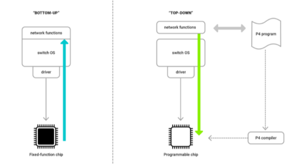
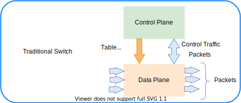
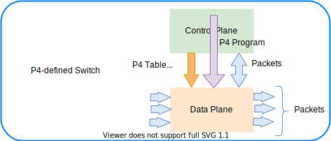
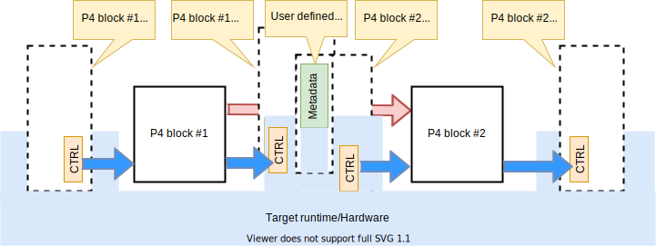

# P4 language overview

The **Programming Protocol-independent Packet Processors** (P4, in other word PPPP that is P4) is a domain-specific language for network devices, specifying how data plane devices (switches, NICs, routers, filters, etc.) process packets. For more information, see [P4 Open-Source Programming Language](https://p4.org/).

P4 is a domain-specific language that is designed to be implementable on a large variety of targets including programmable **network interface cards** (NIC), **FPGAs**, **software switches**, and **hardware ASICs**. As such, the language is restricted to constructs that can be efficiently implemented on all of these platforms. The following are some of the main core constructs provided by the P4 lanaguage:

## Why P4?

Network devices like switches or routers are most commonly designed **bottom-up**. The **switch vendors** that offer products to their clients usually **rely on external chips from 3rd party silicon vendors**. The chip is the heart of the system and determines the device OS and its functionality. The chip is a fixed-function unit and its internal packet processing pipeline cannot be easily reconfigured at runtime. It is a complex a long process that may because a chip redesign is usually required.

P4 offers a completely different approach, similar to how the Central Processing Unit (CPU), Graphics Processing Unit (GPU) or Digital Signal Processor (DSP) work. These processing units execute code written in a specific programming language (e.g C++ for CPU, OpenCL for GPU or Matlab for DSP). The code is first compiled and then loaded into the processor. 

P4 is based on the same principle, but for **network devices**. This is a **top-down** approach. The programmer defines the network feature set in the P4 program. The code is then compiled and the configuration is injected into the network device. Of course, to enable this, you need to use a special type of chip. It can still have a number of fixed-function blocks inside, but it must also contain programmable blocks.




## P4 language specifications

Go to the [P4 Language and Related Specifications](https://p4.org/specs/) page, scroll to the end of the page and select the link of the language specification and the format you desire, for example [Working draft](https://p4.org/p4-spec/docs/P4-16-working-spec.html).

The specificatons say P4 is a language for describing **how packets are processed by the data plane of a programmable forwarding element such as a hardware or software switch, network interface card, router, or network appliance**. The name P4 comes from the original paper that introduced the language, [Programming Protocol-independent Packet Processors](https://​arxiv.​org/​pdf/​1312.​1719.​pdf). While P4 was initially designed for programming switches, its scope has been broadened to cover a large variety of devices. 

> [!NOTE] 
> P4 is designed to **specify only the data plane functionality of the target**. P4 programs also **partially define the interface by which the control plane and the data-plane communicate**, but P4 cannot be used to describe the control-plane functionality of the target.

### P4 language overview

Before we start talking about traditional switch vs P4 switch, let's have a couple of definitions. 

- **Control plane**. A class of algorithms and the corresponding input and output data that are concerned with the **provisioning and configuration of the data plane**. In other words, the **control plane** performs **provisioning and configuring of the data plane**. 
- **Data plane**. A class of algorithms that **describe transformations on packets by packet-processing systems**.  In other words, the **data plane** **describes transformations on packets by packet-processing systems**.  

The language is designed to meet several goals:

#### arget independence
P4 programs are designed to be implementation-independent; they can be compiled against many different types of execution machines such as general-purpose CPUs, FPGAs, system(s)-on-chip, network processors, and ASICs. These different types of machines are known as **P4 targets**, and each target must be provided with a **compiler that maps the P4 source code into a target switch model**. The compiler may be embedded in the target device, an externally running software, or even a cloud service. As many of the initial targets for P4 programs were used for simple packet switching it is very common to hear the term *P4 switch* used, even though **P4 target** is more formally correct.

#### Protocol independence
P4 is designed to be protocol-independent; the language has no native support for even common protocols such as IP, Ethernet, TCP, VxLAN, or MPLS. Instead, the P4 programmer describes the **header formats** and **field names** of the **required protocols** in the program, which are in turn interpreted and processed by the **compiled program and target device**.

#### Reconfigurability
**Protocol independence** and the **abstract language model** allow for **reconfigurability**. P4 targets should be able to change the way they process packets (perhaps multiple times) after they are deployed. This capability is traditionally associated with **forwarding planes** built on general-purpose CPUs or network processors, rather than the fixed function ASICs. Although within the language there is nothing to prevent a given target from optimizing around a certain set of protocols, these optimizations are invisible to the language author and may ultimately reduce the system's flexibility and reconfigurability goals.


### Components
P4 programs typically have the components described below.

#### Parsing logic
P4 allows the specification of custom packet header parsing logic including but not limited to parsing typical headers used in the TCP/IP protocol suite and application specific headers.

#### Headers
Header definitions describe packet formats and provide names for the fields within the packet. The language allows customized header names and fields of arbitrary length, although many header definitions use widely known protocol names and fields widths. 
For example, an 802.3 Ethernet header definition might be 

- Called **Ethernet** 
- Consist of the a **48-bit field** named **dest** 
- Followed by a **48-bit field** named **src**
- Followed by a **16-bit field** named **type**. 

The names in a header definition are used later in the P4 program to reference these fields.

#### Parsers
The P4 parser is a **finite state machine** that walks an incoming byte-stream and **extracts headers** based on the programmed parse graph. A simple example would be a parser that extracts the Ethernet source and destination and type fields, then performs a further extraction based on the value in the type field (common values might be ipv4, ipv6, or MPLS).

#### Stateful processing
P4 allows the programmer to **maintain state** in the form of **registers**, **counters**, and **meters**.

#### Generic match action tables
The primary component of a P4 program is a set of user-defined **match action tables**. P4 treats all match action tables as generic, leaving the **user to add their match-action rules via the control plane**.

#### Match-action processing
Fundamental to P4 is the concept of **match-action pipelines**. Conceptually, forwarding network packets or frames can be broken down into a series of **table lookups and corresponding header manipulations**. In P4 these manipulations are known as **actions** and generally consist of things such as **copying byte fields from one location to another** based on the lookup results on learned forwarding state. 
P4 **addresses only the data plane** of a packet forwarding device. It **does not specify the control plane** nor any exact protocol for communicating state between the control and data planes. Instead, P4 uses the **concept of tables to represent forwarding plane state**. 
An interface between the control plane and the various P4 tables must be provided to allow the control plane to inject/modify state in the program. This interface is generally referred to as the **program API**.

#### Tables
P4 tables contain the **state used to forward packets**. Tables are composed of **lookup keys and a corresponding set of actions and their parameters**. A trivial example might be to store a set of destination MAC addresses as the lookup keys, and the corresponding action could set the output port on the device, and/or increment a counter. Tables and their associated actions are **almost always chained together in sequence to realize the full packet forwarding logic**, although in the abstract it is possible to build a single table that includes all the lookup key information and the full output action set.

#### Actions
Actions in P4 **describe packet field and metadata manipulations**. In P4 context, **metadata is information about a packet that is not directly derived from the parser**, such as the input interface that the frame arrived on. English descriptions of an example action might be "decrement the IPv4 TTL field by one" or "copy the MAC address from the output port table into the outgoing packet header." P4 defines both standard metadata that must be provided by all targets as well as target-specific metadata, which is provided by the author of specific targets.


#### Traditonal switch

In a traditional switch the **manufacturer defines the data plane functionality**. The **control plane controls the data plane** by managing entries in tables (e.g. routing tables), configuring specialized objects (e.g. meters), and by processing control-packets (e.g. routing protocol packets) or asynchronous events, such as link state changes or learning notifications.
Note that this is manufacturer specific and baked it in. It requires speific development and related tools. 



#### P4 programmable switch

A P4 programmable switch differs from a traditional switch in two essential ways:

- The **data plane functionality is not fixed in advance but is defined by a P4 program**. The data plane is configured at initialization time to implement the functionality described by the P4 program (shown by the long red arrow) and has no built-in knowledge of existing network protocols.
- The control plane communicates with the data plane using the same channels as in a fixed-function device, but **the set of tables and other objects in the data plane are no longer fixed**, since they are defined by a P4 program. The **P4 compiler generates the API that the control plane uses to communicate with the data plane**.
Hence, P4 can be said to be **protocol independent**, but it enables programmers to express a rich set of protocols and other data plane behaviors.



P4 is protocol independent, but it enables programmers to **express a rich set of protocols and other data plane behaviors**.

The following figure shows the workflow when programming a target via P4. 


- Target manufacturers provide the **hardware or software implementation framework**, an **architecture definition**, and a **P4 compiler** for that target. 
- P4 programmers write **programs for a specific architecture**, which defines a **set of P4-programmable components on the target** as well as **their external data plane interfaces**.

Compiling a set of P4 programs produces two artifacts:
- A **data plane configuration** that implements the forwarding logic described in the input program.
- An **API** for managing the state of the data plane objects from the control plane.

> [!NOTE]
> The computational complexity of a P4 program is linear in the total size of all headers, and never depends on the size of the state accumulated while processing data (e.g., the number of flows, or the total number of packets processed). 


### Archietcture model

The P4 architecture identifies the P4-programmable blocks (e.g., parser, ingress control flow, egress control flow, deparser, etc.) and their data plane interfaces.



The previous figure shows the **data plane interfaces between P4-programmable blocks**. It shows a target that has two programmable blocks. 
- Each block is programmed through a separate fragment of P4 code. 
- The target interfaces with the P4 program through a set of control registers (TRL) or signals. 
- Input controls provide information to P4 programs (e.g., the input port that a packet was received from), while output controls can be written to by P4 programs to influence the target behavior (e.g., the output port where a packet has to be directed). 
- Control registers/signals are represented in P4 as intrinsic metadata. 
- P4 programs can also store and manipulate data pertaining to each packet as user-defined metadata.

Each manufacturer must provide both a P4 compiler as well as an accompanying architecture definition for their target. The architecture definition does not have to expose the entire programmable surface of the data plane. A manufacturer may even choose to provide multiple definitions for the same hardware device, each with different capabilities (e.g., with or without multicast support).

#### Data plane interfaces

To describe a **functional block that can be programmed in P4**, the architecture includes a type declaration that specifies the interfaces between the block and the other components in the architecture. For example, the architecture might contain a declaration such as the following:

```p4
control MatchActionPipe<H>(in bit<4> inputPort, 
                           inout H parsedHeaders,
                           out bit<4> outputPort);
```

The previous code snippet declares a block named `MatchActionPipe` that can be programmed using a data dependent sequence of match-action unit invocations and other imperative constructs (indicated by the `control` keyword). 

The interface between the `MatchActionPipe` block and the other components of the architecture can be read from this declaration:

- The first parameter is a 4-bit value named `inputPort`. The direction `in` indicates that this parameter **is an input that cannot be modified**.
- The second parameter is an object of type `H` named parsedHeaders, where **H is a type variable representing the headers** that will be defined later by the P4 programmer. The direction `inout` indicates that this parameter is both an input and an output.
- The third parameter is a 4-bit value named `outputPort`. The direction out indicates that this parameter is an output whose value is undefined initially but can be modified.

#### Extern objects and functions

P4 programs can also interact with objects and functions provided by the architecture. Such objects are described using the `extern` construct, which describes the interfaces that such objects expose to the data-plane.

An `extern` object describes a set of methods that are implemented by an object, but not the implementation of these methods (it is similar to an abstract class in an object-oriented language). For example, the following construct could be used to describe the operations offered by an incremental checksum unit:

```p4
extern Checksum16 {
    Checksum16();              // constructor
    void clear();              // prepare unit for computation
    void update<T>(in T data); // add data to checksum
    void remove<T>(in T data); // remove data from existing checksum
    bit<16> get(); // get the checksum for the data added since last clear
}
```


## References

- [Getting started](https://github.com/p4lang/education/blob/master/GettingStarted.md)
- [Tutorials](https://github.com/p4lang/tutorials) Official tutorials.
- [Example of startjng with P4](https://opennetworking.org/news-and-events/blog/getting-started-with-p4/) It needs cloud deployment.
- [Fingerhut p4-guide](https://github.com/jafingerhut/p4-guide)
- [P4PI Introduction](https://youtu.be/UdQh38SCBKA) - Interesting experimental environment that includes a specific designed hardware.
- [P4 Language Tutorial](https://youtu.be/U3Mn6o2j4zQ)
- [P4 programming language - introduction to network programming with P4](https://youtu.be/UEMAvXXNWsY)


### Videos

| Title | Description |
|-------|-------------|
| [P4 language consortium](https://www.youtube.com/results?search_query=P4+LANGUAGE+CONSORTIUM)| Youtube search |
| [Introduction to P4_16. Part 1](https://www.youtube.com/watch?v=GslseT4hY1w) | Part 1 with diagrams and details |
| [Introduction to P4_16. Part 2](https://www.youtube.com/watch?v=yqxpypXIOtQ) | Part 2 with diagrams and details |
| [P4 Tutorial](https://youtu.be/pk_s53l6-Ec "Ctrl + Left Click to open link in a new window") | By Andy Fingerhut and Antonin Bas|
| [ Introduction to P4_16 presentation](https://opennetworking.org/wp-content/uploads/2020/12/Nov-2015-P4-Bootcamp-P4-Tutorial.pdf) | Good pictures and and P4 introduction |