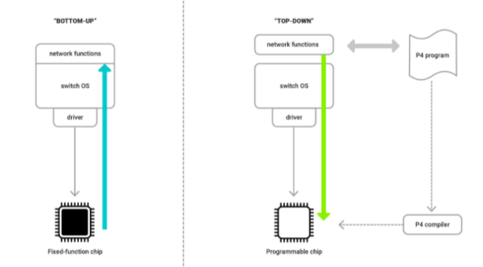
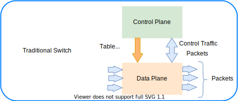
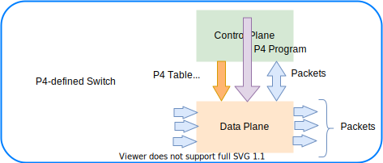
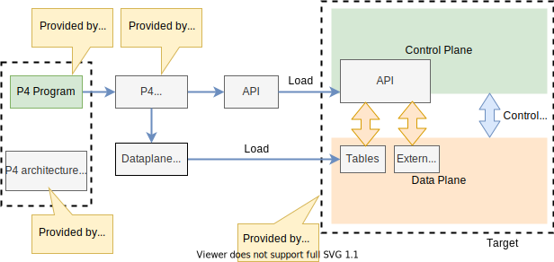
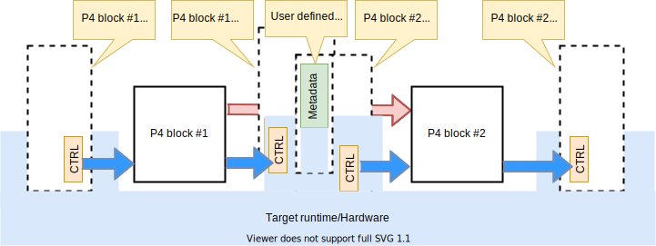

# P4 language

The **Programming Protocol-independent Packet Processors** (P4, in other word PPPP that is P4) is a domain-specific language for network devices, specifying how data plane devices (switches, NICs, routers, filters, etc.) process packets. For more information, see [P4 Open-Source Programming Language](https://p4.org/).

P4 is a domain-specific language that is designed to be implementable on a large variety of targets including programmable **network interface cards** (NIC), **FPGAs**, **software switches**, and **hardware ASICs**. As such, the language is restricted to constructs that can be efficiently implemented on all of these platforms. The following are some of the main core constructs provided by the P4 lanaguage:

## Background

Network devices like switches or routers are most commonly designed **bottom-up**. The **switch vendors** that offer products to their clients usually **rely on external chips from 3rd party silicon vendors**. The chip is the heart of the system and determines the device OS and its functionality. The chip is a fixed-function unit and its internal packet processing pipeline cannot be easily reconfigured at runtime. It is a complex a long process that may because a chip redesign is usually required.

P4 offers a completely different approach, similar to how the Central Processing Unit (CPU), Graphics Processing Unit (GPU) or Digital Signal Processor (DSP) work. These processing units execute code written in a specific programming language (e.g C++ for CPU, OpenCL for GPU or Matlab for DSP). The code is first compiled and then loaded into the processor. 

P4 is based on the same principle, but for **network devices**. This is a **top-down** approach. The programmer defines the network feature set in the P4 program. The code is then compiled and the configuration is injected into the network device. Of course, to enable this, you need to use a special type of chip. It can still have a number of fixed-function blocks inside, but it must also contain programmable blocks.



## Getting started with P4

1. Go to [P4 Open-Source Programming Language](https://p4.org/), then select the **Learn More** button. This takes you to the [Learn](https://p4.org/learn/) section.
1. Scroll to the end of the page. In the *Educational Working Group* section select the [Getting Started](https://github.com/p4lang/education/blob/master/GettingStarted.md) link.  This takes you to the GitHub **education** repository. 
1. Select the link [P4 Language and Related Specifications](https://p4.org/specs/) and read it or at least some of it. 
1. Then we suggest to watch the videos, specifically the **P4 tutorial in four parts**.
1. Finally you can go to the [tutorials](https://github.com/p4lang/tutorials) to start playing with the code examples. We suggest the alternative as described next.

### Suggested steps

1. You'll need a Linux machine - I installed Virtualbox hypervisor and then installed an Ubuntu 20.04 VM. it's
    a bit of a process. All the p4 stuff runs exclusively on Linux.  For more information, see [How to Install VirtualBox on Ubuntu ](../../Ubuntu/ubuntu-notes.md#how-to-install-virtualbox-on-ubuntu).
1. Once you have a VM, you might visit [https://github.com/jafingerhut/p4-guide](https://github.com/jafingerhut/p4-guide), it's one of the best resources I'm aware of. Andy Fingerhut put it together as a personal project. He's a big player in the P4 community and attends DASH meetings.
1. If you follow Andy's instructions, you'll end up installing a huge pile of tools with one convenient script.
    > [!NOTE]
    > You need more than just the compiler to do anything useful.
    > You need something to run the output on - e.g., the bmv2 simulator. Then you'll need example programs, which Andy's repo has in abundance.
1. Listen to video: [Goodbye Scapy, Hello Snappi (DEMO) - Chris Sommers & Ankur Sheth, Keysight technologies](https://www.youtube.com/watch?v=Db7Cx1hngVY)
1. See related slides: [Goodbye Scapy,Hello snappi](https://opennetworking.org/wp-content/uploads/2021/05/2021-P4-WS-Chris-Sommers-Ankur-Sheth-Slides.pdf)

## P4 language specifications

Go to the [P4 Language and Related Specifications](https://p4.org/specs/) page, scroll to the end of the page and select the link of the language specification and the format you desire, for example [Working draft](https://p4.org/p4-spec/docs/P4-16-working-spec.html).

The specificatons say P4 is a language for describing **how packets are processed by the data plane of a programmable forwarding element such as a hardware or software switch, network interface card, router, or network appliance**. The name P4 comes from the original paper that introduced the language, [Programming Protocol-independent Packet Processors](https://​arxiv.​org/​pdf/​1312.​1719.​pdf). While P4 was initially designed for programming switches, its scope has been broadened to cover a large variety of devices. 

> [!NOTE] 
> P4 is designed to **specify only the data plane functionality of the target**. P4 programs also **partially define the interface by which the control plane and the data-plane communicate**, but P4 cannot be used to describe the control-plane functionality of the target.

### P4 language overview

Before we start talking about traditional switch vs P4 switch, let's have a couple of definitions. 

- **Control plane**. A class of algorithms and the corresponding input and output data that are concerned with the **provisioning and configuration of the data plane**. In other words, the **control plane** performs **provisioning and configuring of the data plane**. 
- **Data plane**. A class of algorithms that **describe transformations on packets by packet-processing systems**.  In other words, the **data plane** **describes transformations on packets by packet-processing systems**.  


#### Traditonal switch

In a traditional switch the **manufacturer defines the data plane functionality**. The **control plane controls the data plane** by managing entries in tables (e.g. routing tables), configuring specialized objects (e.g. meters), and by processing control-packets (e.g. routing protocol packets) or asynchronous events, such as link state changes or learning notifications.
Note that this is manufacturer specific and baked it in. It requires speific development and related tools. 



#### P4 programmable switch

A P4 programmable switch differs from a traditional switch in two essential ways:

- The **data plane functionality is not fixed in advance but is defined by a P4 program**. The data plane is configured at initialization time to implement the functionality described by the P4 program (shown by the long red arrow) and has no built-in knowledge of existing network protocols.
- The control plane communicates with the data plane using the same channels as in a fixed-function device, but **the set of tables and other objects in the data plane are no longer fixed**, since they are defined by a P4 program. The **P4 compiler generates the API that the control plane uses to communicate with the data plane**.
Hence, P4 can be said to be **protocol independent**, but it enables programmers to express a rich set of protocols and other data plane behaviors.



P4 is protocol independent, but it enables programmers to **express a rich set of protocols and other data plane behaviors**.

The following figure shows the workflow when programming a target via P4. 



- Target manufacturers provide the **hardware or software implementation framework**, an **architecture definition**, and a **P4 compiler** for that target. 
- P4 programmers write **programs for a specific architecture**, which defines a **set of P4-programmable components on the target** as well as **their external data plane interfaces**.

Compiling a set of P4 programs produces two artifacts:
- A **data plane configuration** that implements the forwarding logic described in the input program.
- An **API** for managing the state of the data plane objects from the control plane.

> [!NOTE]
> The computational complexity of a P4 program is linear in the total size of all headers, and never depends on the size of the state accumulated while processing data (e.g., the number of flows, or the total number of packets processed). 


### Archietcture model

The P4 architecture identifies the P4-programmable blocks (e.g., parser, ingress control flow, egress control flow, deparser, etc.) and their data plane interfaces.



The previous figure shows the **data plane interfaces between P4-programmable blocks**. It shows a target that has two programmable blocks. 
- Each block is programmed through a separate fragment of P4 code. 
- The target interfaces with the P4 program through a set of control registers (TRL) or signals. 
- Input controls provide information to P4 programs (e.g., the input port that a packet was received from), while output controls can be written to by P4 programs to influence the target behavior (e.g., the output port where a packet has to be directed). 
- Control registers/signals are represented in P4 as intrinsic metadata. 
- P4 programs can also store and manipulate data pertaining to each packet as user-defined metadata.

Each manufacturer must provide both a P4 compiler as well as an accompanying architecture definition for their target. The architecture definition does not have to expose the entire programmable surface of the data plane. A manufacturer may even choose to provide multiple definitions for the same hardware device, each with different capabilities (e.g., with or without multicast support).

#### Data plane interfaces

To describe a **functional block that can be programmed in P4**, the architecture includes a type declaration that specifies the interfaces between the block and the other components in the architecture. For example, the architecture might contain a declaration such as the following:

``` c++
control MatchActionPipe<H>(in bit<4> inputPort, 
                           inout H parsedHeaders,
                           out bit<4> outputPort);
```

The previous code snippet declares a block named `MatchActionPipe` that can be programmed using a data dependent sequence of match-action unit invocations and other imperative constructs (indicated by the `control` keyword). 

The interface between the `MatchActionPipe` block and the other components of the architecture can be read from this declaration:

- The first parameter is a 4-bit value named `inputPort`. The direction `in` indicates that this parameter **is an input that cannot be modified**.
- The second parameter is an object of type `H` named parsedHeaders, where **H is a type variable representing the headers** that will be defined later by the P4 programmer. The direction `inout` indicates that this parameter is both an input and an output.
- The third parameter is a 4-bit value named `outputPort`. The direction out indicates that this parameter is an output whose value is undefined initially but can be modified.

#### Extern objects and functions

P4 programs can also interact with objects and functions provided by the architecture. Such objects are described using the `extern` construct, which describes the interfaces that such objects expose to the data-plane.

An `extern` object describes a set of methods that are implemented by an object, but not the implementation of these methods (it is similar to an abstract class in an object-oriented language). For example, the following construct could be used to describe the operations offered by an incremental checksum unit:

```c++
extern Checksum16 {
    Checksum16();              // constructor
    void clear();              // prepare unit for computation
    void update<T>(in T data); // add data to checksum
    void remove<T>(in T data); // remove data from existing checksum
    bit<16> get(); // get the checksum for the data added since last clear
}
```


## Vscode support

Install the extension: Name: [p4 language support in vscode](https://marketplace.visualstudio.com/items?itemName=ZhanghanWang.p4-lang)


## References

- [Getting started](https://github.com/p4lang/education/blob/master/GettingStarted.md)
- [Tutorials](https://github.com/p4lang/tutorials) Official tutorials
- [P4 Language presentation](https://opennetworking.org/wp-content/uploads/2020/12/P4_tutorial_01_basics.gslide.pdf)
- [Example of startjng with P4](https://opennetworking.org/news-and-events/blog/getting-started-with-p4/) It needs cloud deployment.
- [Fingerhut p4-guide](https://github.com/jafingerhut/p4-guide)
- [P4PI Introduction](https://youtu.be/UdQh38SCBKA) - Interesting experimental environment that includes a specific designed hardware.
- [P4 Language Tutorial](https://youtu.be/U3Mn6o2j4zQ)
- [P4 programming language - introduction to network programming with P4](https://youtu.be/UEMAvXXNWsY)
- [P4 Tutorial](https://youtu.be/pk_s53l6-Ec)

