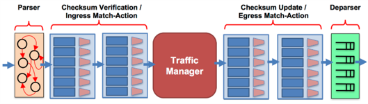

# Using P4 in Mininet on BMV2

From [Working with P4 in Mininet on BMV2](https://usi-advanced-networking.github.io/deliverables/p4-mininet/).

The open source software switch called **behavioral model version 2** (BMV2), developed by the *P4.org* is designed to be a **target** for **P4 programs**. That is, P4 programs can be compiled and configure BMV2 to processes packets. Every P4 target supports one or more P4 target architectures. The target architecture supported by BMV2 that we will be using for these introductory exercises is called the **V1Model**. A diagram of the V1Model is shown below.

)

The V1Model, or **architecture**, consists of six P4 programmable components:

1. Parser
1. Checksum verification control block
1. Ingress Match-Action processing control block
1. Egress Match-Action processing control block
1. Checksum update control block
1. Deparser

P4.org has defined this target architecture in the file called  [v1model.p4](https://github.com/p4lang/p4c/blob/main/p4include/v1model.p4) and added support for it to the open source P4 front end compiler called **p4c**. This allows p4c to compile P4 programs written for the V1Model into a **json file** that can be used **to configure the BMV2 software switch**.

P4.org has put together a set of [tuorials](https://github.com/p4lang/tutorials) exercises designed to incrementally introduce new features of the P4 language.  