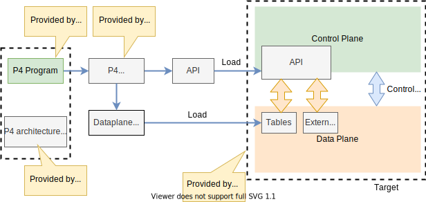

# Network notes

Learning while drinking from the fire hose

## Network concepts and definitions

## Programming Protocol-independent Packet Processors (P4)

|Document|Description|
|--------|-----------|
|[P4 language overview](P4/p4-language-overview.md)|A round-up of P4 main characteristics|
|[P4 language getting started](P4/p4-language-getting-started.md)| How to start using P4: setting the environment, tools, etc.|
|[P4 language details](P4/p4-language-details.md)| Getting into the P4 weeds|
|[Using P4 in Mininet on BMV2](P4/samples/bmv2.md)| Software switch called **behavioral model version 2** (BMV2)|