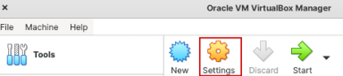

# Ubuntu notes


## Install Visual Studio Code

Open your terminal (`Ctrl + Alt + T`). Then perform the steps below.

Foolow the steps as described in the section 
2- Install Visual Studio Code On Ubuntu 20.04 (LTS) and 20.10 Using Terminal, in the article [How to Install Visual Studio Code On Ubuntu 20.04](https://linuxhint.com/install_use_vs_code_ubuntu/). 


## Install GitHub desktop 

Open your terminal (`Ctrl + Alt + T`). Then perform the steps below.

The following command upload version 2.6.3, but you can select the version you want. 

``` cmd
sudo wget https://github.com/shiftkey/desktop/releases/download/release-2.6.3-linux1/GitHubDesktop-linux-2.6.3-linux1.deb`
```
```cmd
sudo apt-get install gdebi-core
```
```cmd
sudo gdebi GitHubDesktop-linux-2.6.3-linux1.deb
```

To acctivate the app, go to the **Applications** window and search for `github`. 
Select the app.  

For mmore information, see [Install GitHub Desktop on Ubuntu 20.04 or Ubuntu-based distributions](https://meshworld.in/install-github-desktop-on-ubuntu-20-04-or-ubuntu-based-distributions/).

> [!NOTE]
> I had login problems when trying to access my GitHub repo. To solve the issue, I created a personal access token (PAT) and use it instead of the password to login. For more information, see [Creating a personal access token](https://docs.github.com/en/authentication/keeping-your-account-and-data-secure/creating-a-personal-access-token).


## How to Install VirtualBox on Ubuntu 

### What is VirtualBox?
VirtualBox is a free, open-source and cross-platform software that lets you create, run, and manage **virtual machines** (VMs) on your computer.  

- With Oracle VM VirtualBox you can create one or more VMs on a single physical server. 
- Virtual machines are computers that use the hardware components of the host computer, each running its own operating system. 
- VirtualBox supports the installation of MS Windows, Linux, BDS, and MS-DOS on the installed VMs.

Below we'll explain how to install a VirtualBox on Ubuntu 20.04 LTS  system using the CLI commands.


Open a terminal and execute the commands shown below.


1. Install repository GPG key:

    ```cmd
    wget -q https://www.virtualbox.org/download/oracle_vbox_2016.asc -O- | sudo apt-key add 
    ```
    ```cmd
    wget -q https://www.virtualbox.org/download/oracle_vbox.asc -O- | sudo apt-key add 
    ```

1. Open the follwoing file for editing:

    ```cmd
        nano /etc/apt/sources.list
    ```
    Add the following line to the file:
    
    ```cmd
    deb https://download.virtualbox.org/virtualbox/debian hirsute contrib
    ```

1. Install virtualbox-6.1 deb package:

    ```cmd
    sudo apt-get install virtualbox-6.1
    ```

1. Launch the VirtualBox interface by entering the following:

    ```cmd
    virtualbox
    ```

1. Install VirtualBox extension pack

```cmd
wget https://download.virtualbox.org/virtualbox/6.1.26/Oracle_VM_VirtualBox_Extension_Pack-6.1.26.vbox-extpack
```

```cmd
sudo VBoxManage extpack install Oracle_VM_VirtualBox_Extension_Pack-6.1.26.vbox-extpack
```

For more information, see [How to Install VirtualBox on Ubuntu](https://phoenixnap.com/kb/install-virtualbox-on-ubuntu).

If you get and error saying that the Kernel modules do not match the version of the VirtualBox, follow the steps described [here](https://askubuntu.com/questions/837427/virtualbox-kernel-modules-do-not-match-this-version-of-virtualbox). 


### Install C header Linux Kernel on Debian or Ubuntu

In case the virtualbox does not start you may need to install Linux headers as shown next. 


To install the Linux Kernel headers on Ubuntu or Debian Linux run this command to install the sources for your kernel specific version.

```cmd
sudo apt-get install linux-headers-$(uname -r)
```

And this command to install the generic package, and keep your sources up to date. Every time you run

```cmd
sudo apt-get update && sudo apt-get upgrade
```

Your kernel and kernel headers will upgrade if an upgrade is available.

```cmd
    aptitude install linux-headers-2.6-686
```
Replace the "-686" for "-(xen	vserver	openvz)-686" or "-amd64" or "-686-bigmem", if you need to. That depends on your architecture. To check yours, use this command: 

```cmd
uname -a 
```

For more information, see [How to install Linux Kernel headers on Debian or Ubuntu](https://www.garron.me/en/go2linux/how-install-linux-kernel-headers-debian-or-ubuntu.html).


## How to Uninstall VirtualBox on Ubuntu 

To uninstall VirtualBox from your system without removing any configurations you might have made, enter the following command as sudo:

```cmd
sudo apt remove virtualbox
```

If you have made any configurations, such as installing an extension package, you can remove VirtualBox and all those by using the following command:

``` 
sudo apt purge virtualbox
```

For more information, see [How to Install VirtualBox on Ubuntu 20.04 LTS](https://vitux.com/how-to-install-virtualbox-on-ubuntu/).


## Install Linux on a Virtual Machine using VirtualBox

This section explains how to create a Linux VM using VirtualBox. You do this in two phases:

1. [Create a virtual machine](#create-a-virtual-machine).
1. [Install the operating system on the virtual machine](#install-the-operating-system-on-the-virtual-machine). 

For a crisp explanation of the steps involved, see this video: [Install Linux on a Virtual Machine using VirtualBox](https://www.youtube.com/watch?app=desktop&v=hvkJv71PsCs).

The steps described next are foirm here: [How To Setup a Linux Virtual Machine with VirtualBox](https://www.techjunkie.com/setup-linux-virtual-machine-virtualbox/)

### Create a virtual machine
1. Assure that you have the VirtualBox installed on your computer. See the section [## How to Install VirtualBox on Ubuntu ](#how-to-install-virtualbox-on-ubuntu). 
1. Open the **VirtualBox** application to create a **Virtual Machine** (VM). 
1. In the right pane select the **New** icon.

    

1. In the displayed wizard select a name for the new virtual machine, select the operating system you want.

    

1. Select **Next**.

1. Select the RAM size, we suggest 4GB.

    

1. Select **Next**.

1. Create the virtual hard disk.

    

1. Select **Create**.

1. Select hard disk type.

    

1. Select **Next**.

1. Select hard disk type of allocation. We slected *dynamic*. 

    

1. Click **Next**. 

1. Select hard disk size. We suggest 60GB.

    

1. Click **Create**. 

You should have settings similar to the following:


### Install the operating system on the virtual machine

1. Download the ISO for the virtual machine operating system. We choose Ubuntu, which you can download [ubuntu desktop download](https://ubuntu.com/#download) for free. Once you have the ISO downloaded, you’ll want to mount it to your virtual machine. 
1. In the VirtualBox, in the the left pane, select the virtual machine you created. 
1. In the right pane, select the **Settings** icon.

    

1. In the displayed wizard, in the left pane, select **Storage**. In the right pane, select **Controller IDE**, and then select the **Adds Optical Drive** icon. 

     

1. Select the ***Add* icon. Then search for the file Ubuntu image file you downloaded and select it. It will show in the wizard. 

     

1. Select **Choose**. 
1. Select **OK**. 
1. Now you can start the virtual machine with the installed Ubuntu OS. Select the **Start** icon.  
    
    

## Miscellanea

- Hide and unhide the VirtualBox menu bar in a virtual machine. 
Enter `Host + C`. Where `Host` is the right `Ctrl` key. For more information, see [I hid the menu bar in virtual box, how to show it again?](https://superuser.com/questions/1176587/i-hid-the-menu-bar-in-virtual-box-how-to-show-it-again). For more information, see [VirtualBox 6.0 keyboard shortcuts](https://defkey.com/oracle-vm-virtualbox-shortcuts). 

- Create shared folder between a virtual machine and the host computer. Follow the steps described in [You do not have the permissions necessary to view the content of the shared folder](https://darrenma.wordpress.com/2012/07/18/you-do-not-have-the-permissions-necessary-to-view-the-contents-of-shared_folder/).
The following is an example of the command to run on the virtual 
machine:

```bash
    sudo usermod -G vboxsf -a michael
```
Where `vboxsf` is the VirtualBox group (Ubuntu). You need to replace michael with the user name of your virtual machine.
The command takes effect after restarting the virtual machine. 

- [How To Kill A Process On Ubuntu Using The Command Line](https://coderrocketfuel.com/article/how-to-kill-a-process-on-ubuntu-using-the-command-line). 


[How to take screenshots](https://www.makeuseof.com/how-to-take-screenshots-on-ubuntu/)


## Tools

- Install **LibreOffice**. Follow the instructions described in this article: [LibreOffice installation on Ubuntu](https://wiki.ubuntu.com/LibreOffice). 
- Install **draw.io**. Follow the instructions described in this article: [Install the draw.io Desktop diagram generator on Ubuntu](https://ubunlog.com/en/draw-io-desktop-install-ubuntu-diagram-generator/).

## Miscellanea

- [How to Uninstall An Application In Ubuntu](https://techwiser.com/uninstall-applications-ubuntu/)
- [How to Install Deb Files (Packages) on Ubuntu](https://linuxize.com/post/how-to-install-deb-packages-on-ubuntu/)
- [Install Linux on a Virtual Machine using VirtualBox](https://www.youtube.com/watch?app=desktop&v=hvkJv71PsCs)
- [7 Open Source Paint Applications for Linux Users](https://itsfoss.com/open-source-paint-apps/)
- [How to Take Screenshots on Ubuntu? 4 Different Methods](https://www.makeuseof.com/how-to-take-screenshots-on-ubuntu/)
