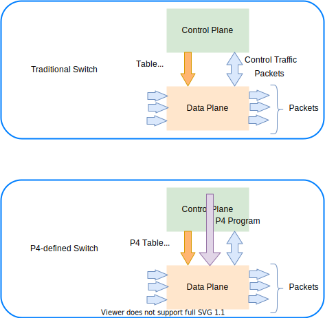

# P4 language

The Programming Protocol-independent Packet Processors (P4, in other word PPPP that is P4) is a domain-specific language for network devices, specifying how data plane devices (switches, NICs, routers, filters, etc.) process packets. For more information, see [P4 Open-Source Programming Language](https://p4.org/).

## Getting started with P4

1. Go to [P4 Open-Source Programming Language](https://p4.org/), then select the **Learn More** button. This takes you to the [Learn](https://p4.org/learn/) section.
1. Scroll to the end of the page. IN the *Educational Working Group* section select the [Getting Started](https://github.com/p4lang/education/blob/master/GettingStarted.md) link.  This takes you to the GitHub **education** repository. 
1. Select the link [P4 Language and Related Specifications](https://p4.org/specs/) and read it or at least some of it. 
1. Then we suggest to watch the videos, specifically the **P4 tutorial in four parts**.
1. Finally you can go to the [tutorials](https://github.com/p4lang/tutorials) to start playing with the code examples. 

## Reading the P4 language specifications

Go to the [P4 Language and Related Specifications](https://p4.org/specs/) page, scroll to the end of the page and select the link of the language specification and the format you desire, for example [Working draft](https://p4.org/p4-spec/docs/P4-16-working-spec.html).

The specificatons say P4 is a language for describing **how packets are processed by the data plane of a programmable forwarding element such as a hardware or software switch, network interface card, router, or network appliance**. The name P4 comes from the original paper that introduced the language, [Programming Protocol-independent Packet Processors](https://​arxiv.​org/​pdf/​1312.​1719.​pdf). While P4 was initially designed for programming switches, its scope has been broadened to cover a large variety of devices. 

> [!NOTE] 
> P4 is designed to **specify only the data plane functionality of the target**. P4 programs also **partially define the interface by which the control plane and the data-plane communicate**, but P4 cannot be used to describe the control-plane functionality of the target.

Next we are going to highlight some of the main P4 characteristics. 

Suggested by Chris

1.  Hi Michael, you'll need a Linux machine - I installed Virtualbox
    hypervisor under Windows and then install an Ubuntu 20.04 VM. it\'s
    a bit of a process. All the p4 stuff runs exclusively on Linux
    AFAIK.

2.  Once you have a VM, you might visit
    [[https://github.com/jafingerhut/p4-guide]{.underline}](https://github.com/jafingerhut/p4-guide),
    it\'s one of the best resources I\'m aware of. Andy Fingerhut put it
    together as a personal project. He\'s a big player in the p4
    community and attends DASH meetings.

3.  If you follow Andy\'s instructions, you\'ll end up installing a huge
    pile of tools with one convenient script.

    a.  You need more than just the compiler to do anything useful.

    b.  You need something to run the output on - e.g., the bmv2
        simulator. Then you\'ll need example programs, which Andy\'s
        repo has in abundance.

Listen to video: [[Goodbye Scapy, Hello Snappi (DEMO) - Chris Sommers &
Ankur Sheth, Keysight
Technologies]{.underline}](https://www.youtube.com/watch?v=Db7Cx1hngVY)

See related slides: [[Goodbye Scapy,Hello
snappi]{.underline}](https://opennetworking.org/wp-content/uploads/2021/05/2021-P4-WS-Chris-Sommers-Ankur-Sheth-Slides.pdf)

References

- [Getting started](https://github.com/p4lang/education/blob/master/GettingStarted.md)
- [Tutorials](https://github.com/p4lang/tutorials) Official tutorials
- [P4 Language presentation](https://opennetworking.org/wp-content/uploads/2020/12/P4_tutorial_01_basics.gslide.pdf)
- [Example of startjng with P4](https://opennetworking.org/news-and-events/blog/getting-started-with-p4/) It needs cloud deployment.
- [Fingerhut p4-guide](https://github.com/jafingerhut/p4-guide)

