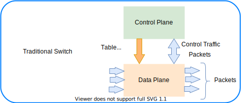
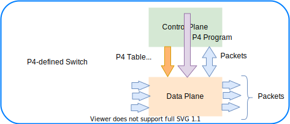
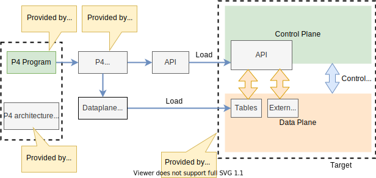

# P4 language

The **Programming Protocol-independent Packet Processors** (P4, in other word PPPP that is P4) is a domain-specific language for network devices, specifying how data plane devices (switches, NICs, routers, filters, etc.) process packets. For more information, see [P4 Open-Source Programming Language](https://p4.org/).

P4 is a domain-specific language that is designed to be implementable on a large variety of targets including programmable **network interface cards** (NIC), **FPGAs**, **software switches**, and **hardware ASICs**. As such, the language is restricted to constructs that can be efficiently implemented on all of these platforms.

The following ae some of the main core abstractions provided by the P4 lanaguage:

- **Header types** describe the format (the set of fields and their sizes) of each header within a packet.
- **Parsers** describe the permitted sequences of headers within received packets, how to identify those header sequences, and the headers and fields to extract from packets.
- **Tables** associate user-defined keys with actions. P4 tables **generalize traditional switch tables**. They can be used to implement **routing tables**, **flow lookup tables**, **access-control lists**, and other user-defined table types, including complex multi-variable decisions.
- **Actions** are code fragments that describe how packet header fields and metadata are manipulated. Actions can include data, which is supplied by the control-plane at runtime.
- **Match-action units** perform the following sequence of operations:
    - Construct lookup keys from packet fields or computed metadata.
    - Perform table lookup using the constructed key, choosing an action (including the associated data) to execute.
    - Finally, execute the selected action.
- **Control flow** expresses an **imperative program that describes packet-processing on a target**, including the data-dependent sequence of match-action unit invocations. **Deparsing** (packet reassembly) can also be performed using a control flow.
- **Extern objects** are **architecture-specific constructs** that can be manipulated by P4 programs through well-defined APIs, but **whose internal behavior is hard-wired** (e.g., checksum units) and **hence not programmable using P4**.
- **User-defined metadata** are user-defined data structures associated with each packet.
- **Intrinsic metadata** is metadata **provided by the architecture associated with each packet** (e.g., the input port where a packet has been received).

## Getting started with P4

1. Go to [P4 Open-Source Programming Language](https://p4.org/), then select the **Learn More** button. This takes you to the [Learn](https://p4.org/learn/) section.
1. Scroll to the end of the page. IN the *Educational Working Group* section select the [Getting Started](https://github.com/p4lang/education/blob/master/GettingStarted.md) link.  This takes you to the GitHub **education** repository. 
1. Select the link [P4 Language and Related Specifications](https://p4.org/specs/) and read it or at least some of it. 
1. Then we suggest to watch the videos, specifically the **P4 tutorial in four parts**.
1. Finally you can go to the [tutorials](https://github.com/p4lang/tutorials) to start playing with the code examples. 

## P4 language specifications

Go to the [P4 Language and Related Specifications](https://p4.org/specs/) page, scroll to the end of the page and select the link of the language specification and the format you desire, for example [Working draft](https://p4.org/p4-spec/docs/P4-16-working-spec.html).

The specificatons say P4 is a language for describing **how packets are processed by the data plane of a programmable forwarding element such as a hardware or software switch, network interface card, router, or network appliance**. The name P4 comes from the original paper that introduced the language, [Programming Protocol-independent Packet Processors](https://​arxiv.​org/​pdf/​1312.​1719.​pdf). While P4 was initially designed for programming switches, its scope has been broadened to cover a large variety of devices. 

> [!NOTE] 
> P4 is designed to **specify only the data plane functionality of the target**. P4 programs also **partially define the interface by which the control plane and the data-plane communicate**, but P4 cannot be used to describe the control-plane functionality of the target.

### P4 language overview

Before we start talking about traditional switch vs P4 switch, let's have a couple of definitions. 

- **Control plane**. A class of algorithms and the corresponding input and output data that are concerned with the **provisioning and configuration of the data plane**. In other words, the **control plane** performs **provisioning and configuring of the data plane**. 
- **Data plane**. A class of algorithms that **describe transformations on packets by packet-processing systems**.  In other words, the **data plane** **describes transformations on packets by packet-processing systems**.  

#### Traditonal switch

In a traditional switch the **manufacturer defines the data plane functionality**. The **control plane controls the data plane** by managing entries in tables (e.g. routing tables), configuring specialized objects (e.g. meters), and by processing control-packets (e.g. routing protocol packets) or asynchronous events, such as link state changes or learning notifications.
Note that this is manufacturer specific and baked it in. It requires speific development and related tools. 

#### P4 programmable switch

A P4 programmable switch differs from a traditional switch in two essential ways:

- The **data plane functionality is not fixed in advance but is defined by a P4 program**. The data plane is configured at initialization time to implement the functionality described by the P4 program (shown by the long red arrow) and has no built-in knowledge of existing network protocols.
- The control plane communicates with the data plane using the same channels as in a fixed-function device, but **the set of tables and other objects in the data plane are no longer fixed**, since they are defined by a P4 program. The **P4 compiler generates the API that the control plane uses to communicate with the data plane**.
Hence, P4 can be said to be **protocol independent**, but it enables programmers to express a rich set of protocols and other data plane behaviors.

P4 is protocol independent, but it enables programmers to **express a rich set of protocols and other data plane behaviors**.

The following figure shows the workflow when programming a target via P4. 

- Target manufacturers provide the **hardware or software implementation framework**, an **architecture definition**, and a **P4 compiler** for that target. 
- P4 programmers write **programs for a specific architecture**, which defines a **set of P4-programmable components on the target** as well as **their external data plane interfaces**.

Compiling a set of P4 programs produces two artifacts:
- A **data plane configuration** that implements the forwarding logic described in the input program.
- An **API** for managing the state of the data plane objects from the control plane.

> [!NOTE]
> The computational complexity of a P4 program is linear in the total size of all headers, and never depends on the size of the state accumulated while processing data (e.g., the number of flows, or the total number of packets processed). 

Suggested steps

1.  Hi Michael, you'll need a Linux machine - I installed Virtualbox
    hypervisor under Windows and then install an Ubuntu 20.04 VM. it\'s
    a bit of a process. All the p4 stuff runs exclusively on Linux
    AFAIK.

2.  Once you have a VM, you might visit
    [https://github.com/jafingerhut/p4-guide](https://github.com/jafingerhut/p4-guide),
    it's one of the best resources I'm aware of. Andy Fingerhut put it
    together as a personal project. He's a big player in the P4 community and attends DASH meetings.

3.  If you follow Andy's instructions, you'll end up installing a huge
    pile of tools with one convenient script.

    a.  You need more than just the compiler to do anything useful.

    b.  You need something to run the output on - e.g., the bmv2
        simulator. Then you'll need example programs, which Andy's
        repo has in abundance.

Listen to video: [Goodbye Scapy, Hello Snappi (DEMO) - Chris Sommers & Ankur Sheth, Keysight technologies](https://www.youtube.com/watch?v=Db7Cx1hngVY)

See related slides: [Goodbye Scapy,Hello snappi](https://opennetworking.org/wp-content/uploads/2021/05/2021-P4-WS-Chris-Sommers-Ankur-Sheth-Slides.pdf)

References

- [Getting started](https://github.com/p4lang/education/blob/master/GettingStarted.md)
- [Tutorials](https://github.com/p4lang/tutorials) Official tutorials
- [P4 Language presentation](https://opennetworking.org/wp-content/uploads/2020/12/P4_tutorial_01_basics.gslide.pdf)
- [Example of startjng with P4](https://opennetworking.org/news-and-events/blog/getting-started-with-p4/) It needs cloud deployment.
- [Fingerhut p4-guide](https://github.com/jafingerhut/p4-guide)

