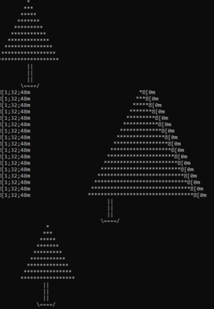

# Xmas Sample
More than anything this sample shows the steps to use the virtual environment to build and run the example.

1. In your command terminal, navigate to the directory that contains the virtual environment, for example: `cd C:\Users\<user name>\Python>`.
1. Activate the environment: `venv\Scripts\activate`.
1. Navigate to the directory where the sample is, for example: `cd examples\xmas`.
1. Make sure to install the required packages:
`pip install -r requirements.txt`.
1. Run the sample: `python xmas-tree.py`.
You get the following output:

    .