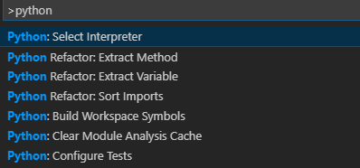

# Python environments in Visual Studio code

- [Overview](#overview)
- [Select and activate an environment](#select-and-activate-an-environment)
- [Where the extension looks for environments](#where-the-extension-looks-for-environments)
- [Global, virtual, and conda environments](#global-virtual-and-conda-environments)
- [References](#references)

## Overview 

An **environment** in Python is the **context** in which a program runs. An environment consists of an interpreter and any number of installed packages. The Python extension for VS Code provides helpful integration features for working with different environments. To create a virtual environment, see [Python virtual environments](python-virtual-environments.md).

> **Note**. If you're looking to get started with Python in Visual Studio Code, see [Getting Started with Python in VS Code](https://code.visualstudio.com/docs/python/python-tutorial).

A **context** includes one of the following environments:

- global
- virtual
- [conda](https://www.anaconda.com/)

An environment consists of:

- an interpreter
- a library (typically the Python Standard Library)
- a set of installed packages

> **Note**.
> An environment determine which language constructs and syntax are valid, what operating-system functionality you can access, and which packages you can use.


## Select and activate an environment

By default, the Python extension looks for and uses the first **Python interpreter** it finds in the system path. If it doesn't find an interpreter, it issues a warning.
To select a specific environment, use the **Python: Select Interpreter** command from the **Command Palette `(Ctrl+Shift+P)`**.



You can switch environments at any time; switching environments helps you test different parts of your project with different interpreters or library versions as needed.

To switch environment, perform the steps described below.

1. Open the **Command Palette** by entering `(Ctrl+Shift+P)` on your keyboard.
1. In the input box, enter **Python: Select Interpreter**. This displays a list of available global, conda, and virtual environments.
1. Selecting an interpreter from the list. This adds an entry for `python.pythonPath` inside your **Workspace Settings**. Because the path is part of the workspace settings,the same environment should already be selected whenever you open that workspace. 
1. If you want to set up your own default interpreter for your applications, you can instead add an entry for `python.pythonPath` manually inside your **User Settings**. To do so, do the following:
    1. Open the **Command Palette `(Ctrl+Shift+P)`**.
    1. In the input box, enter **Preferences: Open User Settings**. Then set `python.pythonPath`, which is in the **Python extension** section of *User Settings*, with the appropriate interpreter.

The Python extension uses the selected environment for running Python code. Activate a **New Terminal** from, switch to the directory where the Python file is, the run the command `python filename.py`. 

When you have a `.py` file open in the editor, and open a terminal, VS Code automatically activated the selected environment.

**Note**. To prevent automatic activation of a selected environment, add `"python.terminal.activateEnvironment": false` to your `settings.json` file. It can be placed anywhere as a sibling to the existing settings.

To edit the `settings.json` file, perform these steps:

1. Open the **Command Palette** by entering `(Ctrl+Shift+P)` on your keyboard.
1. In the input box, enter **Preferences: Open Default Settings (JSON)**.
1. Add the settings:

    ```json
    {
        "python.terminal.activateEnvironment": false
    }
    ```

1. Save the `settings.json` file.


## Where the extension looks for environments

The extension automatically looks for interpreters in the following locations:

- Standard install paths such as `/usr/local/bin`, `/usr/sbin`, `/sbin`, `c:\\python27`, `c:\\python37`, etc.
- Virtual environments located directly under the workspace (project) folder.
- Virtual environments located in the folder identified by the `python.venvPath` setting (see General settings), which can contain multiple virtual environments. The extension looks for virtual environments in the first-level sub-folders of `venvPath`.
- Virtual environments located in a `~/.virtualenvs` folder for *virtualenvwrapper*.
- Interpreters installed by *pyenv*.
- A pipenv environment for the workplace folder. If one is found, then no other interpreters are searched for or listed as pipenv expects to manage all aspects.
- Virtual environments located in the path identified by `WORKON_HOME` (as used by *virtualenvwrapper* and *pipenv*).
- Conda environments that contain a Python interpreter. VS Code does not show conda environments that don't contain an interpreter.
- Interpreters installed in a *.direnv* folder for *direnv* under the workspace (project) folder.

You can also manually specify an interpreter if Visual Studio Code does not locate it automatically.
The extension also loads an environment variable definitions file identified by the `python.envFile` setting. The default value of this setting is `${workspaceFolder}/.env`.

## Global, virtual, and conda environments

By default, **any Python interpreter** that you've installed **runs in its own global environment**, which is not specific to any one project. 
For example, if you just run python (Windows) or python3 (macOS/Linux) at a new command prompt, you're running in that interpreter's global environment. Accordingly, any packages that you install or uninstall affect the global environment and all programs that you run within that context.

Although working in the global environment is an easy way to get started, that environment will, over time, **become cluttered with many different packages that you've installed for different projects**. 

>**Note**. Clutter makes it difficult to thoroughly test an application against a specific set of packages with known versions, which is exactly the kind of environment you'd set up on a build server or web server.

For the above reason, you create a **virtual environment** for a project. A virtual environment is a sub-folder in a project that contains a copy of a specific interpreter. 

**When you activate the virtual environment, any packages you install are installed only in that environment's subfolder**. When you then run a Python program within that environment, you know that it's running against only those specific packages.

>**Note**. A conda environment is a virtual environments that's created and managed using the conda package manager. See Conda environments for more details.

To create a virtual environment, in Windows, use the command shown below, where ".myvenv" is the name of the environment folder:

```cmd
# Windows
# You can also use py -3 -m venv .myvenv
python -m venv .myvenv
```

When you create a new virtual environment, a prompt will be displayed to allow you to select it for the workspace.

## References

- [Getting Started with Python in VS Code](https://code.visualstudio.com/docs/python/python-tutorial)
- [Using Python environments in VS Code](https://code.visualstudio.com/docs/python/environments#_global-virtual-and-conda-environments)
- [How to create and manage Python environments in Visual Studio](https://docs.microsoft.com/en-us/visualstudio/python/managing-python-environments-in-visual-studio?view=vs-2019)

