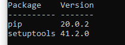

# Python virtual environments

- [Overview](#overview)
- [Create a virtual environment](#create-a-virtual-environment)
- [Install packages](#install-packages)
- [References](#references)
  
## Overview 

A **virtual environment** is a Python tool for **dependency management** and **project isolation**. It allows Python **packages** (third party libraries) to be installed in isolation for particular project(s), instead of being installed globally (i.e., as part of a machine-wide environment).
The physical underlying of a virtual environment is a directory with 3 important components:

1. A `site-packages/` folder where third party libraries are installed.
1. [Symlinks](https://en.wikipedia.org/wiki/Symbolic_link) to Python executables installed on your machine.
1. **Scripts** that ensure that Python code uses the Python interpreter and site packages installed inside a given virtual environment.

Putting it differently, a **virtual environment** is the **context** in which a program runs. An environment consists of an interpreter and any number of installed packages.

A **context** includes one of the following environments:

- global (machine-wide)
- virtual (isolated)
- [conda](https://www.anaconda.com/)

An environment consists of:

- an interpreter
- a library (typically the Python Standard Library)
- a set of installed packages

> **Note**.
> An environment determine which language constructs and syntax are valid, what operating-system functionality you can access, and which packages you can use.

To find out where your Python interpreter is installed on a Windows machine run the following command:

```cmd
where python3
```

You get an output similar to the following: `C:\Users\<user name>\AppData\Local\Programs\Python\Python37\python.exe`.

## Create a virtual environment

1. Open a terminal window and navigate to the directory where you want to create your virtual environment.

    ```cmd
    cd Users\<user name>\Python
    ```

1. Create the virtual environment `learn-venv`.

    ```cmd
    python -m venv learn-venv/
    ```
    > [!NOTE]
    > You can use any name for the environment different from `learn-venv`.

    The `learn-venv` is created, which is itself a directory. If you run the `tree` command, you can see the structure of this directory.

1. To activate the virtual environment just created, from he `Users\<user name>\Python` directory execute the following command (in Windows):

    ```cmd
    learn-venv\Scripts\activate
    ```

    In the terminal window, you get the path prefixed with the name of your environment in parenthesis, for example:
    `(learn-venv) Users\<user name>\Python`

    At this point, you can navigate to your project directory and work on your project which is completely isolated from the rest of the machine.
    Inside the environment you **cannot access machine-wide site packages** and **any package installed in the environment cannot be accessible outside of the environment**.

    When done working on the project, you can exit the environment as shown next.

1. To deactivate the virtual environment just execute this command:

    ```cmd
    deactivate
    ```

## Install packages

By default, only `pip` and `setuptools` are installed in a new environment.
You can verify this by executing the following command inside the virtual environment:

```cmd
pip list
```

This is the result:




For equivalent Linux commands, see [Python Virtual Environments: A Primer](https://realpython.com/python-virtual-environments-a-primer/).

## References

- [A Guide to Python’s Virtual Environments](https://towardsdatascience.com/virtual-environments-104c62d48c54) - What they are, how to use them, and how they really work.
- [Python Virtual Environments: A Primer](https://realpython.com/python-virtual-environments-a-primer/)
