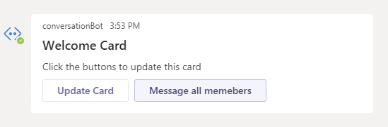

# Bot Framework v4 Conversation Bot sample for Teams

This article shows how to incorporate a conversational bot into [Microsoft Teams](https://products.office.com/en-us/microsoft-teams/group-chat-software).

In this article you will learn the following:

1. Deploy the conversation bot to Azure.
1. Test the bot running on your local machine using the Bot Emulator.
1. Upload the bot to Teams
1. Test the bot running on your local machine using Teams.
1. In Teams, use the bot running in Azure. 

The article uses the example code on GitHub found at this location: [conversation bot](https://github.com/microsoft/BotBuilder-Samples/tree/master/samples/python/57.teams-conversation-bot).

The bot has been created using [Bot Framework v4](https://dev.botframework.com). 

## Prerequisites

- Microsoft Teams is installed and you have an account
- [Python SDK](https://www.python.org/downloads/) min version 3.6
- [ngrok](https://ngrok.com/) or equivalent tunnelling solution


## Deploy the conversation bot to Azure

1. Clone the latest bot builder samples:

    ```bash
    git clone https://github.com/Microsoft/botbuilder-samples.git
    ```

1. Open a terminal window and change directory to `..BotBuilder-Samples\samples\python\57.teams-conversation-bot`.
1. Execute the following commands: 

    ```bash
        pip install azure-storage-blob>=2.1.0 # do we need this?
    ```

    ```bash
        pip install -r requirements.txt 
    ```
 1. Deploy the bot to Azure using the latest [Azure CLI](https://docs.microsoft.com/en-us/cli/azure/install-azure-cli-windows?view=azure-cli-latest). For more information, see [Tutorial: Create and deploy a basic bot](https://docs.microsoft.com/en-us/azure/bot-service/bot-builder-tutorial-basic-deploy?view=azure-bot-service-4.0&tabs=csharp). The following is an example of the steps to follow:

    1. Login into Azure

        ``` cmd
        az login
        ```

    1. Set the subscription

        ```cmd
        az account set --subscription "<<your subscription>>"
        ```

    1. Set Azure Active Directory Graph entities needed for Role Based Access. This step also produces the **app id** to use in the next step.

        ```cmd
        az ad app create --display-name "TeamsConversation" --password "<<your password>>" --available-to-other-tenants
        ```

    1. Deploy via ARM template. This step also produces the subscription id to use in the next step.
    
    ```cmd
        az deployment create --name "TeamsConversation" --template-file "..BotBuilder-Samples\samples\python\57.teams-conversation-bot\deploymentTemplates\template-with-new-rg.json" 
        --location "westus" 
        --parameters appId="<<get it from previous step>>" appSecret="<<your password>>" botId="TeamsConversation" botSku=F0 newAppServicePlanName="<<your plan name>>" newWebAppName="TeamsConversation" groupName="<<your group name>>" groupLocation="westus" newAppServicePlanLocation="westus"
    ```

    1. Optionally, check App Id and Password

    ```cmd
    az webapp config appsettings list -g mm-python-group -n TeamsConversationNew --subscription  your subscription id
    ```

    1. Before performing the deployment step, you must prepare the bot code as described below.

        1. Navigate to `BotBuilder-Samples\samples\python\57.teams-conversation-bot\teams_app_manifest` directory.
        1. In your editor, open the `manifest.json` file.  Assign the `id` and `bot Id` variables assign the **app id** obtained before.
        1. Save the file.
        1. Select all the files in the directory and zipped them up in a file such as `manifest.zip`.

        1. Navigate to `BotBuilder-Samples\samples\python\57.teams-conversation-bot` directory.
        1. In your editor, open the `config.py` file.  Assign the **app Id** and the **password** values from the previous step.
        1. Save the file. 
        1. Select all the files in the directory and zipped them up in a file such as `app.zip`.

    1. Deploy the bot

    ```cmd
    az webapp deployment source config-zip --resource-group "mm-python-group" --name "TeamsConversation" --src "..BotBuilder-Samples\samples\python\57.teams-conversation-bot\app.zip"
    ```

## Testing teams bot

### Teams Setup

1. In Teams, open **App Studio**.
1. Click the **Manifest editor** tab.
1. In the left panel, click the **Create a new app** button.
1. In the **Details** section, click the **App details**.
1. Enter the following  info:
    1. **Short name**. Enter *conversationBot*.  
    1. Click the **Generate** button under **App ID**. You an ID similar to this *772998ff-7fed-4275-b4e3-485cbf312850*. `Why do we need this?`
    1. **Package Name**. Enter *com.teams.devapp*.
    1. **Version** Enter *1.0.0*.
    1. **Short Description**. Enter *Testing conversation bot*.
    1. **Long Description**. Enter *Testing conversation bot*.
    1. **Developer name**. Your name.
    1. **Website**. The name of your website. For example, *https://www.microsoft.com*.
    1. **Privacy statement** web address. For example, *https://www.teams.com/privacy*.
    1. **Terms of use** web address. For example, *https://www.teams.com/termsofuse*.
1. In the left panel, in the **Capabilities** section, click the **Bots** link.
1. Click the **Set up** button. 
1. In the **New bot** tab, enter the following information:
    1. **Name**. Enter *conversationBot*.
    1. **Scope**. Check all 3 boxes.
    1. Click the **Create** button.
1. Copy the **Bot ID** (string under conversationBot) and save it to a file to use it later.
1. Click the **Generate new password** button, copy the password and save it to a file to use it later.
1. In a terminal window execute the following command: `ngrok http -host-header=rewrite 3978`.
Make sure that the port number is set properly in the `config.py` file such as `PORT = 3978`. This is the number to use in the ngrok command.
1. Copy the **https** forwarding address to a file. Notice this forwarding address changes every time you restart ngrok.  
1. Keep **ngrok** running.  
1. In the **Messaging endpoint** section in the **Bot endpoint address** enter the ngrok address you saved earlier followed by */api/messages*. For example: *https://d1dbb0d8.ngrok.io/api/messages*. 
1. Press **Enter** (on your keyboard) to save the address.

### Bot Setup

1. Clone the repository at [botbuilder-python](https://github.com/microsoft/botbuilder-python/).
1. In Visual Studio, navigate to the `52.teams-echo-bot` folder and open the `config.py` file.
1. Assign the bot **Bot ID**, which is called APP_ID in the settings as shown next, and **Password** you saved earlier. This is an example:

    ```python
    APP_ID = os.environ.get("MicrosoftAppId", "<Bot ID>")
    APP_PASSWORD = os.environ.get("MicrosoftAppPassword", "<Password>")
    ```

1. **Save** the `config.py` file.

1. Open the file `config.py`. Make sure that this setting exists: `PORT = 3978`.
1. Open the file `teams_app_manifest\manifest.json`. Assign to the `id` and `botId` variables the **Bot ID** value you saved earlier.  
1. **Save** the `manifest.json` file.
1. Zip the 3 files contained in the folder.
1. Navigate to the `57.teams-conversation-bot` folder.
1. Execute `python app.py`.
1. The bot start running at the location `localhost:3978`.

## Deploy bot to Azure

After you have tested the bot, it is time to deploy it to Azure following  the steps shown below.

1. Open a terminal window and log into Azure portal:

    ```cmd
    az login
    ```

1. Set the subscription

    ```cmd
    az account set --subscription "FUSE Temporary"
    ```

1. Create app registration

    ```cmd
    az ad app create --display-name "mm-conversation-bot" --password "@mm-conversation-bot-22499" --available-to-other-tenants
    ```

1. Deploy via ARM template
Create a new resource group in Azure and then use the ARM template to create the resources specified in it. In this case, we are providing App Service Plan, Web App, and Bot Channels Registration.

    ```cmd
    az deployment create --name "mm-teams-conversation-bot" --template-file "C:\Users\v-mimiel\aWork\GitHub\botbuilder-samples-python-josh\samples\57.teams-conversation-bot\template-with-new-rg.json" --location "westus" --parameters appId="<msa-app-guid>" appSecret="@mm-conversation-bot-22499" botId="mm-teams-conversation-bot" botSku=F0 newAppServicePlanName="mm-python-service-plan" newWebAppName="mm-teams-conversation-bot" groupName="mm-python-group" groupLocation="westus" newAppServicePlanLocation="westus"
    ```

1. Check App Id and Password
Optionally, check if App Id and Password have been set correctly.  

    ```cmd
    az webapp config appsettings list -g mm-python-group -n mm-conversation-bot --subscription 174c5021-8109-4087-a3e2-a1de20420569
    ```

1. Deploy the bot
At this point we are ready to deploy the bot to Azure.

    ```cmd
    az webapp deployment source config-zip --resource-group "mm-echo-bot-group" --name "mm-echo-bot" --src "C:\Users\v-mimiel\aWork\GitHub\botbuilder-samples-python-josh\samples\57.teams-conversation-bot\app.zip"
    ```

## Finish Teams Setup

1. In Teams click **Test and distribute** in the left panel in the **Finish** section.
1. Click the **Install** button.

    Personal|Group|Team|
    |----|----|----|
    |Chat|Group|Team|
    |Click `Add` button|Click the down arrow to the right of the `Add` button <br> Click `Add to Chat` <br> Search for and select your group chat <br> Click the `Set up bot` button <br> **Note**: There must be at least 1 message in a group chat for it to be searchable |Click the down arrow to the right of the `Add` button <br> Click `Add to Team` <br> Search for and select your team <br> Click the <code>Set up a bot</code> button|


The following are the inputs to test the conversational bot?
<p><strong>Note:</strong> If you send an unsupported string in a group chat or personal chat the bot will respond with an error message. This is because it's missing data that comes with messages that orignates from a team or group chat.</p>

|Personal|Group|Team|
|----|----|----|
| N/A |Show Welcome |Show Welcome  <br/> Mention Me  <br/>  Message All Members  |
