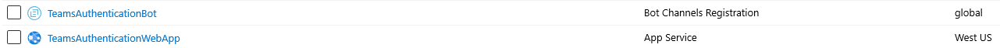
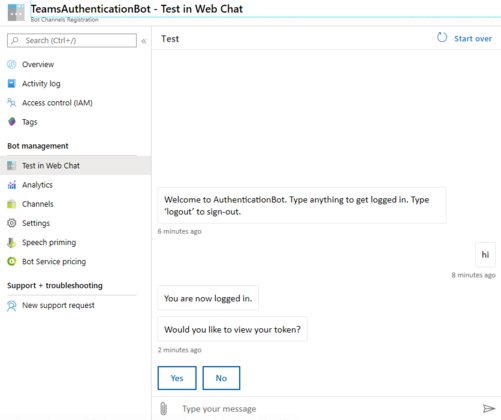
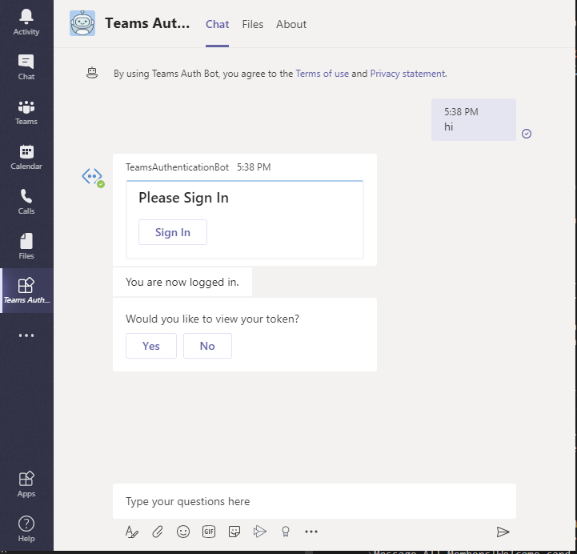
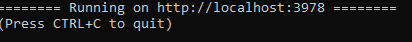
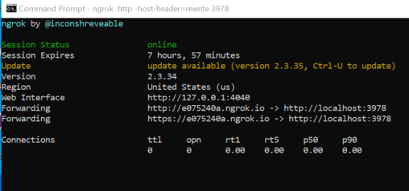
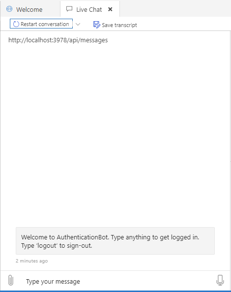
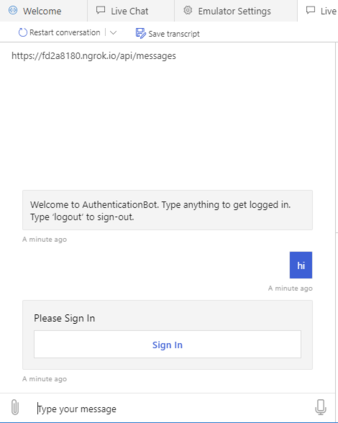
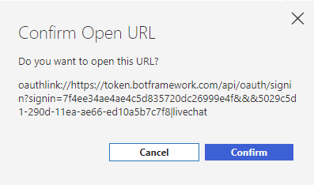
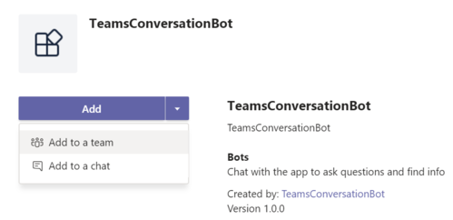

# Bot Framework v4 Authentication Bot sample for Teams

This article shows how to incorporate an authentication Python bot into [Microsoft Teams](https://products.office.com/en-us/microsoft-teams/group-chat-software). You will learn the following:

1. Deploy the Authentication bot to Azure.
1. Test the bot running on your local machine using the Bot Emulator.
1. Test the bot running on your local machine using Teams.
1. In Teams, use the bot running in Azure.

The article uses the example code on GitHub found at this location: [teams authentication bot](https://github.com/microsoft/BotBuilder-Samples/tree/master/samples/python/46.teams-auth).

The bot has been created using [Bot Framework v4](https://dev.botframework.com). 

## Prerequisites

- Microsoft Teams is installed and you have an account
- [Python SDK](https://www.python.org/downloads/) min version 3.6
- [ngrok](https://ngrok.com/) or equivalent tunnelling solution
- [Bot Framework Emulator](https://github.com/Microsoft/BotFramework-Emulator/blob/master/README.md)


## Prepare bot deployment to Azure

 1. Deploy the bot to Azure using the latest [Azure Command-Line Interface (CLI)](https://docs.microsoft.com/en-us/cli/azure/install-azure-cli-windows?view=azure-cli-latest). For more information, see [Tutorial: Create and deploy a basic bot](https://docs.microsoft.com/en-us/azure/bot-service/bot-builder-tutorial-basic-deploy?view=azure-bot-service-4.0&tabs=csharp). 
 
    You can run the az cli commands from within Visual Studio Code using the [AZ CLI extension](https://marketplace.visualstudio.com/items?itemName=ms-vscode.azurecli). See also [The Azure Command-Line Interface (CLI)](https://docs.microsoft.com/en-us/cli/azure/?view=azure-cli-latest).

    The following is an example of the steps to follow:

    1. Login into Azure

        ``` cmd
        az login
        ```

    1. Set the subscription

        ```cmd
        az account set --subscription "<<your subscription>>"
        ```

        If you are not sure which subscription to use for deploying the bot, you can view the list of subscriptions for your account by using the `az account list` command.

    1. Create the application registration

        Creating the application registration allows the bot to access the Bot Framework Service for sending and receiving authenticated messages.

        ```cmd
        az ad app create --display-name "TeamsAuthenticationBot" --password "<<your password>>" --available-to-other-tenants
        ```

        |Parameter|Description|Notes|
        |-------|---|-------|
        |display-name|The name to display in the resources list||
        |password|App password, aka 'client secret'. The password must be at least 16 characters long, contain at least 1 upper or lower case alphabetical character, and contain at least 1 special character.|Copy and save to a file. To be used later.|

        Copy and save to a file the **app id** obtained, to use in the next step.

    1. Create bot channel registration via ARM template

        This connects the bot to channels and facilitates communication between bot and the user.

        ```cmd
        az deployment create --name "TeamsAuthenticationBot" --template-file "..BotBuilder-Samples\samples\python\57.teams-auth\deploymentTemplates\template-with-new-rg.json" --location "westus" --parameters appId="<<get it from previous step>>" appSecret="<<your password>>" botId="TeamsAuthenticationBot" botSku=F0 newAppServicePlanName="<<your plan name>>" newWebAppName="TeamsAuthenticationWebApp" groupName="<<your group name>>" groupLocation="westus" newAppServicePlanLocation="westus"
        ```

        |Parameter|Description|Notes|
        |-------|---|-------|
        |name|Resource name|Displayed in the resources list|
        |template-file|The path to the ARM template. You can use the `template-with-new-rg.json` file provided in the `deploymentTemplates` folder of the project.|
        |location| Resource location. |Values from: `az account list-locations`|
        |parameters|`appId` value you got from running the `az ad app create` command. <br/>`appSecret` bot password you provided in the previous step.<br/>`botId` globally unique bot identifier. It is also used to configure the display name of the bot, which is mutable.<br/>`botSku` the pricing tier and can be F0 (Free) or S1 (Standard). <br/>`newAppServicePlanName` the name of App Service Plan. <br/>`newWebAppName` the name of the Web App you are creating. <br/>`groupName` the name of the Azure resource group you are creating. <br/>`groupLocation` the location of the Azure resource group.<br/> `newAppServicePlanLocation` the location of the App Service Plan.||

        Copy the **subscription id** obtained to use in the next step.

    1. Optionally, check app id and password settings

        ```cmd
        az webapp config appsettings list -g <<your group name>> -n TeamsAuthenticationWebApp --subscription  <<your subscription id>>
        ```

    If you navigate to the Azure portal, you should see the bot channel registration and the web app service listed as shown below.

    

## Create the identity provider

You need an identity provider that can be used for authentication. In this procedure you'll use an Azure Active Directory provider. Follow the steps described in [Create the identity provider](https://docs.microsoft.com/microsoftteams/platform/bots/how-to/authentication/add-authentication#create-the-identity-provider).

At this time you will also configure the identity provider connection and register it with the bot channel registration created earlier. 
Copy and save the connection name you used to a file.  

## Prepare the bot code

1. If you have not done it yet, clone the latest bot builder samples:

    ```bash
    git clone https://github.com/Microsoft/botbuilder-samples.git
    ```

1. Open a terminal window and change directory to `*\BotBuilder-Samples\samples\python\46.teams-auth`.
1. Make sure that the `requirements.txt` file contains the following dependencies

    ```text
    aiohttp
    botbuilder-core>=4.7.0
    botbuilder-dialogs>=4.7.0 
    ```

    Install the dependencies.

    ```cmd
    pip install -r requirements.txt
    ```

    > Note. To find out the if a specific package is installed you can run a command similar to this (in Windows) `pip freeze | findstr botbuilder-dialogs`. To get the list of all the packages run this command `pip freeze`.  

 1. Before performing the deployment step, you must prepare the bot code as described below.

    1. Create `manifest.zip` file
        1. Navigate to `*\BotBuilder-Samples\samples\python\46.teams-auth\teams_app_manifest` directory.
        1. In your editor, open the `manifest.json` file.  To the `id` and `bot Id` variables assign the bot channel registration **app id** you saved before.
        1. Save the file.
        1. Select all the files in the directory and zipped them up in a file such as `manifest.zip`.

    1. Create `app.zip` file
        1. Navigate to `*\BotBuilder-Samples\samples\python\46.teams-auth` directory.
        1. In your editor, open the `config.py` file.  
        Assign the following values:
            1. `APP_ID = os.environ.get("MicrosoftAppId", "")` assign the *app id* you saved earlier.
            1. `APP_PASSWORD = os.environ.get("MicrosoftAppPassword", "")` assign the password you saved earlier. 
            1. `CONNECTION_NAME = os.environ.get("ConnectionName", "")` assign the identity provider connection name you created earlier.
        1. Save the file.
        1. Select all the files in the directory and zipped them up in a file such as `app.zip`.

## Deploy the bot to Azure

In a terminal window, execute the following command:

```cmd
az webapp deployment source config-zip --resource-group "<<your group name>>" --name "TeamsAuthenticationWebApp" --src "*\BotBuilder-Samples\samples\python\57.teams-Authentication-bot\app.zip"
```

You can test the bot using the WebChat client in Azure. 

1. Navigate to the [Azure portal](https://ms.portal.azure.com/).
1. Go to the bot channel registration, in this example is *TeamsAuthenticationBot*. 
1. Click the **Test in Web Chat** link.
1. Follow the bot instructions. The following picture shows an example.

     

At this point the bot is ready to be used from within Teams.

## Using the bot within Teams

1. Activate your Microsoft Teams.
1. In the lower left, left panel, click the **Apps** icon.
1. In the right panel, click the **Upload a custom app** link.
1. Navigate to the directory `..BotBuilder-Samples\samples\python\57.teams-Authentication-bot\teams_app_manifest`.
1. Select the `manifest.zip` file.
1. Click the **Open** button.
1. In the Teams wizard window, click the arrow in the **Add** button.
1. After the bot is set, you can start entering the allowed requests 
1. If you enter *hi*, the sign in card is displayed. 
1. Click the **Sign In** button and select the sign-in account to use.
    You will been asked if you want to display your authentication token.

      

1. If you click *Yes* your authentication token is displayed.

The bot will respond to the following commands

|Personal|Description|Result|
|:---|:---|:---|
|Any string|The user starts conversation with the bot|The bot displays sign-in card|
|Click **Sign In** button|The user logs into the bot|The bot performs authentication. If successful, the bot logs the user in and displays a card asking if the user wants to view the authentication token |
|Click **Yes** or **No** button|The user accepts or declines to view the token|If the **Yes** buton is clicked the bot displays the token|

## Appendix

### Test the bot using the Bot Emulator

Before deploying the bot to Azure let's test it on the local machine.

1. In a terminal window, navigate to `*\BotBuilder-Samples\samples\python\46.teams-auth`.
1. Launch the application.

    ```cmd
    python app.py
    ```

    The following message is displayed:

    

1. Open a new terminal window and execute this command:

    ```cmd
    ngrok http -host-header=rewrite 3978
    ```

    > Note.
    > The port number 3978 is defined in the `configg.py` file. Make sure that the values match.  

    You get an output similar to this:

    

1. Copy the **https forwarding** address which is similar to this: `https://e075240a.ngrok.io`.
1. Add to it `api/messages`, so the address is similar to this `https://e075240a.ngrok.io/api/messages`. Save the address to a file.
This is the **end point** to connect with the bot running locally.
1. 
1. Activate the Bot Framework Emulator.
1. Click the **Open Bot** button.
1. In the **Bot URL** box, enter the end point address you saved before such as `https://e075240a.ngrok.io/api/messages`.
1. In the **Microsoft App ID** box enter the *app id* you saved earlier.  
1. In the **Microsoft App  password** box enter same *password* you saved earlier.
    > NOTE
    > If you restart ngrok, the end point URL changes and you must restart the emulator and enter the new URL.
1. Click the **Connect** button.
1. Wait for the emulator to connect to the bot. The following welcome message is displayed:

    

1. Enter any text in the emulator box, for example *hi*.
1. The login card is displayed.

    

1. Click the Sign in link. The following popup dialog window is displayed asking your permission to redirect the request to the authentication location (this is how OAuth works). 

    

1. Click the **Confirm** button. You will be redirected to the login page. 

### Test the bot running on your local machine using Teams

1. Activate your Microsoft Teams.
1. In the lower left, left panel, click the **Apps** icon.
1. In the right panel, click the **Upload a custom app** link.
1. Navigate to the directory `*\BotBuilder-Samples\samples\python\47.teams-auth\teams_app_manifest`.
1. Select the `manifest.zip` file.
1. Click the **Open** button.
1. In the Teams wizard window, click the arrow in the **Add** button and select *Add to a team* or *Add to a chat*.

     

1. In Teams, open **App Studio**.
1. Click the **Manifest editor** tab.
1. In the left panel, click the **Create a new app** button.
1. In the **Details** section, click the **App details**.
1. Enter the following  info:
    1. **Short name**. Enter *conversationBot*.  
    1. Click the **Generate** button under **App ID**. You an ID similar to this *772998ff-7fed-4275-b4e3-485cbf312850*. `Why do we need this?`
    1. **Package Name**. Enter *com.teams.devapp*.
    1. **Version** Enter *1.0.0*.
    1. **Short Description**. Enter *Testing conversation bot*.
    1. **Long Description**. Enter *Testing conversation bot*.
    1. **Developer name**. Your name.
    1. **Website**. The name of your website. For example, *https://www.microsoft.com*.
    1. **Privacy statement** web address. For example, *https://www.teams.com/privacy*.
    1. **Terms of use** web address. For example, *https://www.teams.com/termsofuse*.
1. In the left panel, in the **Capabilities** section, click the **Bots** link.
1. Click the **Set up** button. 
1. In the **New bot** tab, enter the following information:
    1. **Name**. Enter *conversationBot*.
    1. **Scope**. Check all 3 boxes.
    1. Click the **Create** button.
1. Copy the **Bot ID** (string under conversationBot) and save it to a file to use it later.
1. Click the **Generate new password** button, copy the password and save it to a file to use it later.
1. In a terminal window execute the following command: `ngrok http -host-header=rewrite 3978`.
Make sure that the port number is set properly in the `config.py` file such as `PORT = 3978`. This is the number to use in the ngrok command.
1. Copy the **https** forwarding address to a file. Notice this forwarding address changes every time you restart ngrok.  
1. Keep **ngrok** running.  
1. In the **Messaging endpoint** section in the **Bot endpoint address** enter the ngrok address you saved earlier followed by */api/messages*. This is an example: `https://d1dbb0d8.ngrok.io/api/messages`. 
1. Press **Enter** (on your keyboard) to save the address.
